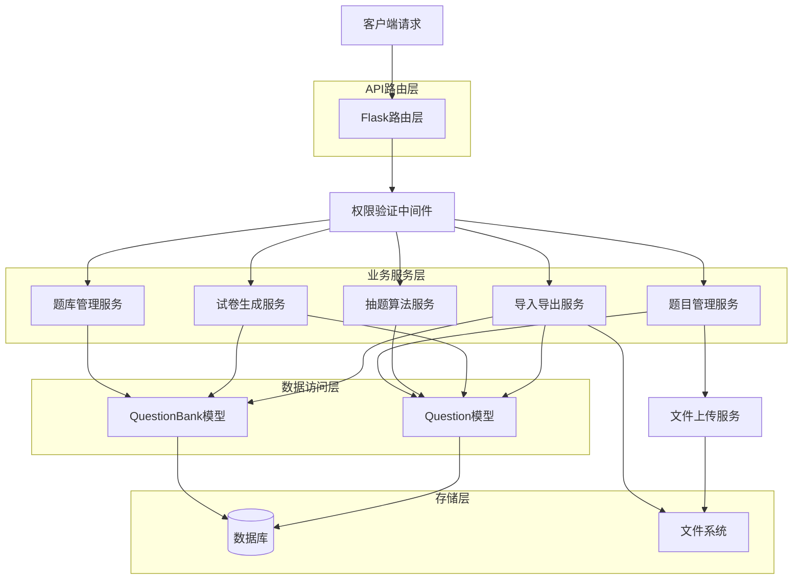
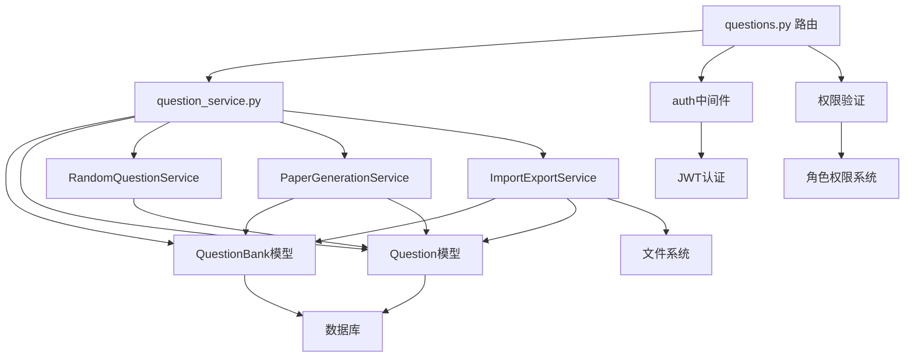
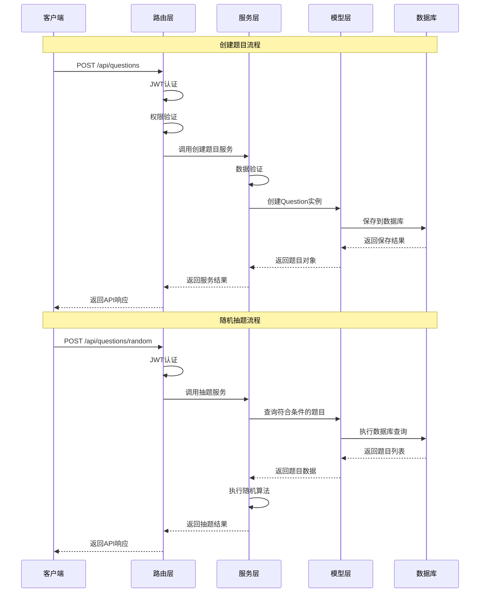

# T09题库管理API - 系统架构设计 (DESIGN)

## 1. 整体架构设计

### 1.1 系统架构图



### 1.2 分层设计

**1. API路由层** (`app/routes/questions.py`)
- 题库管理路由：CRUD操作
- 题目管理路由：CRUD操作
- 抽题功能路由：随机抽题API
- 试卷生成路由：试卷生成API
- 导入导出路由：数据导入导出API

**2. 业务服务层** (`app/services/question_service.py`)
- 题库业务逻辑
- 题目业务逻辑
- 随机抽题算法
- 试卷生成算法
- 数据导入导出逻辑

**3. 数据访问层** (`app/models/question.py`)
- QuestionBank模型：题库数据模型
- Question模型：题目数据模型
- 数据库操作封装

**4. 存储层**
- SQLite/PostgreSQL：结构化数据存储
- 文件系统：音频、图片、导入导出文件存储

## 2. 核心组件设计

### 2.1 题库管理组件

**功能职责**：
- 题库CRUD操作
- 题库权限管理
- 题库分类管理
- 题库统计信息

**核心方法**：
```python
class QuestionBankService:
    def create_question_bank(self, data, user_id)
    def get_question_banks(self, filters, user_id)
    def get_question_bank_detail(self, bank_id, user_id)
    def update_question_bank(self, bank_id, data, user_id)
    def delete_question_bank(self, bank_id, user_id)
    def get_bank_statistics(self, bank_id, user_id)
```

### 2.2 题目管理组件

**功能职责**：
- 题目CRUD操作
- 题目类型管理
- 题目标签管理
- 媒体文件关联

**核心方法**：
```python
class QuestionService:
    def create_question(self, data, user_id)
    def get_questions(self, filters, user_id)
    def get_question_detail(self, question_id, user_id)
    def update_question(self, question_id, data, user_id)
    def delete_question(self, question_id, user_id)
    def batch_create_questions(self, questions_data, user_id)
```

### 2.3 随机抽题组件

**功能职责**：
- 多维度抽题算法
- 避重复抽题机制
- 抽题结果缓存
- 抽题历史记录

**核心算法**：
```python
class RandomQuestionService:
    def random_select(self, criteria, count, exclude_ids=None)
    def weighted_random_select(self, criteria, count, weights)
    def generate_question_pool(self, criteria)
    def avoid_duplicate_selection(self, user_id, selected_ids)
```

### 2.4 试卷生成组件

**功能职责**：
- 试卷结构定义
- 智能题目分配
- 分值计算
- 试卷模板管理

**核心算法**：
```python
class PaperGenerationService:
    def generate_paper(self, template, criteria)
    def allocate_questions_by_type(self, template, question_pool)
    def calculate_total_score(self, questions)
    def validate_paper_structure(self, paper)
```

### 2.5 导入导出组件

**功能职责**：
- Excel文件解析
- JSON数据处理
- 数据验证
- 批量操作

**核心方法**：
```python
class ImportExportService:
    def import_from_excel(self, file_path, bank_id, user_id)
    def export_to_excel(self, bank_id, user_id)
    def import_from_json(self, json_data, bank_id, user_id)
    def export_to_json(self, bank_id, user_id)
    def validate_import_data(self, data)
```

## 3. 模块依赖关系图



## 4. 接口契约定义

### 4.1 题库管理API

#### 4.1.1 创建题库
```
POST /api/question-banks
Authorization: Bearer <token>

Request Body:
{
  "name": "英语语法题库",
  "description": "包含各种语法练习题",
  "category": "grammar",
  "difficulty_level": "intermediate",
  "is_public": false
}

Response:
{
  "success": true,
  "data": {
    "id": 1,
    "name": "英语语法题库",
    "description": "包含各种语法练习题",
    "category": "grammar",
    "difficulty_level": "intermediate",
    "created_by": 1,
    "creator_name": "张老师",
    "is_public": false,
    "question_count": 0,
    "created_at": "2024-01-16T10:00:00Z",
    "updated_at": "2024-01-16T10:00:00Z"
  },
  "message": "题库创建成功"
}
```

#### 4.1.2 获取题库列表
```
GET /api/question-banks?category=grammar&difficulty=intermediate&page=1&per_page=10
Authorization: Bearer <token>

Response:
{
  "success": true,
  "data": {
    "question_banks": [
      {
        "id": 1,
        "name": "英语语法题库",
        "category": "grammar",
        "difficulty_level": "intermediate",
        "creator_name": "张老师",
        "is_public": false,
        "question_count": 25,
        "created_at": "2024-01-16T10:00:00Z"
      }
    ],
    "pagination": {
      "page": 1,
      "per_page": 10,
      "total": 1,
      "pages": 1
    }
  }
}
```

### 4.2 题目管理API

#### 4.2.1 创建题目
```
POST /api/questions
Authorization: Bearer <token>

Request Body:
{
  "question_bank_id": 1,
  "question_type": "multiple_choice",
  "title": "选择正确的语法形式",
  "content": "She _____ to school every day.",
  "options": "[\"go\", \"goes\", \"going\", \"gone\"]",
  "correct_answer": "goes",
  "explanation": "第三人称单数现在时用goes",
  "points": 2,
  "difficulty_level": "beginner",
  "tags": "present_tense,third_person"
}

Response:
{
  "success": true,
  "data": {
    "id": 1,
    "question_bank_id": 1,
    "question_bank_name": "英语语法题库",
    "question_type": "multiple_choice",
    "title": "选择正确的语法形式",
    "content": "She _____ to school every day.",
    "options": "[\"go\", \"goes\", \"going\", \"gone\"]",
    "correct_answer": "goes",
    "explanation": "第三人称单数现在时用goes",
    "points": 2,
    "difficulty_level": "beginner",
    "tags": ["present_tense", "third_person"],
    "created_by": 1,
    "creator_name": "张老师",
    "is_active": true,
    "created_at": "2024-01-16T10:30:00Z"
  },
  "message": "题目创建成功"
}
```

### 4.3 随机抽题API

#### 4.3.1 随机抽题
```
POST /api/questions/random
Authorization: Bearer <token>

Request Body:
{
  "question_bank_id": 1,
  "count": 5,
  "criteria": {
    "difficulty_level": "beginner",
    "question_type": "multiple_choice",
    "tags": ["present_tense"]
  },
  "exclude_ids": [1, 2, 3]
}

Response:
{
  "success": true,
  "data": {
    "questions": [
      {
        "id": 4,
        "title": "选择正确的时态",
        "content": "He _____ basketball yesterday.",
        "options": "[\"play\", \"plays\", \"played\", \"playing\"]",
        "points": 2,
        "difficulty_level": "beginner",
        "question_type": "multiple_choice"
      }
    ],
    "total_available": 15,
    "selected_count": 5
  },
  "message": "随机抽题成功"
}
```

### 4.4 试卷生成API

#### 4.4.1 生成试卷
```
POST /api/question-banks/1/generate-paper
Authorization: Bearer <token>

Request Body:
{
  "paper_name": "期中语法测试",
  "total_score": 100,
  "structure": {
    "multiple_choice": {
      "count": 20,
      "points_per_question": 2,
      "difficulty_distribution": {
        "beginner": 0.4,
        "intermediate": 0.4,
        "advanced": 0.2
      }
    },
    "fill_blank": {
      "count": 10,
      "points_per_question": 3,
      "difficulty_distribution": {
        "beginner": 0.3,
        "intermediate": 0.5,
        "advanced": 0.2
      }
    }
  }
}

Response:
{
  "success": true,
  "data": {
    "paper_id": "paper_20240116_001",
    "paper_name": "期中语法测试",
    "total_score": 100,
    "question_count": 30,
    "sections": [
      {
        "section_name": "选择题",
        "question_type": "multiple_choice",
        "questions": [...],
        "section_score": 40
      },
      {
        "section_name": "填空题",
        "question_type": "fill_blank",
        "questions": [...],
        "section_score": 30
      }
    ],
    "generated_at": "2024-01-16T11:00:00Z"
  },
  "message": "试卷生成成功"
}
```

### 4.5 导入导出API

#### 4.5.1 导入题目
```
POST /api/question-banks/1/import
Authorization: Bearer <token>
Content-Type: multipart/form-data

Form Data:
- file: questions.xlsx
- format: excel

Response:
{
  "success": true,
  "data": {
    "imported_count": 25,
    "failed_count": 2,
    "errors": [
      {
        "row": 3,
        "error": "题目内容不能为空"
      },
      {
        "row": 7,
        "error": "无效的题目类型"
      }
    ]
  },
  "message": "导入完成，成功导入25道题目"
}
```

#### 4.5.2 导出题目
```
GET /api/question-banks/1/export?format=excel
Authorization: Bearer <token>

Response:
- Content-Type: application/vnd.openxmlformats-officedocument.spreadsheetml.sheet
- Content-Disposition: attachment; filename="question_bank_1_20240116.xlsx"
- Binary Excel file content
```

## 5. 数据流向图



## 6. 异常处理策略

### 6.1 业务异常处理

**题库权限异常**：
- 访问私有题库：403 Forbidden
- 修改他人题库：403 Forbidden
- 删除包含题目的题库：400 Bad Request

**题目操作异常**：
- 题目不存在：404 Not Found
- 无效题目类型：400 Bad Request
- 答案格式错误：400 Bad Request

**抽题算法异常**：
- 题目数量不足：400 Bad Request
- 无符合条件题目：404 Not Found
- 抽题参数无效：400 Bad Request

### 6.2 系统异常处理

**数据库异常**：
- 连接超时：500 Internal Server Error
- 约束违反：400 Bad Request
- 事务回滚：500 Internal Server Error

**文件操作异常**：
- 文件格式错误：400 Bad Request
- 文件大小超限：413 Payload Too Large
- 文件读取失败：500 Internal Server Error

### 6.3 异常响应格式

```json
{
  "success": false,
  "error": {
    "code": "QUESTION_NOT_FOUND",
    "message": "题目不存在",
    "details": {
      "question_id": 123,
      "timestamp": "2024-01-16T12:00:00Z"
    }
  }
}
```

## 7. 性能优化策略

### 7.1 数据库优化

**索引策略**：
```sql
-- 题库查询优化
CREATE INDEX idx_question_banks_category ON question_banks(category);
CREATE INDEX idx_question_banks_difficulty ON question_banks(difficulty_level);
CREATE INDEX idx_question_banks_public ON question_banks(is_public);

-- 题目查询优化
CREATE INDEX idx_questions_bank_id ON questions(question_bank_id);
CREATE INDEX idx_questions_type ON questions(question_type);
CREATE INDEX idx_questions_difficulty ON questions(difficulty_level);
CREATE INDEX idx_questions_active ON questions(is_active);
CREATE INDEX idx_questions_tags ON questions(tags);
```

**查询优化**：
- 使用分页查询避免大量数据加载
- 实现查询结果缓存机制
- 优化复杂查询的SQL语句

### 7.2 算法优化

**随机抽题优化**：
- 预生成题目池，减少实时查询
- 使用加权随机算法提高抽题质量
- 实现抽题结果缓存，避免重复计算

**试卷生成优化**：
- 并行处理不同题型的题目分配
- 使用贪心算法优化分值分配
- 缓存常用试卷模板

### 7.3 缓存策略

**Redis缓存应用**：
```python
# 题库信息缓存
key_pattern = "question_bank:{bank_id}"
expire_time = 3600  # 1小时

# 抽题结果缓存
key_pattern = "random_questions:{criteria_hash}"
expire_time = 1800  # 30分钟

# 用户权限缓存
key_pattern = "user_permissions:{user_id}"
expire_time = 1800  # 30分钟
```

## 8. 安全设计

### 8.1 权限控制

**角色权限矩阵**：

| 操作 | 管理员 | 教师 | 学生 |
|------|--------|------|------|
| 创建题库 | ✅ | ✅ | ❌ |
| 查看公开题库 | ✅ | ✅ | ✅ |
| 查看私有题库 | ✅ | 仅自己创建 | ❌ |
| 修改题库 | ✅ | 仅自己创建 | ❌ |
| 删除题库 | ✅ | 仅自己创建 | ❌ |
| 创建题目 | ✅ | ✅ | ❌ |
| 修改题目 | ✅ | 仅自己创建 | ❌ |
| 删除题目 | ✅ | 仅自己创建 | ❌ |
| 随机抽题 | ✅ | ✅ | ✅ |
| 生成试卷 | ✅ | ✅ | ❌ |
| 导入导出 | ✅ | ✅ | ❌ |

### 8.2 数据验证

**输入验证规则**：
```python
# 题库验证
question_bank_schema = {
    'name': {'required': True, 'type': 'string', 'maxlength': 200},
    'description': {'type': 'string', 'maxlength': 1000},
    'category': {'type': 'string', 'maxlength': 100},
    'difficulty_level': {'required': True, 'allowed': ['beginner', 'intermediate', 'advanced']},
    'is_public': {'type': 'boolean'}
}

# 题目验证
question_schema = {
    'question_bank_id': {'required': True, 'type': 'integer'},
    'question_type': {'required': True, 'allowed': ['multiple_choice', 'true_false', 'fill_blank', 'essay', 'listening', 'speaking']},
    'title': {'required': True, 'type': 'string', 'maxlength': 500},
    'content': {'required': True, 'type': 'string'},
    'points': {'type': 'integer', 'min': 1, 'max': 100}
}
```

### 8.3 文件安全

**文件上传安全**：
- 限制文件类型：仅允许图片、音频文件
- 限制文件大小：最大50MB
- 文件名安全处理：防止路径遍历攻击
- 病毒扫描：集成文件安全检查

## 9. 测试策略

### 9.1 单元测试

**测试覆盖范围**：
- 所有API接口的正常流程
- 边界条件和异常情况
- 权限控制逻辑
- 数据验证规则
- 算法正确性

**测试文件结构**：
```
tests/
├── test_question_bank_routes.py    # 题库API测试
├── test_question_routes.py         # 题目API测试
├── test_random_question_service.py # 抽题算法测试
├── test_paper_generation.py        # 试卷生成测试
├── test_import_export.py           # 导入导出测试
└── fixtures/
    ├── sample_questions.xlsx        # 测试数据文件
    └── sample_questions.json
```

### 9.2 集成测试

**测试场景**：
- 完整的题库创建到题目添加流程
- 抽题到试卷生成的完整流程
- 导入导出的端到端测试
- 权限控制的集成验证

### 9.3 性能测试

**性能指标**：
- 随机抽题响应时间 < 500ms
- 试卷生成时间 < 2秒
- 并发用户支持 > 100
- 数据库查询优化验证

## 10. 部署配置

### 10.1 环境变量

```bash
# 题库相关配置
QUESTION_BANK_UPLOAD_FOLDER=/uploads/question_banks
MAX_IMPORT_QUESTIONS=1000
RANDOM_QUESTION_CACHE_TTL=1800

# 文件上传配置
MAX_FILE_SIZE=52428800  # 50MB
ALLOWED_AUDIO_EXTENSIONS=mp3,wav,ogg
ALLOWED_IMAGE_EXTENSIONS=jpg,jpeg,png,gif
```

### 10.2 数据库迁移

```bash
# 创建迁移文件
flask db migrate -m "Add question bank management features"

# 应用迁移
flask db upgrade
```

---

**文档状态**: ✅ 架构设计完成  
**创建时间**: 2024-01-16  
**最后更新**: 2024-01-16  
**下一步**: 进入Atomize阶段，生成详细的任务拆分文档