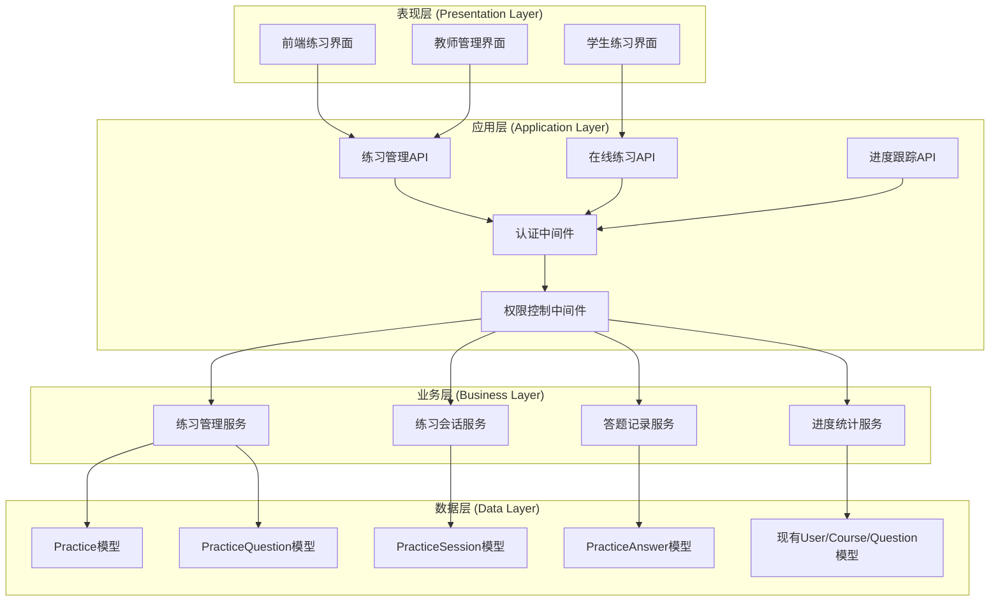
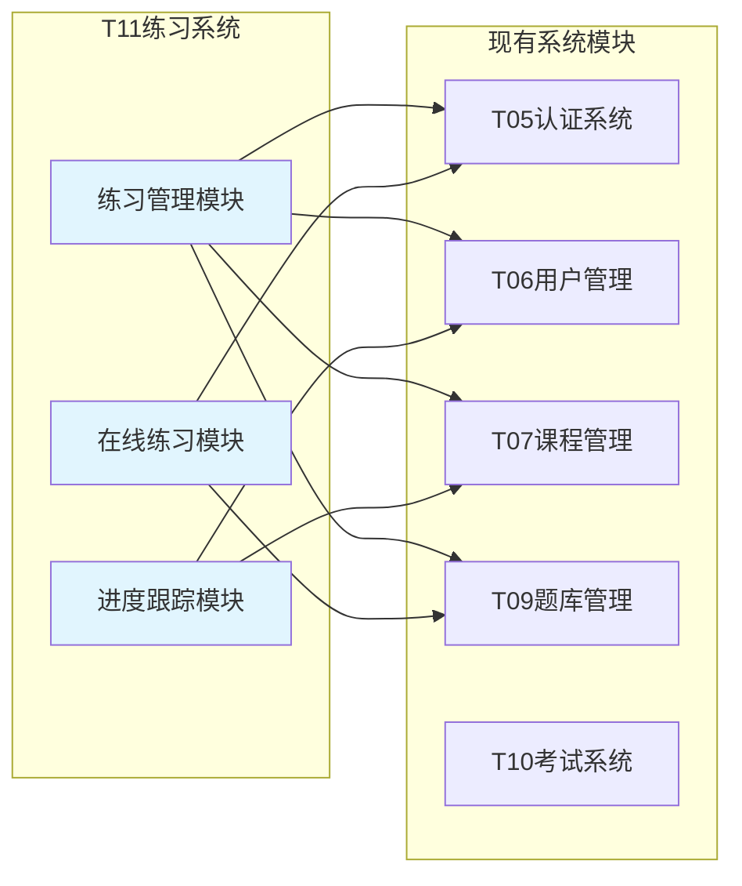
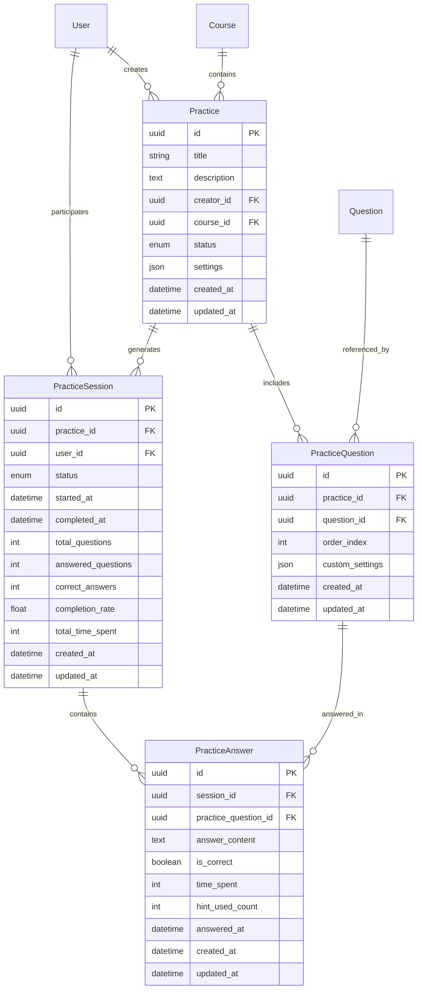
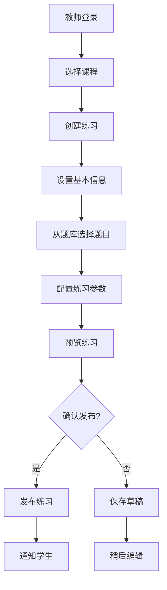
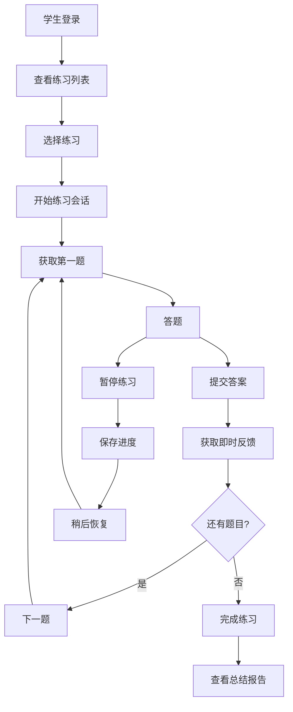
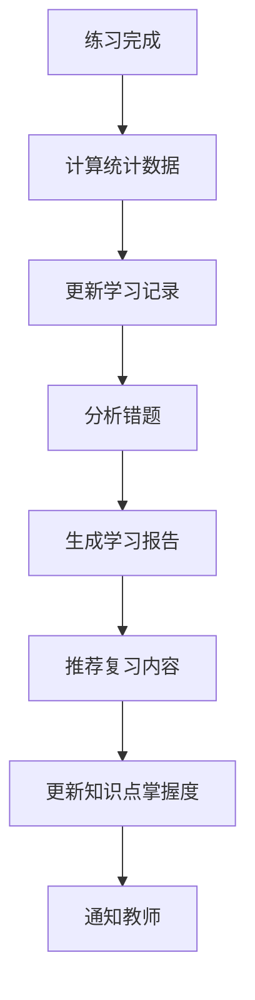

# T11练习系统架构设计文档

## 1. 整体架构图

### 1.1 系统分层架构


### 1.2 模块依赖关系图


## 2. 数据模型设计

### 2.1 数据模型关系图


### 2.2 详细数据模型定义

#### Practice (练习集)
```python
class Practice(db.Model):
    __tablename__ = 'practices'
    
    id = db.Column(db.String(36), primary_key=True, default=lambda: str(uuid.uuid4()))
    title = db.Column(db.String(200), nullable=False)
    description = db.Column(db.Text)
    creator_id = db.Column(db.String(36), db.ForeignKey('users.id'), nullable=False)
    course_id = db.Column(db.String(36), db.ForeignKey('courses.id'))
    status = db.Column(db.Enum('draft', 'published', 'archived'), default='draft')
    settings = db.Column(db.JSON)  # 练习配置参数
    created_at = db.Column(db.DateTime, default=datetime.utcnow)
    updated_at = db.Column(db.DateTime, default=datetime.utcnow, onupdate=datetime.utcnow)
    
    # 关系定义
    creator = db.relationship('User', backref='created_practices')
    course = db.relationship('Course', backref='practices')
    questions = db.relationship('PracticeQuestion', backref='practice', cascade='all, delete-orphan')
    sessions = db.relationship('PracticeSession', backref='practice', cascade='all, delete-orphan')
```

#### PracticeQuestion (练习题目关联)
```python
class PracticeQuestion(db.Model):
    __tablename__ = 'practice_questions'
    
    id = db.Column(db.String(36), primary_key=True, default=lambda: str(uuid.uuid4()))
    practice_id = db.Column(db.String(36), db.ForeignKey('practices.id'), nullable=False)
    question_id = db.Column(db.String(36), db.ForeignKey('questions.id'), nullable=False)
    order_index = db.Column(db.Integer, nullable=False)
    custom_settings = db.Column(db.JSON)  # 个性化配置
    created_at = db.Column(db.DateTime, default=datetime.utcnow)
    updated_at = db.Column(db.DateTime, default=datetime.utcnow, onupdate=datetime.utcnow)
    
    # 关系定义
    question = db.relationship('Question', backref='practice_questions')
    answers = db.relationship('PracticeAnswer', backref='practice_question', cascade='all, delete-orphan')
```

#### PracticeSession (练习会话)
```python
class PracticeSession(db.Model):
    __tablename__ = 'practice_sessions'
    
    id = db.Column(db.String(36), primary_key=True, default=lambda: str(uuid.uuid4()))
    practice_id = db.Column(db.String(36), db.ForeignKey('practices.id'), nullable=False)
    user_id = db.Column(db.String(36), db.ForeignKey('users.id'), nullable=False)
    status = db.Column(db.Enum('in_progress', 'paused', 'completed', 'abandoned'), default='in_progress')
    started_at = db.Column(db.DateTime, default=datetime.utcnow)
    completed_at = db.Column(db.DateTime)
    total_questions = db.Column(db.Integer, default=0)
    answered_questions = db.Column(db.Integer, default=0)
    correct_answers = db.Column(db.Integer, default=0)
    completion_rate = db.Column(db.Float, default=0.0)
    total_time_spent = db.Column(db.Integer, default=0)  # 秒数
    created_at = db.Column(db.DateTime, default=datetime.utcnow)
    updated_at = db.Column(db.DateTime, default=datetime.utcnow, onupdate=datetime.utcnow)
    
    # 关系定义
    user = db.relationship('User', backref='practice_sessions')
    answers = db.relationship('PracticeAnswer', backref='session', cascade='all, delete-orphan')
```

#### PracticeAnswer (练习答题记录)
```python
class PracticeAnswer(db.Model):
    __tablename__ = 'practice_answers'
    
    id = db.Column(db.String(36), primary_key=True, default=lambda: str(uuid.uuid4()))
    session_id = db.Column(db.String(36), db.ForeignKey('practice_sessions.id'), nullable=False)
    practice_question_id = db.Column(db.String(36), db.ForeignKey('practice_questions.id'), nullable=False)
    answer_content = db.Column(db.Text)
    is_correct = db.Column(db.Boolean)
    time_spent = db.Column(db.Integer, default=0)  # 秒数
    hint_used_count = db.Column(db.Integer, default=0)
    answered_at = db.Column(db.DateTime, default=datetime.utcnow)
    created_at = db.Column(db.DateTime, default=datetime.utcnow)
    updated_at = db.Column(db.DateTime, default=datetime.utcnow, onupdate=datetime.utcnow)
```

## 3. API接口规范设计

### 3.1 练习管理API

#### 3.1.1 练习CRUD接口
```
# 获取练习列表
GET /api/practices
Query参数: page, per_page, course_id, status, search
权限: PRACTICE_VIEW

# 创建练习
POST /api/practices
权限: PRACTICE_CREATE
请求体: {title, description, course_id, settings}

# 获取练习详情
GET /api/practices/<practice_id>
权限: PRACTICE_VIEW

# 更新练习
PUT /api/practices/<practice_id>
权限: PRACTICE_UPDATE
请求体: {title, description, settings}

# 删除练习
DELETE /api/practices/<practice_id>
权限: PRACTICE_DELETE

# 发布练习
POST /api/practices/<practice_id>/publish
权限: PRACTICE_MANAGE

# 归档练习
POST /api/practices/<practice_id>/archive
权限: PRACTICE_MANAGE
```

#### 3.1.2 练习题目管理接口
```
# 获取练习题目列表
GET /api/practices/<practice_id>/questions
权限: PRACTICE_VIEW

# 添加题目到练习
POST /api/practices/<practice_id>/questions
权限: PRACTICE_UPDATE
请求体: {question_id, order_index, custom_settings}

# 更新练习题目
PUT /api/practices/<practice_id>/questions/<question_id>
权限: PRACTICE_UPDATE
请求体: {order_index, custom_settings}

# 从练习中移除题目
DELETE /api/practices/<practice_id>/questions/<question_id>
权限: PRACTICE_UPDATE

# 批量添加题目
POST /api/practices/<practice_id>/questions/batch
权限: PRACTICE_UPDATE
请求体: {question_ids: [], auto_order: boolean}
```

### 3.2 在线练习API

#### 3.2.1 练习会话管理
```
# 开始练习
POST /api/practices/<practice_id>/start
权限: PRACTICE_PARTICIPATE
响应: {session_id, practice_info, first_question}

# 获取练习会话状态
GET /api/practice-sessions/<session_id>
权限: PRACTICE_PARTICIPATE
响应: {session_info, current_progress, questions}

# 暂停练习
POST /api/practice-sessions/<session_id>/pause
权限: PRACTICE_PARTICIPATE

# 恢复练习
POST /api/practice-sessions/<session_id>/resume
权限: PRACTICE_PARTICIPATE

# 完成练习
POST /api/practice-sessions/<session_id>/complete
权限: PRACTICE_PARTICIPATE
响应: {final_score, statistics, review_data}
```

#### 3.2.2 答题接口
```
# 提交单题答案
POST /api/practice-sessions/<session_id>/answers
权限: PRACTICE_PARTICIPATE
请求体: {practice_question_id, answer_content, time_spent}
响应: {is_correct, explanation, next_question}

# 获取题目详情
GET /api/practice-sessions/<session_id>/questions/<question_id>
权限: PRACTICE_PARTICIPATE
响应: {question_data, hints, custom_settings}

# 使用提示
POST /api/practice-sessions/<session_id>/questions/<question_id>/hint
权限: PRACTICE_PARTICIPATE
响应: {hint_content, remaining_hints}

# 跳过题目
POST /api/practice-sessions/<session_id>/questions/<question_id>/skip
权限: PRACTICE_PARTICIPATE
```

### 3.3 进度跟踪API

#### 3.3.1 学习统计接口
```
# 获取学生练习历史
GET /api/users/<user_id>/practice-history
权限: PRACTICE_VIEW_PROGRESS
Query参数: page, per_page, course_id, date_range

# 获取练习统计报告
GET /api/practices/<practice_id>/statistics
权限: PRACTICE_VIEW_STATS
响应: {completion_rate, average_score, time_analysis}

# 获取学生个人统计
GET /api/users/<user_id>/practice-statistics
权限: PRACTICE_VIEW_PROGRESS
响应: {total_practices, completion_rate, strengths, weaknesses}

# 获取错题集
GET /api/users/<user_id>/wrong-questions
权限: PRACTICE_VIEW_PROGRESS
Query参数: course_id, question_type, difficulty

# 生成复习练习
POST /api/users/<user_id>/generate-review-practice
权限: PRACTICE_PARTICIPATE
请求体: {question_count, difficulty_range, question_types}
```

## 4. 与现有系统的集成方案

### 4.1 认证系统集成
- **复用T05认证中间件**: 使用现有的@require_auth装饰器
- **JWT令牌验证**: 直接使用现有的JWT验证机制
- **会话管理**: 复用现有的会话管理功能

### 4.2 权限系统集成
- **权限常量定义**: 在permissions.py中添加练习相关权限
- **权限装饰器**: 使用现有的@require_permission装饰器
- **角色权限映射**: 扩展现有的角色权限配置

```python
# 新增权限常量
PRACTICE_VIEW = 'practice:view'
PRACTICE_CREATE = 'practice:create'
PRACTICE_UPDATE = 'practice:update'
PRACTICE_DELETE = 'practice:delete'
PRACTICE_MANAGE = 'practice:manage'
PRACTICE_PARTICIPATE = 'practice:participate'
PRACTICE_VIEW_PROGRESS = 'practice:view_progress'
PRACTICE_VIEW_STATS = 'practice:view_stats'
```

### 4.3 题库系统集成
- **直接引用Question模型**: 通过外键关联现有题目
- **题型支持**: 支持所有现有题型(multiple_choice, true_false, fill_blank, essay, matching)
- **媒体文件**: 复用现有的媒体文件管理机制
- **答案验证**: 使用Question模型的验证逻辑

### 4.4 课程系统集成
- **课程关联**: Practice模型关联Course模型
- **权限继承**: 练习权限基于课程权限
- **学生范围**: 基于课程选课关系确定练习可见性

### 4.5 用户系统集成
- **用户角色**: 复用现有的admin/teacher/student角色
- **权限控制**: 基于用户角色分配练习权限
- **数据关联**: 练习创建者、参与者关联User模型

## 5. 业务流程设计

### 5.1 练习创建流程


### 5.2 在线练习流程


### 5.3 进度跟踪流程


## 6. 权限控制设计

### 6.1 角色权限矩阵

| 功能 | Admin | Teacher | Student |
|------|-------|---------|----------|
| 查看所有练习 | ✓ | ✓(自己创建的) | ✓(分配给自己的) |
| 创建练习 | ✓ | ✓ | ✗ |
| 编辑练习 | ✓ | ✓(自己创建的) | ✗ |
| 删除练习 | ✓ | ✓(自己创建的) | ✗ |
| 发布练习 | ✓ | ✓(自己创建的) | ✗ |
| 参与练习 | ✓ | ✓ | ✓ |
| 查看学生进度 | ✓ | ✓(自己课程的) | ✓(自己的) |
| 查看统计报告 | ✓ | ✓(自己课程的) | ✓(自己的) |

### 6.2 权限验证逻辑

#### 练习访问权限
```python
def can_access_practice(user, practice):
    if user.role == 'admin':
        return True
    elif user.role == 'teacher':
        return practice.creator_id == user.id or user.id in practice.course.teachers
    elif user.role == 'student':
        return user.id in practice.course.students and practice.status == 'published'
    return False
```

#### 练习管理权限
```python
def can_manage_practice(user, practice):
    if user.role == 'admin':
        return True
    elif user.role == 'teacher':
        return practice.creator_id == user.id
    return False
```

### 6.3 数据访问控制
- **行级安全**: 基于用户角色和关联关系过滤数据
- **字段级安全**: 敏感字段根据权限显示
- **操作级安全**: 关键操作需要额外权限验证

## 7. 异常处理策略

### 7.1 业务异常处理
- **练习不存在**: 返回404错误
- **权限不足**: 返回403错误
- **会话过期**: 自动保存进度，提示重新登录
- **并发冲突**: 使用乐观锁处理数据冲突

### 7.2 系统异常处理
- **数据库连接失败**: 返回503错误，记录日志
- **文件上传失败**: 返回具体错误信息
- **网络超时**: 自动重试机制

### 7.3 用户体验优化
- **自动保存**: 定期保存答题进度
- **断线重连**: 支持网络中断后恢复
- **错误提示**: 友好的错误信息显示

## 8. 性能优化设计

### 8.1 数据库优化
- **索引设计**: 为常用查询字段添加索引
- **查询优化**: 使用JOIN减少N+1查询问题
- **分页查询**: 大数据量列表使用分页

### 8.2 缓存策略
- **练习数据缓存**: 缓存练习基本信息
- **题目内容缓存**: 缓存题目内容和答案
- **统计数据缓存**: 缓存计算密集的统计结果

### 8.3 并发控制
- **会话隔离**: 每个练习会话独立处理
- **答案提交**: 使用队列处理高并发答案提交
- **统计计算**: 异步计算统计数据

## 9. 扩展性设计

### 9.1 功能扩展接口
- **插件机制**: 支持自定义题型插件
- **评分算法**: 可配置的评分策略
- **推荐算法**: 可扩展的智能推荐

### 9.2 数据扩展
- **自定义字段**: settings字段支持扩展配置
- **元数据存储**: 支持存储额外的业务数据
- **版本控制**: 支持练习内容的版本管理

### 9.3 集成扩展
- **第三方集成**: 预留第三方服务集成接口
- **API扩展**: 支持自定义API端点
- **事件系统**: 支持业务事件的订阅和处理

---

**设计原则总结**:
1. **一致性**: 与现有系统架构保持一致
2. **复用性**: 最大化复用现有组件和模式
3. **扩展性**: 为未来功能扩展预留接口
4. **性能**: 考虑高并发和大数据量场景
5. **安全性**: 完善的权限控制和数据保护
6. **用户体验**: 流畅的练习流程和友好的交互