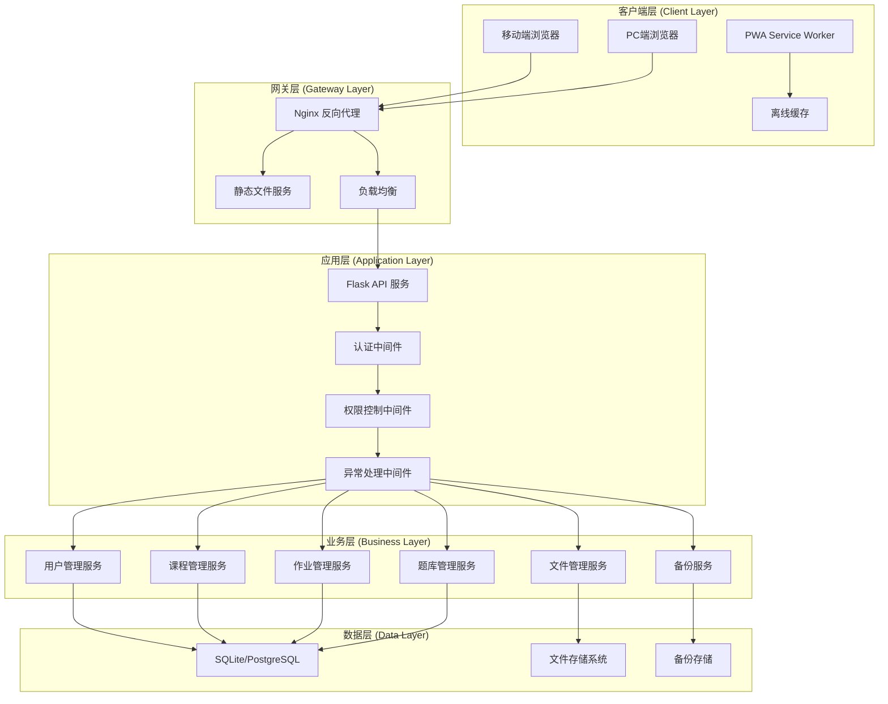
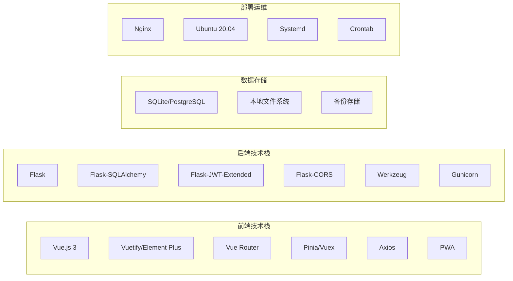
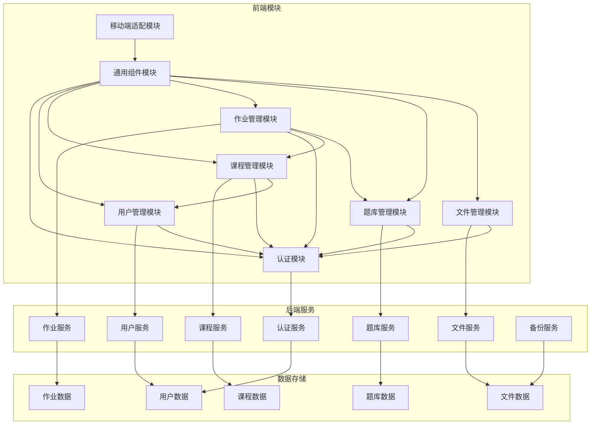
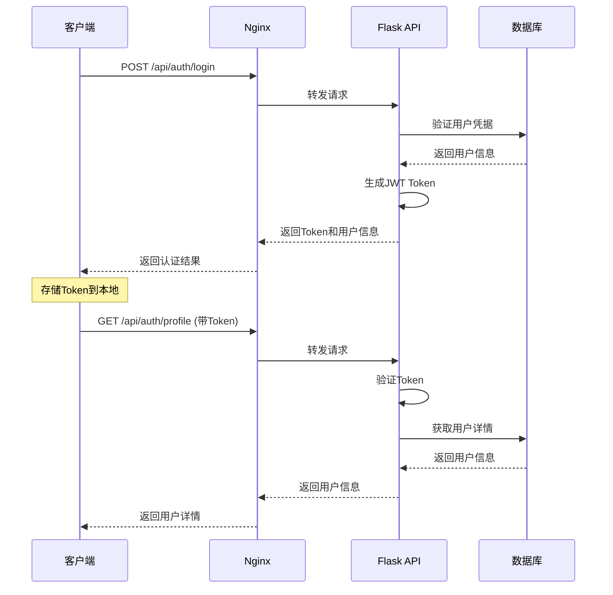
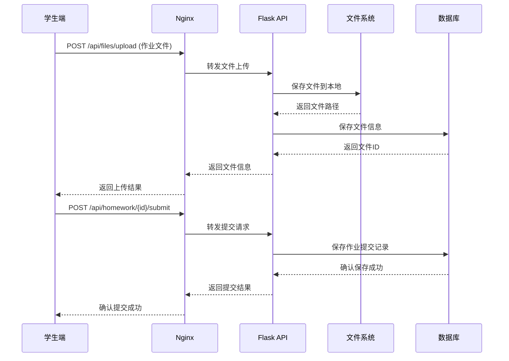
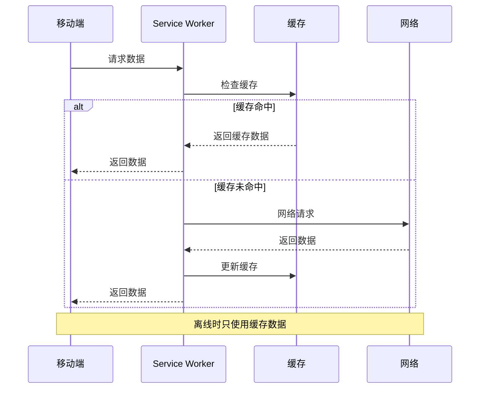

# 英语家教管理系统 - 架构设计文档 (DESIGN)

## 1. 整体架构图

### 1.1 系统总体架构


### 1.2 技术架构栈


## 2. 分层设计和核心组件

### 2.1 表现层 (Presentation Layer)

#### 2.1.1 Vue.js 前端应用
```
src/
├── components/          # 通用组件
│   ├── common/         # 基础组件
│   ├── forms/          # 表单组件
│   └── mobile/         # 移动端专用组件
├── views/              # 页面视图
│   ├── auth/           # 认证相关页面
│   ├── dashboard/      # 仪表板
│   ├── courses/        # 课程管理
│   ├── homework/       # 作业管理
│   ├── questions/      # 题库管理
│   └── users/          # 用户管理
├── router/             # 路由配置
├── store/              # 状态管理
├── utils/              # 工具函数
├── api/                # API 接口
└── assets/             # 静态资源
```

#### 2.1.2 移动端适配组件
- **响应式布局组件**: 自适应不同屏幕尺寸
- **触屏交互组件**: 手势支持、触摸反馈
- **文件上传组件**: 支持拍照、录音、录像
- **PWA组件**: 离线缓存、推送通知

### 2.2 应用层 (Application Layer)

#### 2.2.1 Flask API 服务架构
```
api/
├── app.py              # 应用入口
├── config.py           # 配置管理
├── models/             # 数据模型
│   ├── user.py
│   ├── course.py
│   ├── homework.py
│   └── question.py
├── routes/             # 路由控制器
│   ├── auth.py
│   ├── users.py
│   ├── courses.py
│   ├── homework.py
│   ├── questions.py
│   └── files.py
├── services/           # 业务逻辑服务
├── middleware/         # 中间件
├── utils/              # 工具函数
└── tests/              # 测试文件
```

#### 2.2.2 核心中间件
- **认证中间件**: JWT token验证
- **权限控制中间件**: RBAC权限检查
- **异常处理中间件**: 统一错误处理
- **日志中间件**: 请求日志记录
- **CORS中间件**: 跨域请求处理

### 2.3 业务层 (Business Layer)

#### 2.3.1 用户管理服务
- **认证服务**: 登录、登出、token管理
- **用户服务**: CRUD操作、角色管理
- **权限服务**: 权限验证、角色分配

#### 2.3.2 课程管理服务
- **课程服务**: 课程CRUD、时间安排
- **选课服务**: 学生选课、退课
- **分组服务**: 一对多课程分组管理

#### 2.3.3 作业管理服务
- **作业服务**: 作业发布、管理
- **提交服务**: 作业提交、文件处理
- **批改服务**: 作业评分、反馈

#### 2.3.4 题库管理服务
- **题目服务**: 题目CRUD、分类管理
- **抽题服务**: 随机抽题、条件筛选
- **试卷服务**: 自动生成试卷

#### 2.3.5 文件管理服务
- **上传服务**: 文件上传、类型验证
- **存储服务**: 文件存储、路径管理
- **下载服务**: 文件下载、权限控制

### 2.4 数据层 (Data Layer)

#### 2.4.1 数据库设计
- **用户表**: 用户基本信息、角色权限
- **课程表**: 课程信息、时间安排
- **作业表**: 作业内容、截止时间
- **提交表**: 作业提交、评分反馈
- **题库表**: 题目内容、分类标签
- **试卷表**: 试卷结构、题目组合

#### 2.4.2 文件存储
- **作业文件**: 图片、视频、音频
- **题库资源**: 题目附件、参考资料
- **备份文件**: 数据库备份、文件备份

## 3. 模块依赖关系图



## 4. 接口契约定义

### 4.1 API 接口规范

#### 4.1.1 通用响应格式
```json
{
  "code": 200,
  "message": "success",
  "data": {},
  "timestamp": "2024-01-01T00:00:00Z"
}
```

#### 4.1.2 错误响应格式
```json
{
  "code": 400,
  "message": "参数错误",
  "error": "详细错误信息",
  "timestamp": "2024-01-01T00:00:00Z"
}
```

### 4.2 核心接口定义

#### 4.2.1 认证接口
```typescript
// 登录接口
POST /api/auth/login
Request: {
  username: string;
  password: string;
}
Response: {
  token: string;
  user: UserInfo;
  expires_in: number;
}

// 获取用户信息
GET /api/auth/profile
Headers: { Authorization: "Bearer <token>" }
Response: {
  user: UserInfo;
}
```

#### 4.2.2 用户管理接口
```typescript
// 用户信息类型
interface UserInfo {
  id: number;
  username: string;
  name: string;
  email: string;
  role: 'admin' | 'teacher' | 'student';
  contact_info?: string;
  teacher_id?: number;
  created_at: string;
}

// 获取用户列表
GET /api/users?role=student&page=1&limit=10
Response: {
  users: UserInfo[];
  total: number;
  page: number;
  limit: number;
}

// 创建用户
POST /api/users
Request: {
  username: string;
  password: string;
  name: string;
  email: string;
  role: string;
  contact_info?: string;
  teacher_id?: number;
}
```

#### 4.2.3 课程管理接口
```typescript
// 课程信息类型
interface CourseInfo {
  id: number;
  name: string;
  course_type: 'one_to_one' | 'one_to_many';
  max_students: number;
  schedule: string;
  teacher_id: number;
  teacher_name: string;
  enrolled_count: number;
  created_at: string;
}

// 获取课程列表
GET /api/courses?teacher_id=1
Response: {
  courses: CourseInfo[];
}

// 创建课程
POST /api/courses
Request: {
  name: string;
  course_type: string;
  max_students: number;
  schedule: string;
}
```

#### 4.2.4 作业管理接口
```typescript
// 作业信息类型
interface HomeworkInfo {
  id: number;
  title: string;
  description: string;
  homework_type: 'oral' | 'question_bank' | 'mixed';
  course_id: number;
  course_name: string;
  due_date: string;
  created_at: string;
  submission_count: number;
}

// 作业提交类型
interface HomeworkSubmission {
  id: number;
  homework_id: number;
  user_id: number;
  user_name: string;
  content: string;
  file_paths: string[];
  score?: number;
  feedback?: string;
  status: 'pending' | 'submitted' | 'graded';
  submitted_at: string;
  graded_at?: string;
}

// 获取作业列表
GET /api/homework?course_id=1
Response: {
  homework: HomeworkInfo[];
}

// 提交作业
POST /api/homework/{id}/submit
Request: {
  content: string;
  file_ids: number[];
}
```

#### 4.2.5 题库管理接口
```typescript
// 题目信息类型
interface QuestionInfo {
  id: number;
  title: string;
  content: string;
  question_type: string;
  difficulty: 'easy' | 'medium' | 'hard';
  tags: string[];
  teacher_id: number;
  created_at: string;
}

// 随机抽题
POST /api/questions/random
Request: {
  count: number;
  difficulty?: string;
  tags?: string[];
}
Response: {
  questions: QuestionInfo[];
}
```

#### 4.2.6 文件管理接口
```typescript
// 文件上传
POST /api/files/upload
Request: FormData (multipart/form-data)
Response: {
  file_id: number;
  filename: string;
  file_path: string;
  file_size: number;
  mime_type: string;
}

// 文件下载
GET /api/files/{id}
Response: File Stream
```

## 5. 数据流向图

### 5.1 用户认证流程


### 5.2 作业提交流程


### 5.3 移动端PWA数据流


## 6. 异常处理策略

### 6.1 前端异常处理

#### 6.1.1 网络异常处理
```typescript
// API请求拦截器
axios.interceptors.response.use(
  response => response,
  error => {
    if (error.code === 'NETWORK_ERROR') {
      // 网络错误，尝试使用缓存数据
      return getCachedData(error.config);
    }
    if (error.response?.status === 401) {
      // 认证失效，跳转登录页
      router.push('/login');
    }
    return Promise.reject(error);
  }
);
```

#### 6.1.2 移动端特殊异常
```typescript
// 文件上传异常处理
const handleFileUpload = async (file: File) => {
  try {
    // 检查文件大小
    if (file.size > 50 * 1024 * 1024) {
      throw new Error('文件大小不能超过50MB');
    }
    
    // 检查网络状态
    if (!navigator.onLine) {
      // 离线状态，保存到本地待上传
      await saveToLocalStorage(file);
      showMessage('网络离线，文件将在网络恢复后自动上传');
      return;
    }
    
    await uploadFile(file);
  } catch (error) {
    handleUploadError(error);
  }
};
```

### 6.2 后端异常处理

#### 6.2.1 全局异常处理器
```python
from flask import Flask, jsonify
from werkzeug.exceptions import HTTPException

app = Flask(__name__)

@app.errorhandler(Exception)
def handle_exception(e):
    # 记录异常日志
    app.logger.error(f"Unhandled exception: {str(e)}", exc_info=True)
    
    if isinstance(e, HTTPException):
        return jsonify({
            'code': e.code,
            'message': e.description,
            'timestamp': datetime.utcnow().isoformat()
        }), e.code
    
    # 未知异常，返回通用错误
    return jsonify({
        'code': 500,
        'message': '服务器内部错误',
        'timestamp': datetime.utcnow().isoformat()
    }), 500

@app.errorhandler(ValidationError)
def handle_validation_error(e):
    return jsonify({
        'code': 400,
        'message': '参数验证失败',
        'error': str(e),
        'timestamp': datetime.utcnow().isoformat()
    }), 400
```

#### 6.2.2 业务异常处理
```python
class BusinessException(Exception):
    def __init__(self, message, code=400):
        self.message = message
        self.code = code
        super().__init__(message)

class AuthenticationError(BusinessException):
    def __init__(self, message="认证失败"):
        super().__init__(message, 401)

class PermissionError(BusinessException):
    def __init__(self, message="权限不足"):
        super().__init__(message, 403)

class ResourceNotFoundError(BusinessException):
    def __init__(self, message="资源不存在"):
        super().__init__(message, 404)
```

### 6.3 数据库异常处理

#### 6.3.1 连接异常处理
```python
from sqlalchemy.exc import OperationalError, IntegrityError

def handle_db_operation(func):
    def wrapper(*args, **kwargs):
        try:
            return func(*args, **kwargs)
        except OperationalError as e:
            # 数据库连接异常
            app.logger.error(f"Database connection error: {str(e)}")
            raise BusinessException("数据库连接失败，请稍后重试", 503)
        except IntegrityError as e:
            # 数据完整性异常
            app.logger.error(f"Database integrity error: {str(e)}")
            raise BusinessException("数据操作失败，请检查输入数据", 400)
    return wrapper
```

### 6.4 文件操作异常处理

#### 6.4.1 文件上传异常
```python
import os
from werkzeug.utils import secure_filename

def handle_file_upload(file):
    try:
        # 检查文件类型
        allowed_extensions = {'png', 'jpg', 'jpeg', 'gif', 'mp4', 'mp3', 'wav'}
        if not allowed_file(file.filename, allowed_extensions):
            raise BusinessException("不支持的文件类型")
        
        # 检查文件大小
        if file.content_length > 50 * 1024 * 1024:  # 50MB
            raise BusinessException("文件大小不能超过50MB")
        
        # 生成安全的文件名
        filename = secure_filename(file.filename)
        file_path = os.path.join(app.config['UPLOAD_FOLDER'], filename)
        
        # 确保目录存在
        os.makedirs(os.path.dirname(file_path), exist_ok=True)
        
        # 保存文件
        file.save(file_path)
        return file_path
        
    except OSError as e:
        app.logger.error(f"File system error: {str(e)}")
        raise BusinessException("文件保存失败")
    except Exception as e:
        app.logger.error(f"File upload error: {str(e)}")
        raise BusinessException("文件上传失败")
```

### 6.5 系统监控和告警

#### 6.5.1 性能监控
```python
import time
import psutil
from functools import wraps

def monitor_performance(func):
    @wraps(func)
    def wrapper(*args, **kwargs):
        start_time = time.time()
        start_memory = psutil.Process().memory_info().rss
        
        try:
            result = func(*args, **kwargs)
            return result
        finally:
            end_time = time.time()
            end_memory = psutil.Process().memory_info().rss
            
            execution_time = end_time - start_time
            memory_usage = end_memory - start_memory
            
            # 记录性能指标
            app.logger.info(f"Function {func.__name__} executed in {execution_time:.2f}s, memory usage: {memory_usage} bytes")
            
            # 性能告警
            if execution_time > 5.0:  # 超过5秒
                app.logger.warning(f"Slow query detected: {func.__name__} took {execution_time:.2f}s")
            
            if memory_usage > 100 * 1024 * 1024:  # 超过100MB
                app.logger.warning(f"High memory usage detected: {func.__name__} used {memory_usage} bytes")
    
    return wrapper
```

---

**文档状态**: 架构设计完成  
**创建时间**: 2024年当前时间  
**下一阶段**: 进入原子化阶段（Atomize）  
**设计原则**: 轻量级、模块化、移动优先、性能优化