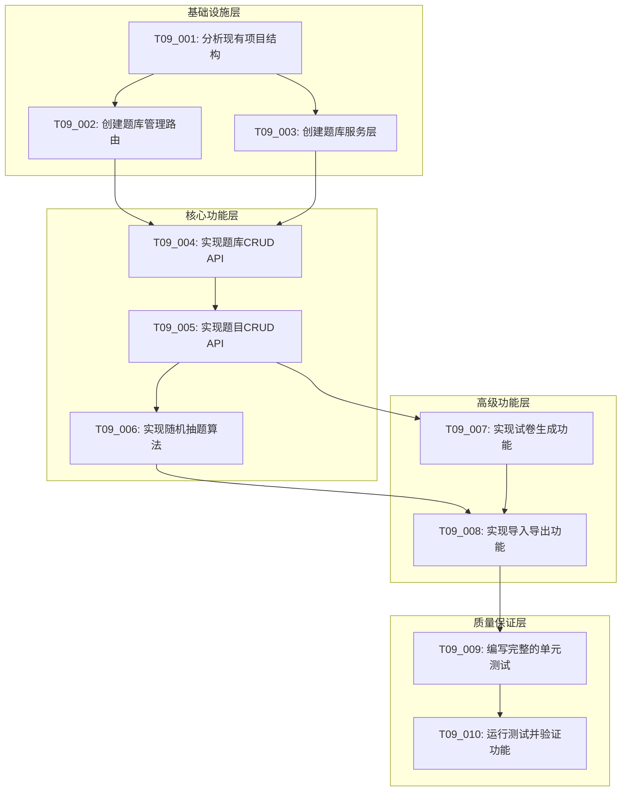

# T09题库管理API - 原子任务拆分 (TASK)

## 1. 任务拆分概述

基于DESIGN文档的架构设计，将T09题库管理API拆分为以下原子任务，确保每个任务具有明确的边界、可独立验证且复杂度可控。

### 1.1 拆分原则
- **原子性**: 每个任务功能单一，不可再分
- **独立性**: 任务可独立开发和测试
- **可验证性**: 每个任务有明确的验收标准
- **复杂度可控**: 单个任务开发时间不超过1-2天

### 1.2 任务分类
- **基础设施任务**: 路由文件创建、服务层搭建
- **核心功能任务**: 题库CRUD、题目CRUD、抽题算法
- **高级功能任务**: 试卷生成、导入导出
- **质量保证任务**: 单元测试、集成测试

## 2. 任务依赖关系图

## 3. 原子任务详细定义

### T09_001: 分析现有项目结构

#### 输入契约
- **前置依赖**: T08作业管理API完成
- **输入数据**: 现有项目代码结构
- **环境依赖**: 项目源码访问权限

#### 输出契约
- **交付物**: 
  - 现有Question和QuestionBank模型分析报告
  - T06-T08实现模式总结
  - 权限系统集成方案
  - 数据库索引优化建议
- **验收标准**:
  - [ ] 完成现有模型结构分析
  - [ ] 确认权限系统集成方案
  - [ ] 明确代码规范和风格要求
  - [ ] 确定数据库优化策略

#### 实现约束
- **技术栈**: 基于现有Flask + SQLAlchemy架构
- **代码规范**: 遵循项目现有PEP8规范
- **质量要求**: 分析报告完整准确

#### 依赖关系
- **后置任务**: T09_002, T09_003
- **并行任务**: 无

---

### T09_002: 创建题库管理路由

#### 输入契约
- **前置依赖**: T09_001
- **输入数据**: API接口设计规范
- **环境依赖**: Flask, Flask-JWT-Extended

#### 输出契约
- **交付物**:
  - `app/routes/questions.py` 路由文件
  - 题库管理相关路由定义
  - JWT认证和权限验证集成
  - 统一的错误处理机制
- **验收标准**:
  - [ ] 路由文件创建成功
  - [ ] 基础路由结构定义完成
  - [ ] JWT认证集成正常
  - [ ] 错误处理机制统一

#### 实现约束
- **技术栈**: Flask Blueprint, JWT认证
- **接口规范**: RESTful API设计
- **质量要求**: 代码结构清晰，注释完整

#### 依赖关系
- **后置任务**: T09_004
- **并行任务**: T09_003

---

### T09_003: 创建题库服务层

#### 输入契约
- **前置依赖**: T09_001
- **输入数据**: 业务逻辑设计
- **环境依赖**: SQLAlchemy, 现有模型

#### 输出契约
- **交付物**:
  - `app/services/question_service.py` 服务文件
  - 题库业务逻辑封装
  - 数据访问层抽象
  - 业务规则验证
- **验收标准**:
  - [ ] 服务层文件创建成功
  - [ ] 业务逻辑封装完整
  - [ ] 数据访问接口定义清晰
  - [ ] 业务规则验证有效

#### 实现约束
- **技术栈**: Python类设计, SQLAlchemy ORM
- **设计模式**: 服务层模式
- **质量要求**: 高内聚低耦合

#### 依赖关系
- **后置任务**: T09_004, T09_005
- **并行任务**: T09_002

---

### T09_004: 实现题库CRUD API

#### 输入契约
- **前置依赖**: T09_002, T09_003
- **输入数据**: 题库管理需求
- **环境依赖**: Flask路由, 服务层

#### 输出契约
- **交付物**:
  - 题库创建API: `POST /api/question-banks`
  - 题库列表API: `GET /api/question-banks`
  - 题库详情API: `GET /api/question-banks/<id>`
  - 题库更新API: `PUT /api/question-banks/<id>`
  - 题库删除API: `DELETE /api/question-banks/<id>`
  - 题库统计API: `GET /api/question-banks/<id>/statistics`
- **验收标准**:
  - [ ] 所有CRUD操作正常工作
  - [ ] 权限控制正确实施
  - [ ] 数据验证规则有效
  - [ ] 错误处理完善
  - [ ] 响应格式统一

#### 实现约束
- **技术栈**: Flask, SQLAlchemy, JWT
- **API规范**: RESTful设计原则
- **质量要求**: 完整的参数验证和错误处理

#### 依赖关系
- **后置任务**: T09_005
- **并行任务**: 无

---

### T09_005: 实现题目CRUD API

#### 输入契约
- **前置依赖**: T09_004
- **输入数据**: 题目管理需求
- **环境依赖**: 题库API基础

#### 输出契约
- **交付物**:
  - 题目创建API: `POST /api/questions`
  - 题目列表API: `GET /api/questions`
  - 题目详情API: `GET /api/questions/<id>`
  - 题目更新API: `PUT /api/questions/<id>`
  - 题目删除API: `DELETE /api/questions/<id>`
  - 批量创建API: `POST /api/questions/batch`
  - 题目搜索API: `GET /api/questions/search`
- **验收标准**:
  - [ ] 所有题目CRUD操作正常
  - [ ] 支持多种题型创建
  - [ ] 标签系统正常工作
  - [ ] 媒体文件关联功能
  - [ ] 批量操作功能正常
  - [ ] 搜索功能准确

#### 实现约束
- **技术栈**: Flask, SQLAlchemy, 文件上传
- **业务规则**: 题型验证, 答案格式检查
- **质量要求**: 支持复杂查询和过滤

#### 依赖关系
- **后置任务**: T09_006, T09_007
- **并行任务**: 无

---

### T09_006: 实现随机抽题算法

#### 输入契约
- **前置依赖**: T09_005
- **输入数据**: 抽题需求和算法设计
- **环境依赖**: 题目数据基础

#### 输出契约
- **交付物**:
  - 随机抽题API: `POST /api/questions/random`
  - 加权随机算法实现
  - 避重复抽题机制
  - 抽题历史记录
  - 抽题结果缓存
- **验收标准**:
  - [ ] 基础随机抽题功能正常
  - [ ] 支持多维度抽题条件
  - [ ] 避重复机制有效
  - [ ] 抽题算法性能优良
  - [ ] 缓存机制工作正常

#### 实现约束
- **技术栈**: Python算法, Redis缓存
- **算法要求**: 时间复杂度O(n), 空间复杂度O(1)
- **质量要求**: 抽题结果无重复, 分布均匀

#### 依赖关系
- **后置任务**: T09_007, T09_008
- **并行任务**: 无

---

### T09_007: 实现试卷生成功能

#### 输入契约
- **前置依赖**: T09_005, T09_006
- **输入数据**: 试卷生成需求
- **环境依赖**: 抽题算法基础

#### 输出契约
- **交付物**:
  - 试卷生成API: `POST /api/question-banks/<id>/generate-paper`
  - 试卷模板管理
  - 智能题目分配算法
  - 分值计算和验证
  - 试卷结构优化
- **验收标准**:
  - [ ] 试卷生成功能正常
  - [ ] 支持自定义试卷结构
  - [ ] 题目分配算法合理
  - [ ] 分值计算准确
  - [ ] 生成速度满足要求

#### 实现约束
- **技术栈**: Python算法, 数学计算
- **算法要求**: 贪心算法优化分配
- **质量要求**: 生成时间 < 2秒

#### 依赖关系
- **后置任务**: T09_008
- **并行任务**: 无

---

### T09_008: 实现导入导出功能

#### 输入契约
- **前置依赖**: T09_006, T09_007
- **输入数据**: 数据导入导出需求
- **环境依赖**: 文件处理库

#### 输出契约
- **交付物**:
  - Excel导入API: `POST /api/question-banks/<id>/import`
  - Excel导出API: `GET /api/question-banks/<id>/export`
  - JSON导入导出支持
  - 数据验证和错误处理
  - 批量操作优化
- **验收标准**:
  - [ ] Excel导入导出功能正常
  - [ ] JSON格式支持完整
  - [ ] 数据验证规则有效
  - [ ] 错误处理机制完善
  - [ ] 支持大批量数据处理

#### 实现约束
- **技术栈**: pandas, openpyxl, JSON
- **文件限制**: 最大1000题目/次
- **质量要求**: 数据完整性保证

#### 依赖关系
- **后置任务**: T09_009
- **并行任务**: 无

---

### T09_009: 编写完整的单元测试

#### 输入契约
- **前置依赖**: T09_008
- **输入数据**: 所有实现的功能
- **环境依赖**: pytest, 测试数据

#### 输出契约
- **交付物**:
  - `tests/test_question_bank_routes.py` - 题库API测试
  - `tests/test_question_routes.py` - 题目API测试
  - `tests/test_random_question_service.py` - 抽题算法测试
  - `tests/test_paper_generation.py` - 试卷生成测试
  - `tests/test_import_export.py` - 导入导出测试
  - 测试数据文件和fixtures
- **验收标准**:
  - [ ] 所有API接口测试覆盖
  - [ ] 边界条件测试完整
  - [ ] 异常情况测试充分
  - [ ] 权限控制测试有效
  - [ ] 测试覆盖率 > 90%

#### 实现约束
- **技术栈**: pytest, unittest, mock
- **测试策略**: 单元测试 + 集成测试
- **质量要求**: 测试用例独立, 可重复执行

#### 依赖关系
- **后置任务**: T09_010
- **并行任务**: 无

---

### T09_010: 运行测试并验证功能

#### 输入契约
- **前置依赖**: T09_009
- **输入数据**: 完整的测试套件
- **环境依赖**: 测试环境配置

#### 输出契约
- **交付物**:
  - 测试执行报告
  - 功能验证报告
  - 性能测试结果
  - 集成测试验证
  - 问题修复记录
- **验收标准**:
  - [ ] 所有单元测试通过
  - [ ] 集成测试验证成功
  - [ ] 性能指标满足要求
  - [ ] 功能完整性确认
  - [ ] 与现有系统集成无冲突

#### 实现约束
- **技术栈**: pytest, 性能测试工具
- **验证标准**: 功能正确性, 性能达标
- **质量要求**: 零缺陷交付

#### 依赖关系
- **后置任务**: 无（任务完成）
- **并行任务**: 无

## 4. 任务优先级和时间估算

### 4.1 高优先级任务（核心功能）

| 任务ID | 任务名称 | 预估时间 | 复杂度 |
|--------|----------|----------|--------|
| T09_001 | 分析现有项目结构 | 0.5天 | 低 |
| T09_002 | 创建题库管理路由 | 0.5天 | 低 |
| T09_003 | 创建题库服务层 | 0.5天 | 中 |
| T09_004 | 实现题库CRUD API | 1天 | 中 |
| T09_005 | 实现题目CRUD API | 1.5天 | 高 |
| T09_009 | 编写完整的单元测试 | 1天 | 中 |
| T09_010 | 运行测试并验证功能 | 0.5天 | 低 |

### 4.2 中优先级任务（高级功能）

| 任务ID | 任务名称 | 预估时间 | 复杂度 |
|--------|----------|----------|--------|
| T09_006 | 实现随机抽题算法 | 1天 | 高 |
| T09_007 | 实现试卷生成功能 | 1天 | 高 |
| T09_008 | 实现导入导出功能 | 1天 | 中 |

### 4.3 总体时间估算

- **总开发时间**: 7.5天
- **关键路径**: T09_001 → T09_002/T09_003 → T09_004 → T09_005 → T09_006/T09_007 → T09_008 → T09_009 → T09_010
- **并行开发机会**: T09_002和T09_003可并行, T09_006和T09_007可并行

## 5. 风险评估和缓解策略

### 5.1 技术风险

**随机抽题算法复杂度**:
- 风险: 算法性能不达标
- 缓解: 提前进行算法原型验证
- 应急: 使用简化版本算法

**大批量数据导入性能**:
- 风险: 导入速度过慢
- 缓解: 实现分批处理机制
- 应急: 限制单次导入数量

### 5.2 集成风险

**与现有系统权限冲突**:
- 风险: 权限验证不一致
- 缓解: 严格遵循现有权限模式
- 应急: 独立实现权限验证

**数据库性能影响**:
- 风险: 新功能影响现有性能
- 缓解: 添加必要的数据库索引
- 应急: 实现查询优化

### 5.3 质量风险

**测试覆盖不足**:
- 风险: 功能缺陷未发现
- 缓解: 制定详细测试计划
- 应急: 增加手工测试验证

## 6. 验收标准总览

### 6.1 功能完整性
- ✅ 题库管理功能完整（CRUD + 统计）
- ✅ 题目管理功能完整（CRUD + 搜索 + 批量）
- ✅ 随机抽题功能正常（多维度 + 避重复）
- ✅ 试卷生成功能正常（模板 + 智能分配）
- ✅ 导入导出功能正常（Excel + JSON）

### 6.2 技术质量
- ✅ 代码规范符合项目标准
- ✅ API设计遵循RESTful原则
- ✅ 权限控制集成正确
- ✅ 错误处理机制完善
- ✅ 性能指标满足要求

### 6.3 测试质量
- ✅ 单元测试覆盖率 > 90%
- ✅ 集成测试验证通过
- ✅ 边界条件测试完整
- ✅ 异常情况处理验证
- ✅ 性能测试达标

### 6.4 集成质量
- ✅ 与T05认证系统集成无冲突
- ✅ 与T06用户管理系统集成正常
- ✅ 与现有数据库模型兼容
- ✅ 与文件管理系统集成正常
- ✅ 不影响现有系统性能

## 7. 交付清单

### 7.1 代码交付物
- `app/routes/questions.py` - 题库管理路由
- `app/services/question_service.py` - 题库业务服务
- `app/utils/question_algorithms.py` - 抽题和生成算法
- `app/utils/import_export.py` - 导入导出工具

### 7.2 测试交付物
- `tests/test_question_bank_routes.py` - 题库API测试
- `tests/test_question_routes.py` - 题目API测试
- `tests/test_random_question_service.py` - 抽题算法测试
- `tests/test_paper_generation.py` - 试卷生成测试
- `tests/test_import_export.py` - 导入导出测试
- `tests/fixtures/` - 测试数据文件

### 7.3 文档交付物
- API接口文档更新
- 数据库索引优化记录
- 性能测试报告
- 集成测试报告

---

**文档状态**: ✅ 任务拆分完成  
**创建时间**: 2024-01-16  
**最后更新**: 2024-01-16  
**下一步**: 进入Approve阶段，进行任务审查和确认