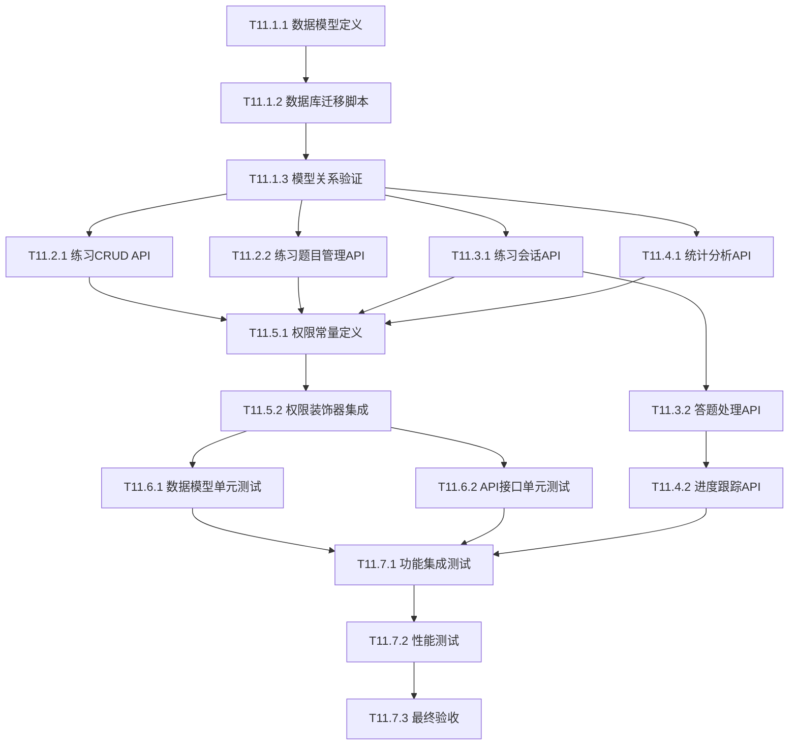

# T11练习系统原子任务拆分文档

## 1. 任务拆分概述

### 1.1 拆分原则
- **原子性**: 每个任务独立完成，可单独验证
- **可控性**: 单个任务复杂度适中，便于AI高成功率交付
- **依赖性**: 明确任务间依赖关系，支持并行开发
- **验收性**: 每个任务有明确的验收标准和测试方法
- **一致性**: 与现有T05-T10模块架构保持一致

### 1.2 任务分组
- **T11.1**: 数据模型设计与实现
- **T11.2**: 练习管理API开发
- **T11.3**: 在线练习API开发
- **T11.4**: 进度跟踪API开发
- **T11.5**: 权限控制集成
- **T11.6**: 单元测试开发
- **T11.7**: 集成测试与验证

## 2. 任务依赖关系图



## 3. 详细原子任务定义

### T11.1 数据模型设计与实现

#### T11.1.1 数据模型定义
**输入契约**:
- DESIGN_T11_practice_system.md中的数据模型设计
- 现有models目录结构和命名规范
- SQLAlchemy 2.0语法规范

**输出契约**:
- `backend/app/models/practice.py` - Practice模型
- `backend/app/models/practice_question.py` - PracticeQuestion模型  
- `backend/app/models/practice_session.py` - PracticeSession模型
- `backend/app/models/practice_answer.py` - PracticeAnswer模型
- 所有模型包含完整的字段定义、关系定义、索引定义

**实现约束**:
- 使用UUID作为主键，与现有模型保持一致
- 遵循现有的字段命名规范(created_at, updated_at等)
- 使用db.Enum定义状态字段
- 添加必要的数据库索引
- 包含完整的关系定义和级联删除

**验收标准**:
- [ ] 所有模型文件创建完成
- [ ] 模型字段定义与设计文档一致
- [ ] 关系定义正确，支持双向访问
- [ ] 索引定义合理，覆盖常用查询字段
- [ ] 代码通过语法检查

**依赖关系**: 无前置依赖

#### T11.1.2 数据库迁移脚本
**输入契约**:
- T11.1.1完成的数据模型文件
- 现有的Flask-Migrate配置
- 现有数据库结构

**输出契约**:
- 数据库迁移脚本文件
- 更新的`backend/app/__init__.py`以导入新模型
- 迁移脚本执行验证

**实现约束**:
- 使用Flask-Migrate生成迁移脚本
- 确保迁移脚本可以安全执行
- 不破坏现有数据结构
- 添加必要的外键约束

**验收标准**:
- [ ] 迁移脚本生成成功
- [ ] 迁移脚本可以正常执行
- [ ] 数据库表结构与模型定义一致
- [ ] 外键约束正确建立
- [ ] 现有数据不受影响

**依赖关系**: T11.1.1

#### T11.1.3 模型关系验证
**输入契约**:
- T11.1.2完成的数据库迁移
- 现有的测试数据

**输出契约**:
- 模型关系验证脚本
- 基础数据操作验证
- 关系查询验证

**实现约束**:
- 验证所有模型关系可以正常工作
- 测试级联删除功能
- 验证查询性能

**验收标准**:
- [ ] 所有模型关系查询正常
- [ ] 级联删除功能正确
- [ ] 数据完整性约束有效
- [ ] 查询性能满足要求

**依赖关系**: T11.1.2

### T11.2 练习管理API开发

#### T11.2.1 练习CRUD API
**输入契约**:
- T11.1.3完成的数据模型
- DESIGN文档中的API接口规范
- 现有的蓝图结构和路由规范

**输出契约**:
- `backend/app/routes/practices.py` - 练习管理路由
- 练习CRUD接口实现(GET, POST, PUT, DELETE)
- 练习发布和归档接口
- 统一的错误处理和响应格式

**实现约束**:
- 使用Flask蓝图组织路由
- 遵循RESTful API设计原则
- 使用现有的响应格式和错误处理
- 实现分页查询功能
- 添加输入数据验证

**验收标准**:
- [ ] 所有CRUD接口实现完成
- [ ] 接口响应格式与现有API一致
- [ ] 输入验证和错误处理完善
- [ ] 分页查询功能正常
- [ ] 接口文档注释完整

**依赖关系**: T11.1.3

#### T11.2.2 练习题目管理API
**输入契约**:
- T11.2.1完成的基础练习API
- 现有的题库系统API结构

**输出契约**:
- 练习题目关联管理接口
- 批量添加题目接口
- 题目顺序调整接口
- 题目配置管理接口

**实现约束**:
- 复用现有题库系统的题目验证逻辑
- 支持批量操作
- 实现题目顺序管理
- 添加题目配置验证

**验收标准**:
- [ ] 题目添加/删除接口正常
- [ ] 批量操作功能完善
- [ ] 题目顺序调整正确
- [ ] 配置验证有效
- [ ] 与题库系统集成无误

**依赖关系**: T11.2.1

### T11.3 在线练习API开发

#### T11.3.1 练习会话API
**输入契约**:
- T11.1.3完成的数据模型
- T11.2.1完成的练习管理API
- 现有的用户认证系统

**输出契约**:
- `backend/app/routes/practice_sessions.py` - 练习会话路由
- 开始练习接口
- 暂停/恢复练习接口
- 完成练习接口
- 会话状态查询接口

**实现约束**:
- 实现会话状态管理
- 支持练习暂停和恢复
- 添加会话超时处理
- 实现进度自动保存

**验收标准**:
- [ ] 练习会话创建正常
- [ ] 状态转换逻辑正确
- [ ] 暂停/恢复功能完善
- [ ] 超时处理机制有效
- [ ] 进度保存可靠

**依赖关系**: T11.1.3, T11.2.1

#### T11.3.2 答题处理API
**输入契约**:
- T11.3.1完成的会话管理API
- 现有的题目验证逻辑

**输出契约**:
- 答案提交接口
- 即时反馈接口
- 提示功能接口
- 跳题功能接口

**实现约束**:
- 复用现有的答案验证逻辑
- 实现即时反馈机制
- 添加答题时间统计
- 支持提示功能

**验收标准**:
- [ ] 答案提交处理正确
- [ ] 即时反馈功能正常
- [ ] 提示功能完善
- [ ] 时间统计准确
- [ ] 跳题逻辑正确

**依赖关系**: T11.3.1

### T11.4 进度跟踪API开发

#### T11.4.1 统计分析API
**输入契约**:
- T11.1.3完成的数据模型
- T11.3.2完成的答题数据

**输出契约**:
- `backend/app/routes/practice_statistics.py` - 统计分析路由
- 练习统计报告接口
- 学生进度查询接口
- 错题统计接口

**实现约束**:
- 实现高效的统计查询
- 添加数据缓存机制
- 支持多维度统计分析
- 优化查询性能

**验收标准**:
- [ ] 统计数据计算准确
- [ ] 查询性能满足要求
- [ ] 缓存机制有效
- [ ] 多维度分析完善
- [ ] 接口响应及时

**依赖关系**: T11.1.3, T11.3.2

#### T11.4.2 进度跟踪API
**输入契约**:
- T11.4.1完成的统计分析API
- 现有的用户系统

**输出契约**:
- 学习历史查询接口
- 个人统计报告接口
- 错题集管理接口
- 复习练习生成接口

**实现约束**:
- 实现个性化数据分析
- 支持历史数据查询
- 添加智能推荐逻辑
- 优化数据展示格式

**验收标准**:
- [ ] 学习历史查询正常
- [ ] 个人统计准确
- [ ] 错题集功能完善
- [ ] 推荐算法有效
- [ ] 数据展示友好

**依赖关系**: T11.4.1

### T11.5 权限控制集成

#### T11.5.1 权限常量定义
**输入契约**:
- 现有的权限系统结构
- DESIGN文档中的权限设计

**输出契约**:
- 更新`backend/app/utils/permissions.py`
- 新增练习相关权限常量
- 更新角色权限映射

**实现约束**:
- 遵循现有权限命名规范
- 与现有权限系统保持一致
- 添加完整的权限文档

**验收标准**:
- [ ] 权限常量定义完整
- [ ] 命名规范一致
- [ ] 角色映射正确
- [ ] 文档注释清晰

**依赖关系**: T11.2.1, T11.3.1, T11.4.1

#### T11.5.2 权限装饰器集成
**输入契约**:
- T11.5.1完成的权限定义
- 现有的权限装饰器
- 所有API接口

**输出契约**:
- 为所有API接口添加权限控制
- 实现权限验证逻辑
- 添加权限测试用例

**实现约束**:
- 使用现有的@require_permission装饰器
- 实现细粒度权限控制
- 添加权限异常处理

**验收标准**:
- [ ] 所有接口权限控制完善
- [ ] 权限验证逻辑正确
- [ ] 异常处理完整
- [ ] 测试覆盖充分

**依赖关系**: T11.5.1

### T11.6 单元测试开发

#### T11.6.1 数据模型单元测试
**输入契约**:
- T11.1.3完成的数据模型
- 现有的测试框架和规范

**输出契约**:
- `backend/tests/test_practice_models.py`
- 所有模型的单元测试
- 关系测试和约束测试
- 边界条件测试

**实现约束**:
- 使用pytest测试框架
- 遵循现有测试命名规范
- 实现完整的测试覆盖
- 添加测试数据工厂

**验收标准**:
- [ ] 所有模型测试完成
- [ ] 测试覆盖率>90%
- [ ] 边界条件测试充分
- [ ] 测试数据隔离良好
- [ ] 所有测试通过

**依赖关系**: T11.1.3

#### T11.6.2 API接口单元测试
**输入契约**:
- T11.5.2完成的所有API接口
- 现有的API测试规范

**输出契约**:
- `backend/tests/test_practice_routes.py`
- `backend/tests/test_practice_session_routes.py`
- `backend/tests/test_practice_statistics_routes.py`
- 所有API接口的单元测试
- 权限测试和异常测试

**实现约束**:
- 使用Flask测试客户端
- 模拟不同用户角色
- 测试所有HTTP状态码
- 验证响应数据格式

**验收标准**:
- [ ] 所有API接口测试完成
- [ ] 权限测试覆盖全面
- [ ] 异常情况测试充分
- [ ] 响应格式验证正确
- [ ] 所有测试通过

**依赖关系**: T11.5.2

### T11.7 集成测试与验证

#### T11.7.1 功能集成测试
**输入契约**:
- T11.6.2完成的所有单元测试
- 完整的T11练习系统

**输出契约**:
- `backend/tests/test_practice_integration.py`
- 端到端功能测试
- 业务流程测试
- 系统集成测试

**实现约束**:
- 测试完整的业务流程
- 验证系统间集成
- 模拟真实使用场景
- 添加性能基准测试

**验收标准**:
- [ ] 端到端流程测试通过
- [ ] 系统集成无问题
- [ ] 业务逻辑验证正确
- [ ] 性能指标达标
- [ ] 数据一致性保证

**依赖关系**: T11.6.1, T11.6.2

#### T11.7.2 性能测试
**输入契约**:
- T11.7.1完成的集成测试
- 性能测试工具和基准

**输出契约**:
- 性能测试报告
- 性能优化建议
- 负载测试结果

**实现约束**:
- 测试API响应时间
- 验证并发处理能力
- 检查内存使用情况
- 分析数据库查询性能

**验收标准**:
- [ ] API响应时间<500ms
- [ ] 支持100并发用户
- [ ] 内存使用合理
- [ ] 数据库查询优化
- [ ] 性能报告完整

**依赖关系**: T11.7.1

#### T11.7.3 最终验收
**输入契约**:
- T11.7.2完成的性能测试
- ALIGNMENT文档中的验收标准

**输出契约**:
- 最终验收报告
- 功能完整性确认
- 质量评估报告
- 部署就绪确认

**实现约束**:
- 验证所有功能需求
- 确认质量标准达成
- 检查文档完整性
- 准备部署材料

**验收标准**:
- [ ] 所有功能需求实现
- [ ] 质量标准全部达成
- [ ] 文档完整准确
- [ ] 系统稳定可靠
- [ ] 准备就绪部署

**依赖关系**: T11.7.2

## 4. 任务执行计划

### 4.1 并行执行组
- **第一组**: T11.1.1 → T11.1.2 → T11.1.3 (串行执行)
- **第二组**: T11.2.1, T11.3.1, T11.4.1 (并行执行，依赖第一组)
- **第三组**: T11.2.2, T11.3.2, T11.4.2 (并行执行，依赖第二组)
- **第四组**: T11.5.1 → T11.5.2 (串行执行，依赖第三组)
- **第五组**: T11.6.1, T11.6.2 (并行执行，依赖第四组)
- **第六组**: T11.7.1 → T11.7.2 → T11.7.3 (串行执行，依赖第五组)

### 4.2 关键路径
```
T11.1.1 → T11.1.2 → T11.1.3 → T11.3.1 → T11.3.2 → T11.4.2 → T11.5.1 → T11.5.2 → T11.6.2 → T11.7.1 → T11.7.2 → T11.7.3
```

### 4.3 预估工作量
- **数据模型**: 3个任务，预计2-3小时
- **API开发**: 6个任务，预计8-10小时
- **权限集成**: 2个任务，预计2-3小时
- **测试开发**: 2个任务，预计4-5小时
- **集成验证**: 3个任务，预计3-4小时
- **总计**: 16个任务，预计19-25小时

## 5. 质量保证

### 5.1 代码质量标准
- 遵循PEP 8代码规范
- 添加完整的类型注解
- 编写清晰的文档字符串
- 保持代码复杂度可控

### 5.2 测试质量标准
- 单元测试覆盖率>90%
- 集成测试覆盖主要业务流程
- 性能测试满足基准要求
- 所有测试必须通过

### 5.3 文档质量标准
- API文档完整准确
- 代码注释清晰易懂
- 设计文档与实现一致
- 用户手册简洁明了

---

**任务拆分完成，准备进入Approve阶段进行人工审查和确认。**