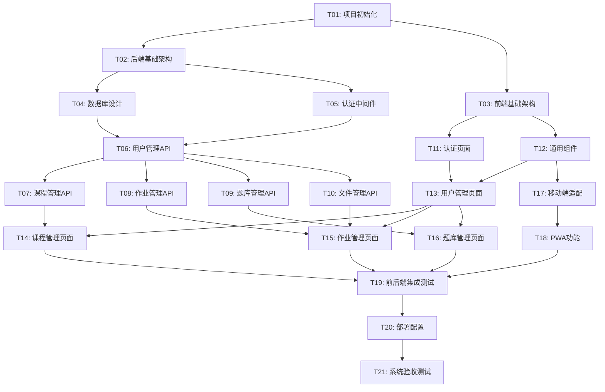

# 英语家教管理系统 - 原子任务拆分文档 (TASK)

## 1. 任务拆分概述

基于DESIGN文档的架构设计，将英语家教管理系统拆分为以下原子任务，确保每个任务具有明确的边界、可独立验证且复杂度可控。

### 1.1 拆分原则
- **原子性**: 每个任务功能单一，不可再分
- **独立性**: 任务可独立开发和测试
- **可验证性**: 每个任务有明确的验收标准
- **复杂度可控**: 单个任务开发时间不超过1-2天

### 1.2 任务分类
- **基础设施任务**: 项目初始化、环境配置
- **后端核心任务**: API服务、数据模型、业务逻辑
- **前端核心任务**: 页面组件、状态管理、路由
- **移动端任务**: 响应式适配、PWA功能
- **集成任务**: 前后端集成、部署配置

## 2. 任务依赖关系图

## 3. 原子任务详细定义

### T01: 项目初始化

#### 输入契约
- **前置依赖**: 无
- **输入数据**: 项目需求文档
- **环境依赖**: Node.js 16.x (通过nvm管理), Python 3.8+ (通过conda管理)

#### 输出契约
- **交付物**: 
  - 独立后端项目结构 (backend/)
    - Flask应用目录结构
    - requirements.txt依赖文件
    - 后端启动脚本和配置
  - 独立前端项目结构 (frontend/)
    - Vue.js 3项目目录结构
    - package.json依赖文件
    - 前端构建和启动脚本
  - 环境配置脚本 (conda/nvm)
  - 项目根目录README.md文档
- **验收标准**:
  - [ ] conda环境创建并激活成功
  - [ ] nvm Node.js版本配置正确
  - [ ] 后端项目在backend/目录独立启动
  - [ ] 前端项目在frontend/目录独立启动
  - [ ] 前后端代码完全隔离，无混合
  - [ ] 各自依赖包安装成功

#### 实现约束
- **技术栈**: Flask, Vue.js 3, Vite
- **代码规范**: PEP8 (Python), ESLint (JavaScript)
- **质量要求**: 代码覆盖率 > 80%

#### 依赖关系
- **后置任务**: T02, T03
- **并行任务**: 无

---

### T02: 后端基础架构

#### 输入契约
- **前置依赖**: T01
- **输入数据**: 架构设计文档
- **环境依赖**: Flask, SQLAlchemy

#### 输出契约
- **交付物**:
  - backend/目录下Flask应用基础结构
  - 中间件配置 (CORS, JWT, 异常处理)
  - 配置管理模块
  - 日志系统
- **验收标准**:
  - [ ] backend/目录下Flask应用正常启动
  - [ ] 中间件功能正常
  - [ ] 配置文件加载正确
  - [ ] 日志记录功能正常

#### 实现约束
- **技术栈**: Flask, Flask-CORS, Flask-JWT-Extended
- **接口规范**: RESTful API
- **质量要求**: 异常处理覆盖完整

#### 依赖关系
- **后置任务**: T04, T05
- **并行任务**: T03

---

### T03: 前端基础架构

#### 输入契约
- **前置依赖**: T01
- **输入数据**: UI设计规范
- **环境依赖**: Vue.js 3, Vite, Vuetify

#### 输出契约
- **交付物**:
  - frontend/目录下Vue.js 3项目结构
  - 路由配置
  - 状态管理 (Pinia)
  - HTTP 客户端配置
  - UI 框架集成
- **验收标准**:
  - [ ] frontend/目录下前端应用正常启动
  - [ ] 路由跳转正常
  - [ ] 状态管理功能正常
  - [ ] API 请求配置正确

#### 实现约束
- **技术栈**: Vue.js 3, Vite, Pinia, Axios, Vuetify
- **代码规范**: Vue 3 Composition API
- **质量要求**: 组件复用率 > 70%

#### 依赖关系
- **后置任务**: T11, T12
- **并行任务**: T02

---

### T04: 数据库设计

#### 输入契约
- **前置依赖**: T02
- **输入数据**: 数据模型设计
- **环境依赖**: SQLite/PostgreSQL, SQLAlchemy

#### 输出契约
- **交付物**:
  - 数据库表结构 (DDL)
  - SQLAlchemy 模型定义
  - 数据库迁移脚本
  - 初始数据脚本
- **验收标准**:
  - [ ] 数据库表创建成功
  - [ ] 模型关系定义正确
  - [ ] 迁移脚本执行正常
  - [ ] 初始数据插入成功

#### 实现约束
- **技术栈**: SQLAlchemy, Flask-Migrate
- **数据库**: SQLite (开发), PostgreSQL (生产)
- **质量要求**: 数据完整性约束完整

#### 依赖关系
- **后置任务**: T06, T07, T08, T09
- **并行任务**: T05

---

### T05: 认证中间件

#### 输入契约
- **前置依赖**: T02
- **输入数据**: 认证流程设计
- **环境依赖**: Flask-JWT-Extended

#### 输出契约
- **交付物**:
  - JWT 认证中间件
  - 权限控制装饰器
  - 用户会话管理
  - 密码加密工具
- **验收标准**:
  - [ ] JWT token 生成和验证正常
  - [ ] 权限控制功能正确
  - [ ] 会话管理功能正常
  - [ ] 密码加密安全可靠

#### 实现约束
- **技术栈**: Flask-JWT-Extended, bcrypt
- **安全要求**: 密码哈希存储, token 过期机制
- **质量要求**: 安全测试通过

#### 依赖关系
- **后置任务**: T06
- **并行任务**: T04

---

### T06: 用户管理API

#### 输入契约
- **前置依赖**: T04, T05
- **输入数据**: 用户管理需求
- **环境依赖**: Flask, SQLAlchemy

#### 输出契约
- **交付物**:
  - 用户 CRUD API
  - 登录/登出 API
  - 角色权限 API
  - 用户信息验证
- **验收标准**:
  - [ ] 用户注册功能正常
  - [ ] 登录认证功能正常
  - [ ] 用户信息更新正常
  - [ ] 角色权限控制正确

#### 实现约束
- **技术栈**: Flask, SQLAlchemy
- **接口规范**: RESTful API, JSON 响应
- **质量要求**: API 测试覆盖率 100%

#### 依赖关系
- **后置任务**: T07, T08, T09, T10, T13
- **并行任务**: 无

---

### T07: 课程管理API

#### 输入契约
- **前置依赖**: T06
- **输入数据**: 课程管理需求
- **环境依赖**: Flask, SQLAlchemy

#### 输出契约
- **交付物**:
  - 课程 CRUD API
  - 选课/退课 API
  - 课程时间安排 API
  - 课程统计 API
- **验收标准**:
  - [ ] 课程创建和管理正常
  - [ ] 学生选课功能正常
  - [ ] 课程时间冲突检测正确
  - [ ] 课程统计数据准确

#### 实现约束
- **技术栈**: Flask, SQLAlchemy
- **业务规则**: 一对多课程最多3人
- **质量要求**: 业务逻辑测试完整

#### 依赖关系
- **后置任务**: T14
- **并行任务**: T08, T09, T10

---

### T08: 作业管理API

#### 输入契约
- **前置依赖**: T06
- **输入数据**: 作业管理需求
- **环境依赖**: Flask, SQLAlchemy

#### 输出契约
- **交付物**:
  - 作业 CRUD API
  - 作业提交 API
  - 作业批改 API
  - 作业统计 API
- **验收标准**:
  - [ ] 作业发布功能正常
  - [ ] 学生提交功能正常
  - [ ] 教师批改功能正常
  - [ ] 作业状态管理正确

#### 实现约束
- **技术栈**: Flask, SQLAlchemy
- **文件支持**: 图片、视频、音频
- **质量要求**: 文件处理安全可靠

#### 依赖关系
- **后置任务**: T15
- **并行任务**: T07, T09, T10

---

### T09: 题库管理API

#### 输入契约
- **前置依赖**: T06
- **输入数据**: 题库管理需求
- **环境依赖**: Flask, SQLAlchemy

#### 输出契约
- **交付物**:
  - 题目 CRUD API
  - 随机抽题 API
  - 试卷生成 API
  - 题库导入导出 API
- **验收标准**:
  - [ ] 题目管理功能正常
  - [ ] 随机抽题算法正确
  - [ ] 试卷生成功能正常
  - [ ] 导入导出功能正常

#### 实现约束
- **技术栈**: Flask, SQLAlchemy
- **算法要求**: 随机抽题算法优化
- **质量要求**: 抽题结果无重复

#### 依赖关系
- **后置任务**: T16
- **并行任务**: T07, T08, T10

---

### T10: 文件管理API

#### 输入契约
- **前置依赖**: T06
- **输入数据**: 文件管理需求
- **环境依赖**: Flask, Werkzeug

#### 输出契约
- **交付物**:
  - 文件上传 API
  - 文件下载 API
  - 文件删除 API
  - 文件权限控制
- **验收标准**:
  - [ ] 文件上传功能正常
  - [ ] 文件下载权限正确
  - [ ] 文件类型验证有效
  - [ ] 文件大小限制正确

#### 实现约束
- **技术栈**: Flask, Werkzeug
- **文件限制**: 最大50MB, 指定类型
- **质量要求**: 文件安全扫描

#### 依赖关系
- **后置任务**: T15
- **并行任务**: T07, T08, T09

---

### T11: 认证页面

#### 输入契约
- **前置依赖**: T03
- **输入数据**: 认证流程设计
- **环境依赖**: Vue.js 3, Vuetify

#### 输出契约
- **交付物**:
  - 登录页面
  - 注册页面
  - 密码重置页面
  - 用户信息页面
- **验收标准**:
  - [ ] 登录界面友好
  - [ ] 表单验证正确
  - [ ] 错误提示清晰
  - [ ] 响应式设计适配

#### 实现约束
- **技术栈**: Vue.js 3, Vuetify, Vuelidate
- **UI规范**: Material Design
- **质量要求**: 用户体验测试通过

#### 依赖关系
- **后置任务**: T13
- **并行任务**: T12

---

### T12: 通用组件

#### 输入契约
- **前置依赖**: T03
- **输入数据**: 组件设计规范
- **环境依赖**: Vue.js 3, Vuetify

#### 输出契约
- **交付物**:
  - 表格组件
  - 表单组件
  - 对话框组件
  - 文件上传组件
  - 移动端适配组件
- **验收标准**:
  - [ ] 组件功能完整
  - [ ] 组件复用性强
  - [ ] 移动端适配良好
  - [ ] 组件文档完整

#### 实现约束
- **技术栈**: Vue.js 3, Vuetify
- **设计原则**: 组件化、可复用
- **质量要求**: 组件测试覆盖率 > 90%

#### 依赖关系
- **后置任务**: T13, T14, T15, T16, T17
- **并行任务**: T11

---

### T13: 用户管理页面

#### 输入契约
- **前置依赖**: T06, T11, T12
- **输入数据**: 用户管理界面设计
- **环境依赖**: Vue.js 3, Vuetify

#### 输出契约
- **交付物**:
  - 用户列表页面
  - 用户详情页面
  - 用户编辑页面
  - 角色权限管理页面
- **验收标准**:
  - [ ] 用户列表显示正确
  - [ ] 用户信息编辑正常
  - [ ] 角色权限设置有效
  - [ ] 页面响应式适配

#### 实现约束
- **技术栈**: Vue.js 3, Vuetify, Pinia
- **权限控制**: 基于角色的页面访问
- **质量要求**: 界面交互测试通过

#### 依赖关系
- **后置任务**: T14, T15, T16
- **并行任务**: 无

---

### T14: 课程管理页面

#### 输入契约
- **前置依赖**: T07, T13
- **输入数据**: 课程管理界面设计
- **环境依赖**: Vue.js 3, Vuetify

#### 输出契约
- **交付物**:
  - 课程列表页面
  - 课程创建页面
  - 课程详情页面
  - 选课管理页面
- **验收标准**:
  - [ ] 课程信息显示完整
  - [ ] 课程创建流程顺畅
  - [ ] 选课功能正常
  - [ ] 时间冲突提示正确

#### 实现约束
- **技术栈**: Vue.js 3, Vuetify, 日历组件
- **业务逻辑**: 课程时间管理
- **质量要求**: 业务流程测试完整

#### 依赖关系
- **后置任务**: T19
- **并行任务**: T15, T16

---

### T15: 作业管理页面

#### 输入契约
- **前置依赖**: T08, T10, T13
- **输入数据**: 作业管理界面设计
- **环境依赖**: Vue.js 3, Vuetify

#### 输出契约
- **交付物**:
  - 作业列表页面
  - 作业发布页面
  - 作业提交页面
  - 作业批改页面
- **验收标准**:
  - [ ] 作业发布功能完整
  - [ ] 文件上传功能正常
  - [ ] 作业批改界面友好
  - [ ] 移动端文件上传正常

#### 实现约束
- **技术栈**: Vue.js 3, Vuetify, 文件上传组件
- **文件处理**: 支持图片、视频、音频
- **质量要求**: 文件上传稳定性测试

#### 依赖关系
- **后置任务**: T19
- **并行任务**: T14, T16

---

### T16: 题库管理页面

#### 输入契约
- **前置依赖**: T09, T13
- **输入数据**: 题库管理界面设计
- **环境依赖**: Vue.js 3, Vuetify

#### 输出契约
- **交付物**:
  - 题目列表页面
  - 题目编辑页面
  - 随机抽题页面
  - 试卷生成页面
- **验收标准**:
  - [ ] 题目管理功能完整
  - [ ] 抽题界面操作简便
  - [ ] 试卷生成功能正常
  - [ ] 题库导入导出正常

#### 实现约束
- **技术栈**: Vue.js 3, Vuetify, 富文本编辑器
- **编辑功能**: 支持富文本题目编辑
- **质量要求**: 题目编辑器稳定性测试

#### 依赖关系
- **后置任务**: T19
- **并行任务**: T14, T15

---

### T17: 移动端适配

#### 输入契约
- **前置依赖**: T12
- **输入数据**: 移动端设计规范
- **环境依赖**: Vue.js 3, CSS媒体查询

#### 输出契约
- **交付物**:
  - 响应式布局样式
  - 移动端导航组件
  - 触屏交互优化
  - 移动端表单优化
- **验收标准**:
  - [ ] 移动端布局适配正确
  - [ ] 触屏操作体验良好
  - [ ] 移动端性能优化
  - [ ] 不同设备兼容性测试通过

#### 实现约束
- **技术栈**: CSS3, Vue.js 3, 移动端调试工具
- **设计原则**: Mobile First
- **质量要求**: 移动端兼容性测试

#### 依赖关系
- **后置任务**: T18
- **并行任务**: 无

---

### T18: PWA功能

#### 输入契约
- **前置依赖**: T17
- **输入数据**: PWA功能需求
- **环境依赖**: Service Worker, Web App Manifest

#### 输出契约
- **交付物**:
  - Service Worker 配置
  - Web App Manifest
  - 离线缓存策略
  - 推送通知功能
- **验收标准**:
  - [ ] 离线访问功能正常
  - [ ] 添加到主屏幕功能正常
  - [ ] 缓存策略有效
  - [ ] 推送通知功能正常

#### 实现约束
- **技术栈**: Service Worker, Push API
- **缓存策略**: 关键资源优先缓存
- **质量要求**: 离线功能测试完整

#### 依赖关系
- **后置任务**: T19
- **并行任务**: 无

---

### T19: 前后端集成测试

#### 输入契约
- **前置依赖**: T14, T15, T16, T18
- **输入数据**: 集成测试用例
- **环境依赖**: 完整的前后端环境

#### 输出契约
- **交付物**:
  - 集成测试套件
  - API 接口测试
  - 端到端测试
  - 性能测试报告
- **验收标准**:
  - [ ] 所有API接口测试通过
  - [ ] 前后端数据交互正常
  - [ ] 端到端业务流程正常
  - [ ] 性能指标达标

#### 实现约束
- **技术栈**: Jest, Cypress, Postman
- **测试覆盖**: 核心业务流程100%覆盖
- **质量要求**: 集成测试自动化

#### 依赖关系
- **后置任务**: T20
- **并行任务**: 无

---

### T20: 部署配置

#### 输入契约
- **前置依赖**: T19
- **输入数据**: 部署环境规范
- **环境依赖**: Ubuntu 20.04, Nginx, Gunicorn

#### 输出契约
- **交付物**:
  - Nginx 配置文件
  - Gunicorn 配置
  - 系统服务配置
  - 部署脚本
  - 备份脚本
- **验收标准**:
  - [ ] 应用部署成功
  - [ ] Nginx 反向代理正常
  - [ ] 静态文件服务正常
  - [ ] 自动备份功能正常

#### 实现约束
- **技术栈**: Nginx, Gunicorn, Systemd
- **部署环境**: 2c2g 服务器
- **质量要求**: 部署自动化脚本

#### 依赖关系
- **后置任务**: T21
- **并行任务**: 无

---

### T21: 系统验收测试

#### 输入契约
- **前置依赖**: T20
- **输入数据**: 验收测试标准
- **环境依赖**: 生产环境

#### 输出契约
- **交付物**:
  - 验收测试报告
  - 用户手册
  - 系统运维文档
  - 问题修复记录
- **验收标准**:
  - [ ] 所有功能需求验收通过
  - [ ] 性能指标达标
  - [ ] 安全测试通过
  - [ ] 用户体验测试通过

#### 实现约束
- **测试范围**: 全功能验收测试
- **性能要求**: 符合2c2g服务器限制
- **质量要求**: 验收测试文档化

#### 依赖关系
- **后置任务**: 无
- **并行任务**: 无

## 4. 任务执行计划

### 4.1 阶段划分

**第一阶段: 基础设施 (1-3天)**
- T01: 项目初始化
- T02: 后端基础架构
- T03: 前端基础架构

**第二阶段: 核心后端 (4-8天)**
- T04: 数据库设计
- T05: 认证中间件
- T06: 用户管理API
- T07: 课程管理API
- T08: 作业管理API
- T09: 题库管理API
- T10: 文件管理API

**第三阶段: 核心前端 (9-15天)**
- T11: 认证页面
- T12: 通用组件
- T13: 用户管理页面
- T14: 课程管理页面
- T15: 作业管理页面
- T16: 题库管理页面

**第四阶段: 移动端优化 (16-18天)**
- T17: 移动端适配
- T18: PWA功能

**第五阶段: 集成部署 (19-21天)**
- T19: 前后端集成测试
- T20: 部署配置
- T21: 系统验收测试

### 4.2 关键里程碑

- **里程碑1**: 基础架构完成 (第3天)
- **里程碑2**: 后端API完成 (第8天)
- **里程碑3**: 前端页面完成 (第15天)
- **里程碑4**: 移动端适配完成 (第18天)
- **里程碑5**: 系统上线 (第21天)

### 4.3 风险控制

**高风险任务**:
- T08: 作业管理API (文件处理复杂)
- T15: 作业管理页面 (移动端文件上传)
- T18: PWA功能 (浏览器兼容性)

**风险缓解措施**:
- 提前进行技术验证
- 准备备选方案
- 增加测试时间

## 5. 质量保证

### 5.1 代码质量标准
- 代码覆盖率 > 80%
- 代码规范检查通过
- 代码审查完成
- 文档完整性检查

### 5.2 测试策略
- 单元测试: 每个API和组件
- 集成测试: 前后端接口
- 端到端测试: 完整业务流程
- 性能测试: 响应时间和并发
- 兼容性测试: 多设备多浏览器

### 5.3 验收标准
- 功能完整性: 100%需求实现
- 性能指标: 页面加载 < 3秒
- 兼容性: 主流浏览器支持
- 安全性: 安全测试通过
- 可用性: 用户体验测试通过

---

**文档状态**: 原子任务拆分完成  
**创建时间**: 2024年当前时间  
**下一阶段**: 进入审批阶段（Approve）  
**任务总数**: 21个原子任务  
**预计工期**: 21天