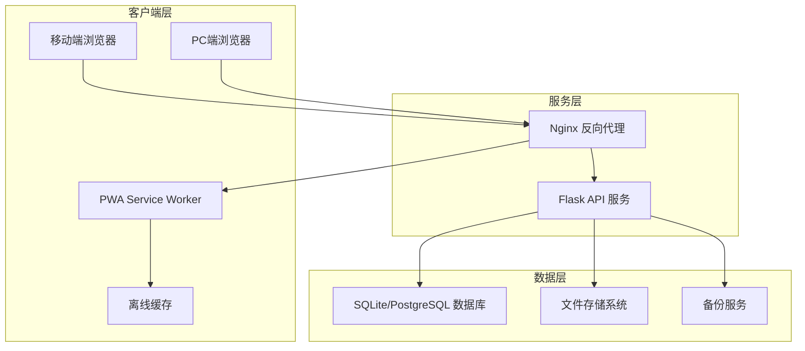
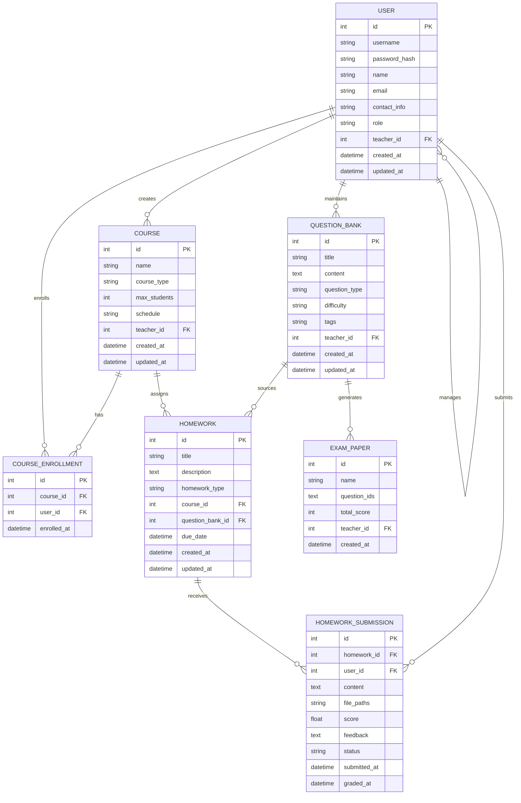

# 英语家教管理系统 - 共识文档 (CONSENSUS)

## 1. 明确的需求描述和功能清单

### 1.1 核心需求确认
基于用户反馈，系统需求已明确如下：
- **学生规模**: 10-30名学生
- **课程类型**: 一对一、一对多（最多3人）
- **作业形式**: 图片、视频、音频文件
- **学生访问**: 学生可登录查看作业和课程信息
- **数据备份**: 系统需要数据备份功能
- **题库管理**: 支持题库维护、作业抽取、考试试卷生成

### 1.2 功能模块清单

#### 1.2.1 用户管理模块
- 管理员账户管理（系统管理员）
- 教师账户管理（主要用户）
- 学生账户管理（学习用户）
- 角色权限管理和分配
- 登录认证和权限控制
- 用户信息维护

#### 1.2.2 课程管理模块
- 课程类型设置（一对一、一对多）
- 课程时间安排和日程管理
- 学生分组管理（最多3人/组）
- 课程记录和历史查询

#### 1.2.3 作业管理模块
- 口头作业布置（文字描述）
- 题库作业抽取和分配
- 多媒体作业支持（图片、视频、音频）
- 作业提交和收集
- 作业批改和评分
- 作业反馈和评语

#### 1.2.4 题库管理模块
- 题目录入和分类管理
- 题目标签和难度设置
- 题目搜索和筛选
- 随机抽题功能
- 考试试卷自动生成
- 题库导入导出

#### 1.2.5 数据备份模块
- 自动数据备份
- 手动备份触发
- 备份文件管理
- 数据恢复功能

#### 1.2.6 系统管理模块
- 系统配置管理
- 日志记录和查询
- 性能监控
- 用户操作审计

## 2. 技术实现方案和架构选择

### 2.1 技术栈确认
- **后端框架**: Flask (Python)
- **前端框架**: Vue.js 3 + 响应式UI框架 (Vuetify/Element Plus)
- **移动端适配**: 响应式Web设计 + PWA技术
- **数据库**: SQLite（开发）/ PostgreSQL（生产）
- **文件存储**: 本地文件系统
- **部署环境**: 2c2g Linux服务器

### 2.2 架构设计原则
- **轻量级设计**: 适应2c2g服务器资源限制
- **模块化架构**: 便于维护和扩展
- **RESTful API**: 前后端分离设计
- **移动优先设计**: 响应式布局，优先考虑移动端体验
- **PWA支持**: 离线缓存、推送通知、类原生应用体验
- **性能优化**: 移动端网络优化、资源压缩、懒加载

### 2.3 系统架构图


### 2.4 技术选型说明
- **SQLite**: 开发阶段使用，部署简单
- **PostgreSQL**: 生产环境可选，支持更好的并发
- **本地文件存储**: 避免外部依赖，降低成本
- **Nginx**: 静态文件服务和反向代理，支持gzip压缩
- **响应式框架**: 确保移动端良好体验
- **PWA技术**: 提供类原生应用体验，支持离线使用
- **移动端优化**: 图片压缩、懒加载、触屏优化

### 2.5 移动端技术实现方案

#### 2.5.1 响应式设计策略
- **移动优先**: 采用Mobile First设计理念
- **断点设置**: 手机(<768px)、平板(768-1024px)、桌面(>1024px)
- **弹性布局**: 使用CSS Grid和Flexbox实现自适应布局
- **触屏优化**: 按钮尺寸≥44px，增加触摸反馈

#### 2.5.2 PWA功能实现
- **Service Worker**: 实现离线缓存和后台同步
- **Web App Manifest**: 支持添加到主屏幕
- **推送通知**: 作业提醒和课程通知
- **离线功能**: 缓存关键页面和数据

#### 2.5.3 移动端性能优化
- **资源优化**: 图片懒加载、WebP格式支持
- **代码分割**: 按路由和组件进行代码分割
- **缓存策略**: 静态资源长期缓存，API数据短期缓存
- **网络优化**: 减少HTTP请求，使用HTTP/2

#### 2.5.4 移动端交互优化
- **手势支持**: 滑动、长按等移动端手势
- **文件上传**: 支持拍照、录音、录像直接上传
- **虚拟键盘**: 适配不同输入类型的键盘
- **加载状态**: 明确的加载指示器和进度反馈

## 3. 数据模型设计

### 3.1 核心实体关系图


### 3.2 数据表设计要点
- **用户认证**: 密码哈希存储，支持会话管理
- **用户角色**: 枚举值（admin, teacher, student）
- **权限控制**: 基于角色的访问控制（RBAC）
- **文件存储**: 文件路径字符串存储，支持多文件
- **课程类型**: 枚举值（one_to_one, one_to_many）
- **作业类型**: 枚举值（oral, question_bank, mixed）
- **提交状态**: 枚举值（pending, submitted, graded）

## 4. 接口规范概要

### 4.1 API 设计原则
- RESTful 风格设计
- JSON 数据格式
- 统一错误处理
- JWT 认证机制

### 4.2 核心 API 端点

#### 4.2.1 认证相关
```
POST /api/auth/login          # 用户登录
POST /api/auth/logout         # 用户登出
GET  /api/auth/profile        # 获取用户信息
```

#### 4.2.2 用户管理
```
GET    /api/users             # 获取用户列表（按角色筛选）
POST   /api/users             # 创建用户（管理员/教师权限）
GET    /api/users/{id}        # 获取用户详情
PUT    /api/users/{id}        # 更新用户信息
DELETE /api/users/{id}        # 删除用户（管理员权限）
PUT    /api/users/{id}/role   # 修改用户角色（管理员权限）
```

#### 4.2.3 课程管理
```
GET    /api/courses           # 获取课程列表
POST   /api/courses           # 创建课程
GET    /api/courses/{id}      # 获取课程详情
PUT    /api/courses/{id}      # 更新课程
DELETE /api/courses/{id}      # 删除课程
POST   /api/courses/{id}/enroll # 学生选课
```

#### 4.2.4 作业管理
```
GET    /api/homework          # 获取作业列表
POST   /api/homework          # 创建作业
GET    /api/homework/{id}     # 获取作业详情
PUT    /api/homework/{id}     # 更新作业
POST   /api/homework/{id}/submit # 提交作业
PUT    /api/homework/{id}/grade  # 批改作业
```

#### 4.2.5 题库管理
```
GET    /api/questions         # 获取题目列表
POST   /api/questions         # 创建题目
GET    /api/questions/{id}    # 获取题目详情
PUT    /api/questions/{id}    # 更新题目
DELETE /api/questions/{id}    # 删除题目
POST   /api/questions/random  # 随机抽题
POST   /api/exam-papers       # 生成试卷
```

#### 4.2.6 文件管理
```
POST   /api/files/upload      # 文件上传
GET    /api/files/{id}        # 文件下载
DELETE /api/files/{id}        # 文件删除
```

## 5. 部署方案

### 5.1 服务器环境要求
- **操作系统**: Ubuntu 20.04 LTS
- **Python**: 3.8+
- **Node.js**: 16.x
- **Nginx**: 1.18+
- **数据库**: SQLite 3.x / PostgreSQL 12+

### 5.2 部署架构
```
移动端/PC浏览器 -> Nginx (80/443) -> Flask App (5000) -> 数据库
                      |
                      +-> 静态文件服务 + 移动端优化
                      +-> PWA Service Worker
                      +-> 资源压缩和缓存
```

### 5.3 部署步骤
1. **环境准备**: 安装Python、Node.js、Nginx
2. **代码部署**: 克隆代码，安装依赖
3. **前端构建**: Vue.js 项目打包
4. **数据库初始化**: 创建表结构，导入初始数据
5. **服务配置**: 配置Nginx、Flask应用
6. **服务启动**: 启动应用服务
7. **备份配置**: 设置定时备份任务

### 5.4 性能优化
- **静态文件缓存**: Nginx 配置静态资源缓存
- **数据库优化**: 添加必要索引，查询优化
- **文件压缩**: Gzip 压缩传输
- **资源限制**: 设置合理的并发连接数
- **移动端优化**: 
  - 图片自适应和WebP格式支持
  - CSS/JS文件压缩和合并
  - 懒加载和按需加载
  - Service Worker缓存策略
  - 减少HTTP请求数量
  - 移动端网络优化

## 6. 验收标准

### 6.1 功能验收标准

#### 6.1.1 用户管理
- [ ] 管理员可以成功登录系统
- [ ] 管理员可以创建、编辑、删除教师和学生账户
- [ ] 管理员可以修改用户角色权限
- [ ] 教师可以成功登录系统
- [ ] 教师可以创建、编辑、删除学生账户
- [ ] 学生可以使用分配的账户登录
- [ ] 系统支持基于角色的权限控制
- [ ] 系统支持会话管理和自动登出

#### 6.1.2 课程管理
- [ ] 教师可以创建一对一和一对多课程
- [ ] 一对多课程最多支持3名学生
- [ ] 课程时间安排功能正常
- [ ] 学生可以查看已选课程

#### 6.1.3 作业管理
- [ ] 教师可以口头布置作业（文字描述）
- [ ] 教师可以从题库选择题目布置作业
- [ ] 学生可以提交图片、视频、音频作业
- [ ] 教师可以批改作业并给出评分和反馈
- [ ] 学生可以查看作业反馈

#### 6.1.4 题库管理
- [ ] 教师可以录入、编辑、删除题目
- [ ] 题目支持分类和标签管理
- [ ] 系统可以随机抽取题目
- [ ] 系统可以自动生成考试试卷
- [ ] 支持题库导入导出功能

#### 6.1.5 数据备份
- [ ] 系统支持自动定时备份
- [ ] 教师可以手动触发备份
- [ ] 系统可以从备份文件恢复数据
- [ ] 备份文件管理功能正常

### 6.2 性能验收标准
- [ ] 系统支持10-30名学生同时在线
- [ ] 页面加载时间 < 3秒
- [ ] 文件上传支持最大50MB
- [ ] 系统内存使用 < 1.5GB
- [ ] CPU使用率正常情况下 < 70%

### 6.3 兼容性验收标准
- [ ] 支持Chrome、Firefox、Safari浏览器
- [ ] 支持桌面、平板和手机设备访问
- [ ] 响应式设计适配不同屏幕尺寸
- [ ] 移动端浏览器兼容性良好（iOS Safari, Android Chrome）
- [ ] 触屏交互体验优化
- [ ] PWA功能正常（离线缓存、添加到主屏幕）
- [ ] 移动端文件上传功能正常（拍照、录音、录像）

### 6.4 安全验收标准
- [ ] 用户密码加密存储
- [ ] 基于角色的权限验证正确实施
- [ ] 不同角色只能访问授权的功能和数据
- [ ] 会话管理安全可靠
- [ ] 文件上传类型限制
- [ ] SQL注入防护
- [ ] XSS攻击防护

### 6.5 可用性验收标准
- [ ] 界面友好，操作直观
- [ ] 错误提示信息清晰
- [ ] 帮助文档完整
- [ ] 系统稳定性 > 99%

## 7. 项目边界和约束

### 7.1 功能边界
**包含功能**:
- 基础的教学管理功能
- 多媒体作业支持
- 题库管理和试卷生成
- 数据备份和恢复

**不包含功能**:
- 在线支付系统
- 视频会议功能
- 复杂的学习分析和报表
- 移动端原生APP开发（使用PWA替代）
- 多机构管理

### 7.2 技术约束
- 服务器资源限制（2c2g）
- 单机部署，不考虑分布式
- 本地文件存储，不使用云存储
- 简化的用户权限模型

### 7.3 时间约束
- 开发周期预估：4-6周
- MVP版本优先交付核心功能
- 后续迭代完善辅助功能

---

**文档状态**: 需求共识已达成  
**创建时间**: 2024年当前时间  
**下一阶段**: 进入架构设计阶段（Architect）  
**批准状态**: 待用户最终确认