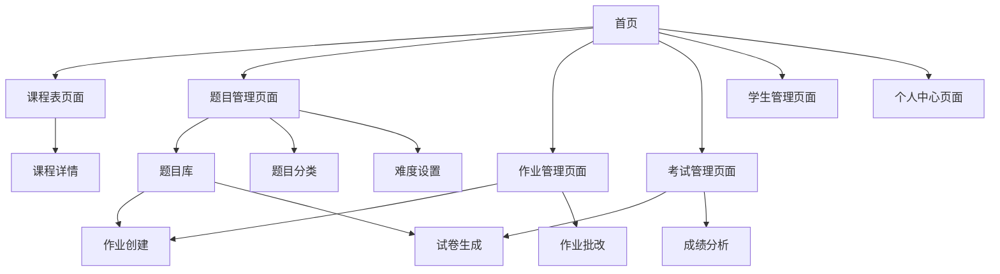

# 英语家教教学管理系统 - 产品需求文档

## 1. 产品概述

本系统是一个专为英语家教老师设计的教学管理平台，帮助老师高效管理课程安排、作业布置与批改、考试组织等日常教学工作。

系统采用移动端优先设计，让老师能够随时随地管理教学事务，提升教学效率和学生学习体验。

目标是成为英语家教老师的得力助手，简化教学管理流程，提高教学质量。

## 2. 核心功能

### 2.1 用户角色

| 角色 | 注册方式 | 核心权限 |
|------|----------|----------|
| 老师 | 手机号注册 | 创建课程、管理学生、布置作业、组织考试 |
| 学生 | 老师邀请码注册 | 查看课程表、提交作业、参加考试、查看成绩 |

### 2.2 功能模块

我们的英语家教教学管理系统包含以下主要页面：

1. **首页**：课程概览、今日任务、快捷操作入口
2. **课程表页面**：课程安排展示、课程详情管理
3. **题目管理页面**：题目库管理、题目分类、难度设置
4. **作业管理页面**：作业布置、批改、成绩统计
5. **考试管理页面**：考试创建、监考、成绩分析
6. **学生管理页面**：学生信息、学习进度跟踪
7. **个人中心页面**：个人信息、系统设置

### 2.3 页面详情

| 页面名称 | 模块名称 | 功能描述 |
|----------|----------|----------|
| 首页 | 课程概览 | 显示今日课程安排、待处理任务数量、快速统计信息 |
| 首页 | 快捷操作 | 提供布置作业、创建考试、添加学生等常用功能入口 |
| 课程表页面 | 课程日历 | 按周/月视图展示课程安排，支持拖拽调整时间 |
| 课程表页面 | 课程详情 | 创建/编辑课程信息，设置上课时间、学生名单、课程内容 |
| 题目管理页面 | 题目库 | 创建、编辑、删除题目，支持单选、多选、填空、问答等题型 |
| 题目管理页面 | 题目分类 | 按知识点、章节、题型进行分类管理，支持标签系统 |
| 题目管理页面 | 难度设置 | 设置题目难度等级（简单、中等、困难），支持难度筛选 |
| 题目管理页面 | 题目导入 | 批量导入题目，支持Excel、Word等格式 |
| 作业管理页面 | 作业创建 | 从题目库选择题目或按难度比例自动生成作业 |
| 作业管理页面 | 作业批改 | 查看学生提交的作业，进行评分、批注、反馈 |
| 作业管理页面 | 成绩统计 | 生成作业完成率、平均分、进步趋势等统计报表 |
| 考试管理页面 | 试卷生成 | 手动选题或智能组卷，支持难度配比和知识点覆盖 |
| 考试管理页面 | 在线监考 | 实时查看考试进度、防作弊监控、异常处理 |
| 考试管理页面 | 成绩分析 | 自动阅卷、成绩排名、错题分析、学习建议 |
| 学生管理页面 | 学生档案 | 管理学生基本信息、联系方式、学习目标 |
| 学生管理页面 | 学习跟踪 | 记录学习进度、出勤情况、成绩变化趋势 |
| 个人中心页面 | 个人信息 | 修改个人资料、头像、联系方式 |
| 个人中心页面 | 系统设置 | 通知设置、隐私设置、数据备份 |

## 3. 核心流程

**老师使用流程：**
老师注册登录后，首先在题目管理页面建立题目库，按知识点和难度分类管理题目。然后在课程表页面创建课程并添加学生。在作业管理页面从题目库选择题目或按难度比例自动生成作业，学生完成后进行批改和反馈。在考试管理页面通过智能组卷或手动选题创建试卷，系统自动生成成绩分析报告。通过学生管理页面跟踪每个学生的学习进度。

**学生使用流程：**
学生通过老师提供的邀请码注册，登录后在首页查看今日课程和待完成任务。在课程表页面查看上课安排，在作业管理页面完成从题目库生成的作业并查看批改结果。参加基于题目库的在线考试并查看成绩反馈和错题分析。

## 4. 用户界面设计

### 4.1 设计风格

- **主色调**：#4A90E2（专业蓝）、#F5F7FA（浅灰背景）
- **辅助色**：#50C878（成功绿）、#FF6B6B（警告红）、#FFD93D（提醒黄）
- **按钮样式**：圆角矩形，8px圆角，渐变效果
- **字体**：系统默认字体，标题16px，正文14px，辅助文字12px
- **布局风格**：卡片式设计，底部导航栏，顶部状态栏
- **图标风格**：线性图标，简洁现代，统一风格

### 4.2 页面设计概览

| 页面名称 | 模块名称 | UI元素 |
|----------|----------|--------|
| 首页 | 课程概览 | 卡片布局，渐变背景，数字统计，进度条显示 |
| 首页 | 快捷操作 | 网格布局，圆形图标按钮，阴影效果 |
| 课程表页面 | 课程日历 | 日历组件，时间轴，拖拽交互，颜色标记 |
| 作业管理页面 | 作业列表 | 列表卡片，状态标签，滑动操作，筛选器 |
| 考试管理页面 | 考试监控 | 实时数据面板，进度环形图，状态指示灯 |
| 学生管理页面 | 学生档案 | 头像展示，信息卡片，标签分类，搜索框 |

### 4.3 响应式设计

系统采用移动端优先设计，主要适配手机屏幕（375px-414px宽度）。支持竖屏和横屏切换，针对触摸操作进行优化，包括合适的按钮大小、手势支持和触觉反馈。