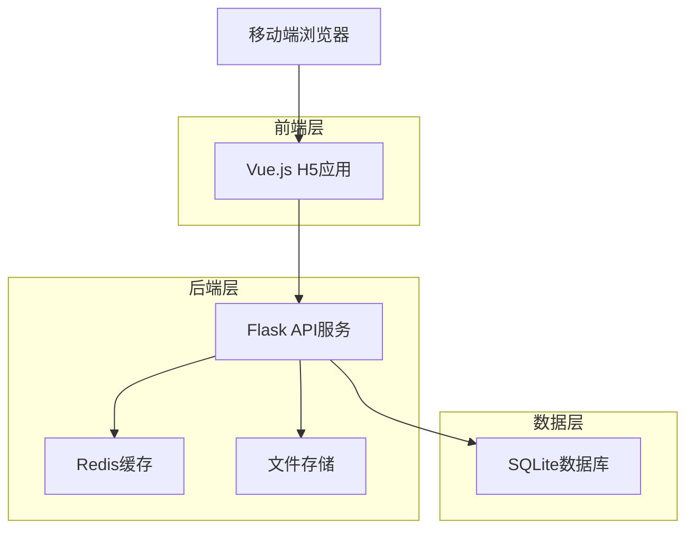
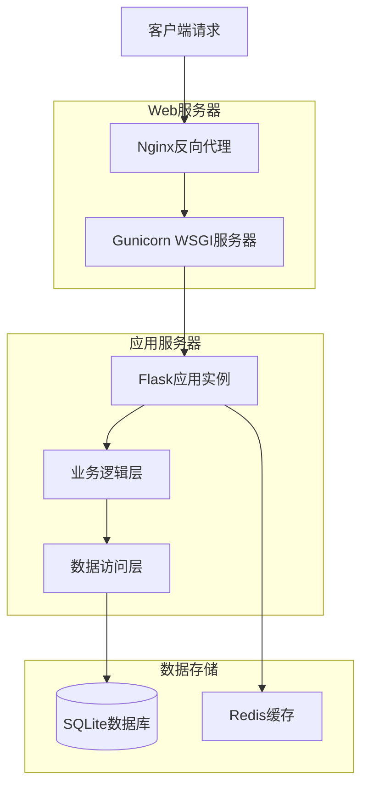

# 英语家教教学管理系统 - 技术架构文档

## 1. 架构设计



## 2. 技术描述

* **前端**: Vue.js\@3 + Vant UI\@4 + Vite\@4 + Pinia状态管理

* **后端**: Flask\@2.3 + Flask-SQLAlchemy + Flask-JWT-Extended + Redis\@7

* **数据库**: SQLite（开发/小规模部署）+ Redis（缓存/会话）

* **部署**: Nginx + Gunicorn + PM2（进程管理）

## 3. 路由定义

| 路由        | 用途                |
| --------- | ----------------- |
| /         | 首页，显示课程概览和快捷操作    |
| /login    | 登录页面，支持老师和学生登录    |
| /register | 注册页面，老师注册和学生邀请码注册 |
| /schedule | 课程表页面，展示和管理课程安排   |
| /homework | 作业管理页面，布置和批改作业    |
| /exam     | 考试管理页面，创建和监控考试    |
| /students | 学生管理页面，管理学生信息和进度  |
| /profile  | 个人中心页面，个人信息和系统设置  |

## 4. API定义

### 4.1 核心API

**用户认证相关**

```
POST /api/auth/login
```

请求参数:

| 参数名      | 参数类型   | 是否必需 | 描述                    |
| -------- | ------ | ---- | --------------------- |
| phone    | string | true | 手机号                   |
| password | string | true | 密码                    |
| role     | string | true | 用户角色（teacher/student） |

响应参数:

| 参数名        | 参数类型    | 描述      |
| ---------- | ------- | ------- |
| success    | boolean | 登录是否成功  |
| token      | string  | JWT访问令牌 |
| user\_info | object  | 用户基本信息  |

示例:

```json
{
  "phone": "13800138000",
  "password": "123456",
  "role": "teacher"
}
```

**课程管理相关**

```
GET /api/courses
POST /api/courses
PUT /api/courses/{course_id}
DELETE /api/courses/{course_id}
```

**作业管理相关**

```
GET /api/homework
POST /api/homework
PUT /api/homework/{homework_id}
GET /api/homework/{homework_id}/submissions
POST /api/homework/{homework_id}/submit
```

**考试管理相关**

```
GET /api/exams
POST /api/exams
GET /api/exams/{exam_id}/questions
POST /api/exams/{exam_id}/answers
GET /api/exams/{exam_id}/results
```

**学生管理相关**

```
GET /api/students
POST /api/students
PUT /api/students/{student_id}
GET /api/students/{student_id}/progress
```

## 5. 服务器架构图



## 6. 数据模型

### 6.1 数据模型定义

```mermaid
erDiagram
  USERS ||--o{ COURSES : teaches/attends
  USERS ||--o{ HOMEWORK_SUBMISSIONS : submits
  USERS ||--o{ EXAM_RESULTS : takes
  COURSES ||--o{ HOMEWORK : contains
  COURSES ||--o{ EXAMS : includes
  HOMEWORK ||--o{ HOMEWORK_SUBMISSIONS : receives
  EXAMS ||--o{ EXAM_QUESTIONS : contains
  EXAMS ||--o{ EXAM_RESULTS : generates
  EXAM_QUESTIONS ||--o{ EXAM_ANSWERS : has

  USERS {
    int id PK
    string phone UK
    string password_hash
    string name
    string role
    datetime created_at
    datetime updated_at
  }

  COURSES {
    int id PK
    int teacher_id FK
    string title
    string description
    datetime start_time
    datetime end_time
    string status
    datetime created_at
  }

  HOMEWORK {
    int id PK
    int course_id FK
    int teacher_id FK
    string title
    text content
    datetime due_date
    int total_score
    datetime created_at
  }

  HOMEWORK_SUBMISSIONS {
    int id PK
    int homework_id FK
    int student_id FK
    text content
    string attachment_url
    int score
    text feedback
    datetime submitted_at
  }

  EXAMS {
    int id PK
    int course_id FK
    int teacher_id FK
    string title
    text description
    datetime start_time
    datetime end_time
    int duration_minutes
    int total_score
    datetime created_at
  }

  EXAM_QUESTIONS {
    int id PK
    int exam_id FK
    string question_type
    text question_content
    text options
    text correct_answer
    int score
    int order_num
  }

  EXAM_RESULTS {
    int id PK
    int exam_id FK
    int student_id FK
    int total_score
    int obtained_score
    text answers
    datetime completed_at
  }
```

### 6.2 数据定义语言

**用户表 (users)**

```sql
-- 创建用户表
CREATE TABLE users (
    id INTEGER PRIMARY KEY AUTOINCREMENT,
    phone VARCHAR(20) UNIQUE NOT NULL,
    password_hash VARCHAR(255) NOT NULL,
    name VARCHAR(100) NOT NULL,
    role VARCHAR(20) NOT NULL CHECK (role IN ('teacher', 'student')),
    avatar_url VARCHAR(255),
    created_at DATETIME DEFAULT CURRENT_TIMESTAMP,
    updated_at DATETIME DEFAULT CURRENT_TIMESTAMP
);

-- 创建索引
CREATE INDEX idx_users_phone ON users(phone);
CREATE INDEX idx_users_role ON users(role);
```

**课程表 (courses)**

```sql
-- 创建课程表
CREATE TABLE courses (
    id INTEGER PRIMARY KEY AUTOINCREMENT,
    teacher_id INTEGER NOT NULL,
    title VARCHAR(200) NOT NULL,
    description TEXT,
    start_time DATETIME NOT NULL,
    end_time DATETIME NOT NULL,
    status VARCHAR(20) DEFAULT 'active' CHECK (status IN ('active', 'completed', 'cancelled')),
    created_at DATETIME DEFAULT CURRENT_TIMESTAMP,
    FOREIGN KEY (teacher_id) REFERENCES users(id)
);

-- 创建索引
CREATE INDEX idx_courses_teacher_id ON courses(teacher_id);
CREATE INDEX idx_courses_start_time ON courses(start_time);
```

**作业表 (homework)**

```sql
-- 创建作业表
CREATE TABLE homework (
    id INTEGER PRIMARY KEY AUTOINCREMENT,
    course_id INTEGER NOT NULL,
    teacher_id INTEGER NOT NULL,
    title VARCHAR(200) NOT NULL,
    content TEXT NOT NULL,
    due_date DATETIME NOT NULL,
    total_score INTEGER DEFAULT 100,
    created_at DATETIME DEFAULT CURRENT_TIMESTAMP,
    FOREIGN KEY (course_id) REFERENCES courses(id),
    FOREIGN KEY (teacher_id) REFERENCES users(id)
);

-- 创建索引
CREATE INDEX idx_homework_course_id ON homework(course_id);
CREATE INDEX idx_homework_due_date ON homework(due_date);
```

**作业提交表 (homework\_submissions)**

```sql
-- 创建作业提交表
CREATE TABLE homework_submissions (
    id INTEGER PRIMARY KEY AUTOINCREMENT,
    homework_id INTEGER NOT NULL,
    student_id INTEGER NOT NULL,
    content TEXT,
    attachment_url VARCHAR(255),
    score INTEGER,
    feedback TEXT,
    submitted_at DATETIME DEFAULT CURRENT_TIMESTAMP,
    FOREIGN KEY (homework_id) REFERENCES homework(id),
    FOREIGN KEY (student_id) REFERENCES users(id),
    UNIQUE(homework_id, student_id)
);

-- 创建索引
CREATE INDEX idx_submissions_homework_id ON homework_submissions(homework_id);
CREATE INDEX idx_submissions_student_id ON homework_submissions(student_id);
```

**考试表 (exams)**

```sql
-- 创建考试表
CREATE TABLE exams (
    id INTEGER PRIMARY KEY AUTOINCREMENT,
    course_id INTEGER NOT NULL,
    teacher_id INTEGER NOT NULL,
    title VARCHAR(200) NOT NULL,
    description TEXT,
    start_time DATETIME NOT NULL,
    end_time DATETIME NOT NULL,
    duration_minutes INTEGER NOT NULL,
    total_score INTEGER DEFAULT 100,
    created_at DATETIME DEFAULT CURRENT_TIMESTAMP,
    FOREIGN KEY (course_id) REFERENCES courses(id),
    FOREIGN KEY (teacher_id) REFERENCES users(id)
);

-- 创建索引
CREATE INDEX idx_exams_course_id ON exams(course_id);
CREATE INDEX idx_exams_start_time ON exams(start_time);
```

**初始化数据**

```sql
-- 插入测试老师账号
INSERT INTO users (phone, password_hash, name, role) VALUES 
('13800138000', 'pbkdf2:sha256:260000$salt$hash', '张老师', 'teacher');

-- 插入测试学生账号
INSERT INTO users (phone, password_hash, name, role) VALUES 
('13800138001', 'pbkdf2:sha256:260000$salt$hash', '小明', 'student'),
('13800138002', 'pbkdf2:sha256:260000$salt$hash', '小红', 'student');
```

