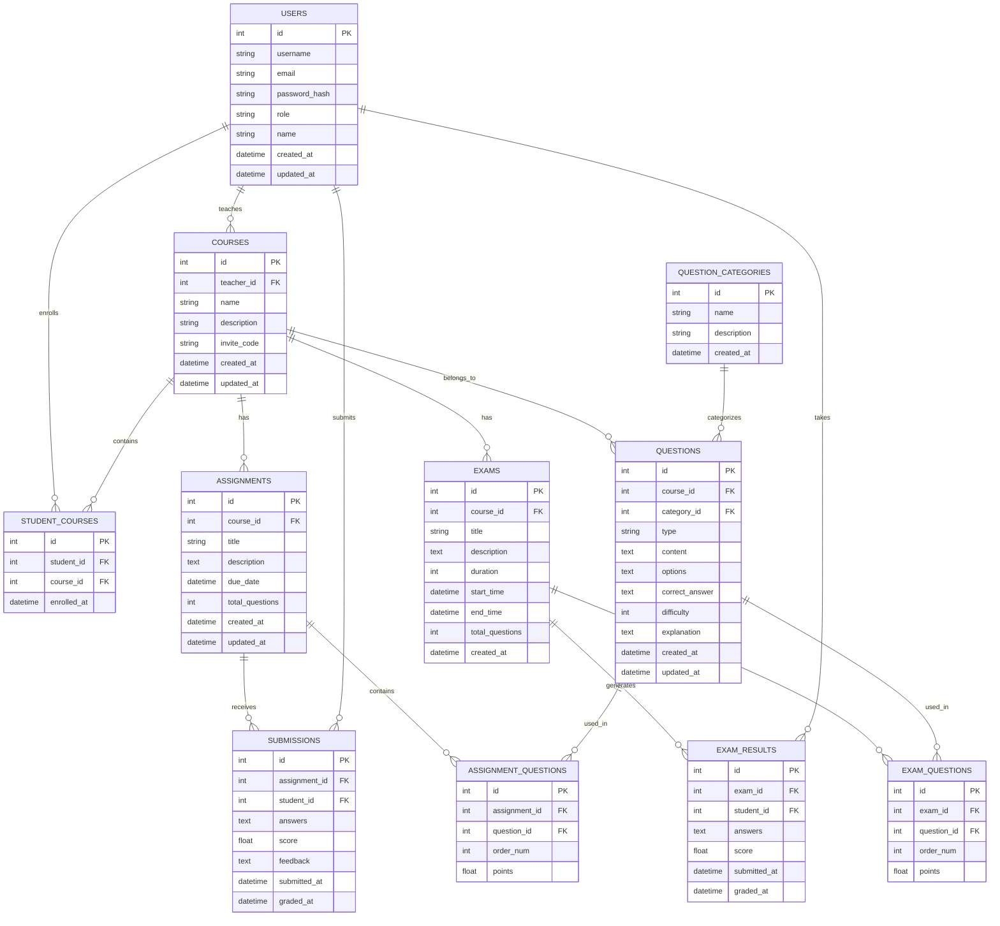

# 英语家教教学管理系统 - 数据库设计文档

## 1. 数据库概述

本系统采用SQLite作为主数据库，Redis作为缓存数据库。SQLite适合中小型应用，部署简单，无需额外的数据库服务器，非常适合2c2g服务器环境。

**设计原则：**

* 数据一致性：确保数据的完整性和一致性

* 性能优化：合理设计索引，优化查询性能

* 扩展性：预留扩展字段，便于功能迭代

* 安全性：敏感数据加密存储

## 2. 数据库架构

### 2.1 ER图



## 3. 数据表设计

### 3.1 用户表 (users)

**表说明：** 存储系统中所有用户信息，包括老师和学生

| 字段名                | 数据类型     | 长度  | 是否为空     | 默认值                | 说明                              |
| ------------------ | -------- | --- | -------- | ------------------ | ------------------------------- |
| id                 | INTEGER  | -   | NOT NULL | AUTO\_INCREMENT    | 主键，用户ID                         |
| phone              | VARCHAR  | 20  | NOT NULL | -                  | 手机号，唯一                          |
| password\_hash     | VARCHAR  | 255 | NOT NULL | -                  | 密码哈希值                           |
| name               | VARCHAR  | 100 | NOT NULL | -                  | 用户姓名                            |
| role               | VARCHAR  | 20  | NOT NULL | -                  | 用户角色（teacher/student）           |
| avatar\_url        | VARCHAR  | 255 | NULL     | NULL               | 头像URL                           |
| email              | VARCHAR  | 100 | NULL     | NULL               | 邮箱地址                            |
| gender             | VARCHAR  | 10  | NULL     | NULL               | 性别                              |
| birth\_date        | DATE     | -   | NULL     | NULL               | 出生日期                            |
| address            | TEXT     | -   | NULL     | NULL               | 地址                              |
| emergency\_contact | VARCHAR  | 100 | NULL     | NULL               | 紧急联系人                           |
| emergency\_phone   | VARCHAR  | 20  | NULL     | NULL               | 紧急联系电话                          |
| status             | VARCHAR  | 20  | NOT NULL | 'active'           | 账户状态（active/inactive/suspended） |
| last\_login\_at    | DATETIME | -   | NULL     | NULL               | 最后登录时间                          |
| created\_at        | DATETIME | -   | NOT NULL | CURRENT\_TIMESTAMP | 创建时间                            |
| updated\_at        | DATETIME | -   | NOT NULL | CURRENT\_TIMESTAMP | 更新时间                            |

**索引设计：**

```sql
CREATE UNIQUE INDEX idx_users_phone ON users(phone);
CREATE INDEX idx_users_role ON users(role);
CREATE INDEX idx_users_status ON users(status);
CREATE INDEX idx_users_created_at ON users(created_at);
```

**建表语句：**

```sql
CREATE TABLE users (
    id INTEGER PRIMARY KEY AUTOINCREMENT,
    phone VARCHAR(20) UNIQUE NOT NULL,
    password_hash VARCHAR(255) NOT NULL,
    name VARCHAR(100) NOT NULL,
    role VARCHAR(20) NOT NULL CHECK (role IN ('teacher', 'student')),
    avatar_url VARCHAR(255),
    email VARCHAR(100),
    gender VARCHAR(10) CHECK (gender IN ('male', 'female', 'other')),
    birth_date DATE,
    address TEXT,
    emergency_contact VARCHAR(100),
    emergency_phone VARCHAR(20),
    status VARCHAR(20) DEFAULT 'active' CHECK (status IN ('active', 'inactive', 'suspended')),
    last_login_at DATETIME,
    created_at DATETIME DEFAULT CURRENT_TIMESTAMP,
    updated_at DATETIME DEFAULT CURRENT_TIMESTAMP
);
```

### 3.2 课程表 (courses)

**表说明：** 存储课程信息和安排

| 字段名               | 数据类型     | 长度   | 是否为空     | 默认值                | 说明                   |
| ----------------- | -------- | ---- | -------- | ------------------ | -------------------- |
| id                | INTEGER  | -    | NOT NULL | AUTO\_INCREMENT    | 主键，课程ID              |
| teacher\_id       | INTEGER  | -    | NOT NULL | -                  | 外键，关联users表          |
| title             | VARCHAR  | 200  | NOT NULL | -                  | 课程标题                 |
| description       | TEXT     | -    | NULL     | NULL               | 课程描述                 |
| subject           | VARCHAR  | 50   | NULL     | NULL               | 学科分类                 |
| level             | VARCHAR  | 20   | NULL     | NULL               | 难度等级                 |
| start\_time       | DATETIME | -    | NOT NULL | -                  | 开始时间                 |
| end\_time         | DATETIME | -    | NOT NULL | -                  | 结束时间                 |
| location          | VARCHAR  | 100  | NULL     | NULL               | 上课地点                 |
| max\_students     | INTEGER  | -    | NULL     | 10                 | 最大学生数                |
| current\_students | INTEGER  | -    | NOT NULL | 0                  | 当前学生数                |
| price             | DECIMAL  | 10,2 | NULL     | NULL               | 课程价格                 |
| status            | VARCHAR  | 20   | NOT NULL | 'active'           | 课程状态                 |
| recurring\_type   | VARCHAR  | 20   | NULL     | NULL               | 重复类型（weekly/monthly） |
| recurring\_end    | DATE     | -    | NULL     | NULL               | 重复结束日期               |
| notes             | TEXT     | -    | NULL     | NULL               | 备注信息                 |
| created\_at       | DATETIME | -    | NOT NULL | CURRENT\_TIMESTAMP | 创建时间                 |
| updated\_at       | DATETIME | -    | NOT NULL | CURRENT\_TIMESTAMP | 更新时间                 |

**索引设计：**

```sql
CREATE INDEX idx_courses_teacher_id ON courses(teacher_id);
CREATE INDEX idx_courses_start_time ON courses(start_time);
CREATE INDEX idx_courses_status ON courses(status);
CREATE INDEX idx_courses_subject ON courses(subject);
```

### 3.3 课程学生关联表 (course\_students)

**表说明：** 多对多关系表，记录课程和学生的关联关系

| 字段名              | 数据类型     | 长度 | 是否为空     | 默认值                | 说明                           |
| ---------------- | -------- | -- | -------- | ------------------ | ---------------------------- |
| id               | INTEGER  | -  | NOT NULL | AUTO\_INCREMENT    | 主键                           |
| course\_id       | INTEGER  | -  | NOT NULL | -                  | 外键，关联courses表                |
| student\_id      | INTEGER  | -  | NOT NULL | -                  | 外键，关联users表                  |
| enrollment\_date | DATETIME | -  | NOT NULL | CURRENT\_TIMESTAMP | 报名时间                         |
| status           | VARCHAR  | 20 | NOT NULL | 'active'           | 状态（active/dropped/completed） |
| payment\_status  | VARCHAR  | 20 | NULL     | 'pending'          | 付费状态                         |
| notes            | TEXT     | -  | NULL     | NULL               | 备注                           |

**建表语句：**

```sql
CREATE TABLE course_students (
    id INTEGER PRIMARY KEY AUTOINCREMENT,
    course_id INTEGER NOT NULL,
    student_id INTEGER NOT NULL,
    enrollment_date DATETIME DEFAULT CURRENT_TIMESTAMP,
    status VARCHAR(20) DEFAULT 'active' CHECK (status IN ('active', 'dropped', 'completed')),
    payment_status VARCHAR(20) DEFAULT 'pending' CHECK (payment_status IN ('pending', 'paid', 'refunded')),
    notes TEXT,
    FOREIGN KEY (course_id) REFERENCES courses(id),
    FOREIGN KEY (student_id) REFERENCES users(id),
    UNIQUE(course_id, student_id)
);
```

### 3.4 作业表 (homework)

**表说明：** 存储作业信息

| 字段名                     | 数据类型     | 长度  | 是否为空     | 默认值                | 说明            |
| ----------------------- | -------- | --- | -------- | ------------------ | ------------- |
| id                      | INTEGER  | -   | NOT NULL | AUTO\_INCREMENT    | 主键，作业ID       |
| course\_id              | INTEGER  | -   | NOT NULL | -                  | 外键，关联courses表 |
| teacher\_id             | INTEGER  | -   | NOT NULL | -                  | 外键，关联users表   |
| title                   | VARCHAR  | 200 | NOT NULL | -                  | 作业标题          |
| content                 | TEXT     | -   | NOT NULL | -                  | 作业内容          |
| homework\_type          | VARCHAR  | 20  | NULL     | 'assignment'       | 作业类型          |
| difficulty              | VARCHAR  | 20  | NULL     | 'medium'           | 难度等级          |
| estimated\_time         | INTEGER  | -   | NULL     | NULL               | 预估完成时间（分钟）    |
| due\_date               | DATETIME | -   | NOT NULL | -                  | 截止时间          |
| total\_score            | INTEGER  | -   | NOT NULL | 100                | 总分            |
| allow\_late\_submission | BOOLEAN  | -   | NOT NULL | 0                  | 是否允许迟交        |
| late\_penalty           | INTEGER  | -   | NULL     | NULL               | 迟交扣分比例        |
| attachment\_url         | VARCHAR  | 255 | NULL     | NULL               | 附件URL         |
| instructions            | TEXT     | -   | NULL     | NULL               | 作业说明          |
| rubric                  | TEXT     | -   | NULL     | NULL               | 评分标准          |
| status                  | VARCHAR  | 20  | NOT NULL | 'active'           | 状态            |
| created\_at             | DATETIME | -   | NOT NULL | CURRENT\_TIMESTAMP | 创建时间          |
| updated\_at             | DATETIME | -   | NOT NULL | CURRENT\_TIMESTAMP | 更新时间          |

**索引设计：**

```sql
CREATE INDEX idx_homework_course_id ON homework(course_id);
CREATE INDEX idx_homework_teacher_id ON homework(teacher_id);
CREATE INDEX idx_homework_due_date ON homework(due_date);
CREATE INDEX idx_homework_status ON homework(status);
```

### 3.5 作业提交表 (homework\_submissions)

**表说明：** 存储学生作业提交记录

| 字段名               | 数据类型     | 长度  | 是否为空     | 默认值                | 说明             |
| ----------------- | -------- | --- | -------- | ------------------ | -------------- |
| id                | INTEGER  | -   | NOT NULL | AUTO\_INCREMENT    | 主键             |
| homework\_id      | INTEGER  | -   | NOT NULL | -                  | 外键，关联homework表 |
| student\_id       | INTEGER  | -   | NOT NULL | -                  | 外键，关联users表    |
| content           | TEXT     | -   | NULL     | NULL               | 提交内容           |
| attachment\_url   | VARCHAR  | 255 | NULL     | NULL               | 附件URL          |
| attachment\_name  | VARCHAR  | 255 | NULL     | NULL               | 附件原始名称         |
| attachment\_size  | INTEGER  | -   | NULL     | NULL               | 附件大小（字节）       |
| score             | INTEGER  | -   | NULL     | NULL               | 得分             |
| feedback          | TEXT     | -   | NULL     | NULL               | 老师反馈           |
| graded\_by        | INTEGER  | -   | NULL     | NULL               | 批改老师ID         |
| graded\_at        | DATETIME | -   | NULL     | NULL               | 批改时间           |
| submission\_count | INTEGER  | -   | NOT NULL | 1                  | 提交次数           |
| is\_late          | BOOLEAN  | -   | NOT NULL | 0                  | 是否迟交           |
| time\_spent       | INTEGER  | -   | NULL     | NULL               | 花费时间（分钟）       |
| status            | VARCHAR  | 20  | NOT NULL | 'submitted'        | 状态             |
| submitted\_at     | DATETIME | -   | NOT NULL | CURRENT\_TIMESTAMP | 提交时间           |
| updated\_at       | DATETIME | -   | NOT NULL | CURRENT\_TIMESTAMP | 更新时间           |

**建表语句：**

```sql
CREATE TABLE homework_submissions (
    id INTEGER PRIMARY KEY AUTOINCREMENT,
    homework_id INTEGER NOT NULL,
    student_id INTEGER NOT NULL,
    content TEXT,
    attachment_url VARCHAR(255),
    attachment_name VARCHAR(255),
    attachment_size INTEGER,
    score INTEGER CHECK (score >= 0),
    feedback TEXT,
    graded_by INTEGER,
    graded_at DATETIME,
    submission_count INTEGER DEFAULT 1,
    is_late BOOLEAN DEFAULT 0,
    time_spent INTEGER,
    status VARCHAR(20) DEFAULT 'submitted' CHECK (status IN ('submitted', 'graded', 'returned')),
    submitted_at DATETIME DEFAULT CURRENT_TIMESTAMP,
    updated_at DATETIME DEFAULT CURRENT_TIMESTAMP,
    FOREIGN KEY (homework_id) REFERENCES homework(id),
    FOREIGN KEY (student_id) REFERENCES users(id),
    FOREIGN KEY (graded_by) REFERENCES users(id),
    UNIQUE(homework_id, student_id)
);
```

### 3.6 考试表 (exams)

**表说明：** 存储考试信息

| 字段名                       | 数据类型     | 长度  | 是否为空     | 默认值                | 说明            |
| ------------------------- | -------- | --- | -------- | ------------------ | ------------- |
| id                        | INTEGER  | -   | NOT NULL | AUTO\_INCREMENT    | 主键，考试ID       |
| course\_id                | INTEGER  | -   | NOT NULL | -                  | 外键，关联courses表 |
| teacher\_id               | INTEGER  | -   | NOT NULL | -                  | 外键，关联users表   |
| title                     | VARCHAR  | 200 | NOT NULL | -                  | 考试标题          |
| description               | TEXT     | -   | NULL     | NULL               | 考试描述          |
| exam\_type                | VARCHAR  | 20  | NULL     | 'quiz'             | 考试类型          |
| start\_time               | DATETIME | -   | NOT NULL | -                  | 开始时间          |
| end\_time                 | DATETIME | -   | NOT NULL | -                  | 结束时间          |
| duration\_minutes         | INTEGER  | -   | NOT NULL | -                  | 考试时长（分钟）      |
| total\_score              | INTEGER  | -   | NOT NULL | 100                | 总分            |
| pass\_score               | INTEGER  | -   | NULL     | 60                 | 及格分数          |
| question\_count           | INTEGER  | -   | NOT NULL | 0                  | 题目数量          |
| shuffle\_questions        | BOOLEAN  | -   | NOT NULL | 0                  | 是否打乱题目顺序      |
| shuffle\_options          | BOOLEAN  | -   | NOT NULL | 0                  | 是否打乱选项顺序      |
| allow\_review             | BOOLEAN  | -   | NOT NULL | 1                  | 是否允许查看答案      |
| show\_result\_immediately | BOOLEAN  | -   | NOT NULL | 1                  | 是否立即显示结果      |
| max\_attempts             | INTEGER  | -   | NULL     | 1                  | 最大尝试次数        |
| instructions              | TEXT     | -   | NULL     | NULL               | 考试说明          |
| status                    | VARCHAR  | 20  | NOT NULL | 'draft'            | 状态            |
| created\_at               | DATETIME | -   | NOT NULL | CURRENT\_TIMESTAMP | 创建时间          |
| updated\_at               | DATETIME | -   | NOT NULL | CURRENT\_TIMESTAMP | 更新时间          |

### 3.7 考试题目表 (exam\_questions)

**表说明：** 存储考试题目

| 字段名               | 数据类型     | 长度  | 是否为空     | 默认值                | 说明          |
| ----------------- | -------- | --- | -------- | ------------------ | ----------- |
| id                | INTEGER  | -   | NOT NULL | AUTO\_INCREMENT    | 主键          |
| exam\_id          | INTEGER  | -   | NOT NULL | -                  | 外键，关联exams表 |
| question\_type    | VARCHAR  | 20  | NOT NULL | -                  | 题目类型        |
| question\_content | TEXT     | -   | NOT NULL | -                  | 题目内容        |
| options           | TEXT     | -   | NULL     | NULL               | 选项（JSON格式）  |
| correct\_answer   | TEXT     | -   | NOT NULL | -                  | 正确答案        |
| explanation       | TEXT     | -   | NULL     | NULL               | 答案解析        |
| score             | INTEGER  | -   | NOT NULL | 1                  | 分值          |
| difficulty        | VARCHAR  | 20  | NULL     | 'medium'           | 难度等级        |
| order\_num        | INTEGER  | -   | NOT NULL | 1                  | 题目顺序        |
| image\_url        | VARCHAR  | 255 | NULL     | NULL               | 题目图片        |
| audio\_url        | VARCHAR  | 255 | NULL     | NULL               | 题目音频        |
| time\_limit       | INTEGER  | -   | NULL     | NULL               | 单题时间限制（秒）   |
| created\_at       | DATETIME | -   | NOT NULL | CURRENT\_TIMESTAMP | 创建时间        |

### 3.8 考试结果表 (exam\_results)

**表说明：** 存储学生考试结果

| 字段名             | 数据类型     | 长度  | 是否为空     | 默认值                | 说明          |
| --------------- | -------- | --- | -------- | ------------------ | ----------- |
| id              | INTEGER  | -   | NOT NULL | AUTO\_INCREMENT    | 主键          |
| exam\_id        | INTEGER  | -   | NOT NULL | -                  | 外键，关联exams表 |
| student\_id     | INTEGER  | -   | NOT NULL | -                  | 外键，关联users表 |
| attempt\_number | INTEGER  | -   | NOT NULL | 1                  | 尝试次数        |
| total\_score    | INTEGER  | -   | NOT NULL | -                  | 总分          |
| obtained\_score | INTEGER  | -   | NOT NULL | -                  | 得分          |
| percentage      | DECIMAL  | 5,2 | NOT NULL | -                  | 得分百分比       |
| answers         | TEXT     | -   | NOT NULL | -                  | 答案（JSON格式）  |
| time\_spent     | INTEGER  | -   | NULL     | NULL               | 用时（分钟）      |
| start\_time     | DATETIME | -   | NOT NULL | -                  | 开始时间        |
| completed\_at   | DATETIME | -   | NOT NULL | CURRENT\_TIMESTAMP | 完成时间        |
| ip\_address     | VARCHAR  | 45  | NULL     | NULL               | IP地址        |
| user\_agent     | TEXT     | -   | NULL     | NULL               | 浏览器信息       |
| status          | VARCHAR  | 20  | NOT NULL | 'completed'        | 状态          |

## 4. 视图设计

### 4.1 学生成绩统计视图

```sql
CREATE VIEW student_performance_view AS
SELECT 
    u.id as student_id,
    u.name as student_name,
    COUNT(DISTINCT cs.course_id) as course_count,
    COUNT(hs.id) as homework_submitted,
    AVG(hs.score) as avg_homework_score,
    COUNT(er.id) as exam_taken,
    AVG(er.percentage) as avg_exam_percentage,
    MAX(u.last_login_at) as last_active
FROM users u
LEFT JOIN course_students cs ON u.id = cs.student_id AND cs.status = 'active'
LEFT JOIN homework_submissions hs ON u.id = hs.student_id AND hs.status = 'graded'
LEFT JOIN exam_results er ON u.id = er.student_id AND er.status = 'completed'
WHERE u.role = 'student' AND u.status = 'active'
GROUP BY u.id, u.name;
```

### 4.2 课程统计视图

```sql
CREATE VIEW course_statistics_view AS
SELECT 
    c.id as course_id,
    c.title as course_title,
    u.name as teacher_name,
    COUNT(DISTINCT cs.student_id) as student_count,
    COUNT(DISTINCT h.id) as homework_count,
    COUNT(DISTINCT e.id) as exam_count,
    AVG(hs.score) as avg_homework_score,
    AVG(er.percentage) as avg_exam_percentage
FROM courses c
JOIN users u ON c.teacher_id = u.id
LEFT JOIN course_students cs ON c.id = cs.course_id AND cs.status = 'active'
LEFT JOIN homework h ON c.id = h.course_id AND h.status = 'active'
LEFT JOIN homework_submissions hs ON h.id = hs.homework_id AND hs.status = 'graded'
LEFT JOIN exams e ON c.id = e.course_id AND e.status = 'published'
LEFT JOIN exam_results er ON e.id = er.exam_id AND er.status = 'completed'
WHERE c.status = 'active'
GROUP BY c.id, c.title, u.name;
```

## 5. 索引优化策略

### 5.1 查询频率分析

**高频查询：**

* 用户登录验证：`users.phone`

* 课程列表查询：`courses.teacher_id`, `courses.start_time`

* 作业列表查询：`homework.course_id`, `homework.due_date`

* 学生成绩查询：`homework_submissions.student_id`, `exam_results.student_id`

### 5.2 复合索引设计

```sql
-- 课程查询优化
CREATE INDEX idx_courses_teacher_time ON courses(teacher_id, start_time, status);

-- 作业提交查询优化
CREATE INDEX idx_submissions_homework_student ON homework_submissions(homework_id, student_id, status);

-- 考试结果查询优化
CREATE INDEX idx_exam_results_student_exam ON exam_results(student_id, exam_id, completed_at);

-- 课程学生关联查询优化
CREATE INDEX idx_course_students_course_status ON course_students(course_id, status);
```

## 6. 数据备份策略

### 6.1 备份计划

**每日备份：**

```bash
#!/bin/bash
# 每日凌晨2点执行
sqlite3 /path/to/database.db ".backup /backup/daily/$(date +%Y%m%d)_database.db"
```

**每周备份：**

```bash
#!/bin/bash
# 每周日凌晨3点执行
sqlite3 /path/to/database.db ".backup /backup/weekly/$(date +%Y%W)_database.db"
```

### 6.2 数据恢复

```bash
# 从备份恢复数据库
sqlite3 /path/to/new_database.db ".restore /backup/20240118_database.db"
```

## 7. 性能优化建议

### 7.1 查询优化

1. **使用EXPLAIN QUERY PLAN分析查询**

```sql
EXPLAIN QUERY PLAN 
SELECT * FROM courses c 
JOIN course_students cs ON c.id = cs.course_id 
WHERE c.teacher_id = 1 AND cs.status = 'active';
```

1. \**避免SELECT ，只查询需要的字段*

```sql
-- 优化前
SELECT * FROM users WHERE role = 'student';

-- 优化后
SELECT id, name, phone FROM users WHERE role = 'student';
```

1. **使用LIMIT限制结果集**

```sql
SELECT id, title, start_time FROM courses 
WHERE teacher_id = 1 
ORDER BY start_time DESC 
LIMIT 10;
```

### 7.2 数据库配置优化

```sql
-- 设置SQLite性能参数
PRAGMA journal_mode = WAL;  -- 启用WAL模式
PRAGMA synchronous = NORMAL;  -- 设置同步模式
PRAGMA cache_size = 10000;  -- 设置缓存大小
PRAGMA temp_store = memory;  -- 临时表存储在内存
```

### 7.3 Redis缓存策略

**缓存热点数据：**

```python
# 缓存用户信息（30分钟）
redis.setex(f"user:{user_id}", 1800, json.dumps(user_data))

# 缓存课程列表（10分钟）
redis.setex(f"courses:teacher:{teacher_id}", 600, json.dumps(courses))

# 缓存统计数据（1小时）
redis.setex(f"stats:teacher:{teacher_id}", 3600, json.dumps(stats))
```

## 8. 数据安全措施

### 8.1 敏感数据加密

```python
# 密码哈希
from werkzeug.security import generate_password_hash, check_password_hash

password_hash = generate_password_hash('user_password')
```

### 8.2 数据访问控制

```sql
-- 创建只读用户（用于报表查询）
CREATE USER 'readonly'@'localhost' IDENTIFIED BY 'password';
GRANT SELECT ON teaching_system.* TO 'readonly'@'localhost';
```

### 8.3 SQL注入防护

```python
# 使用参数化查询
cursor.execute(
    "SELECT * FROM users WHERE phone = ? AND password_hash = ?", 
    (phone, password_hash)
)
```

## 9. 监控和维护

### 9.1 数据库监控

```python
# 监控数据库大小
import os
db_size = os.path.getsize('/path/to/database.db')
print(f"Database size: {db_size / 1024 / 1024:.2f} MB")

# 监控表记录数
cursor.execute("SELECT COUNT(*) FROM users")
user_count = cursor.fetchone()[0]
```

### 9.2 定期维护任务

```sql
-- 清理过期数据（每月执行）
DELETE FROM exam_results WHERE completed_at < date('now', '-1 year');

-- 优化数据库（每周执行）
VACUUM;
ANALYZE;
```

## 10. 扩展性考虑

### 10.1 分表策略

当数据量增长时，可以考虑按时间分表：

```sql
-- 按年份分表
CREATE TABLE homework_submissions_2024 AS SELECT * FROM homework_submissions WHERE 0;
CREATE TABLE homework_submissions_2025 AS SELECT * FROM homework_submissions WHERE 0;
```

### 10.2 读写分离

在高并发场景下，可以配置主从数据库：

```python
# 写操作使用主数据库
master_db = sqlite3.connect('/path/to/master.db')

# 读操作使用从数据库
slave_db = sqlite3.connect('/path/to/slave.db')
```

