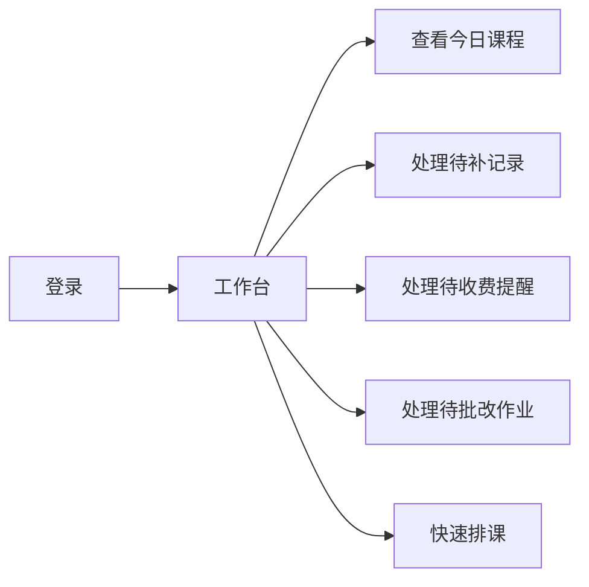
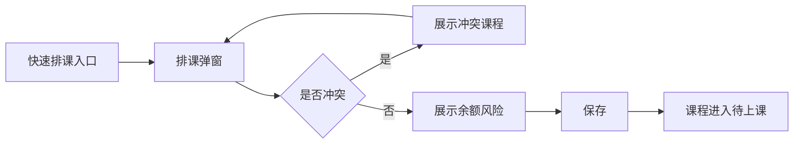
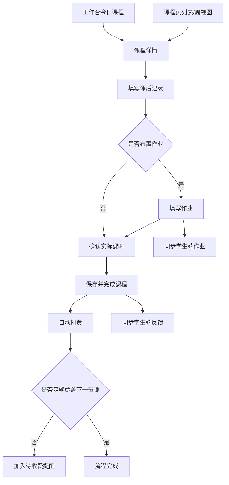
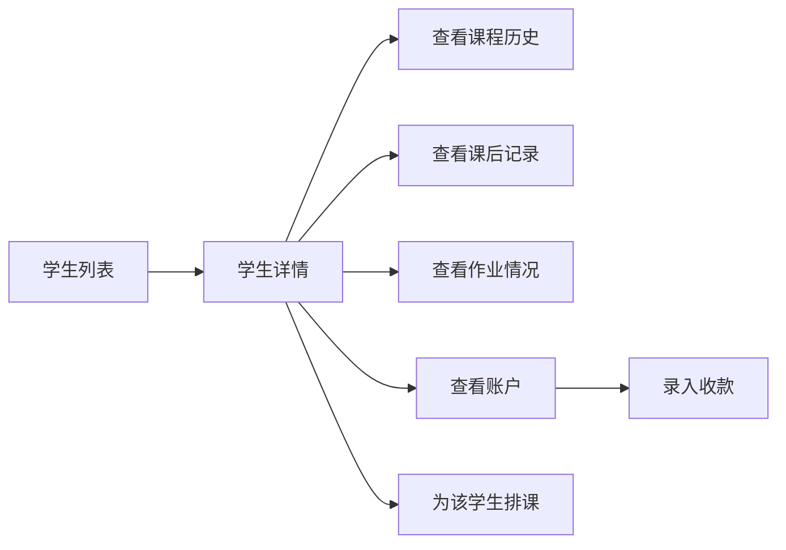

# 家教辅助系统 V2 流程型原型

> 状态：参考
> 范围：老师端 V2
> 更新：2026-04-26
> 版本：2.0
> 日期：2026-04-21
> 说明：本文件补充页面之间的关键流程衔接，用于评审“是否顺手”而不是“是否功能齐全”。

## 1. 目标

本稿不再按页面孤立描述，而是按老师真实动作串联页面和状态变化，重点验证：

- 老师是否能从首页快速进入当天工作
- 一节课是否能在一条链路里完成记录、作业、扣费和收费判断
- 收费提醒是否自然
- 学生端是否能清晰承接老师动作结果

## 2. 流程一：老师开始一天工作

### 2.1 目标

老师打开系统后，不需要思考“先去哪一页”，而是系统直接告诉老师今天该做什么。

### 2.2 页面流转

### 2.3 工作台第一屏优先级

1. 待补记录
2. 今日课程
3. 待收费提醒
4. 待批改作业
5. 快速操作

### 2.4 设计要点

- 老师最怕遗漏课后动作，所以“待补记录”优先级最高
- 收费提醒只在“会影响下一节课”时被抬高，不做泛提醒
- 快速操作永远在首屏底部可见，减少跳转

## 3. 流程二：排一节新课

### 3.1 起点

入口可以来自：

- 工作台“快速排课”
- 课程页周视图空白时间格
- 学生详情页“为该学生排课”

### 3.2 页面流转

### 3.3 排课弹窗关键区块

- 学生
- 科目
- 日期
- 开始时间
- 计划课时
- 冲突检测结果
- 余额风险提示

### 3.4 设计要点

- “冲突检测”和“余额提示”必须放在同一层，不要让老师保存后才发现风险
- 即便余额不足，也不阻止排课，因为老师可能先排课、课后再收费

## 4. 流程三：完成一节课

### 4.1 这是新版最关键的流程

目标不是“改状态”，而是让老师完成一节课后的所有必要动作。

### 4.2 页面流转

### 4.3 课程详情要解决的 5 个问题

1. 这节课是谁、什么时候、上多久
2. 这个学生当前是什么状态
3. 本节课后记录要写什么
4. 是否要留作业
5. 这节课扣多少钱，扣完后够不够下一节课

### 4.4 最小必填策略

为了防止老师因为表单太重而拖延记录，建议课程完成时只强制：

- 实际课时
- 本节内容摘要
- 学生表现摘要

其余内容允许后补。

### 4.5 成功反馈文案

课程完成后，需要明确显示：

- 已保存记录
- 已扣费金额
- 剩余余额
- 是否已进入收费提醒

不要只弹一句“保存成功”。

## 5. 流程四：处理收费提醒

### 5.1 目标

老师处理收费应该像处理待办，而不是进入财务系统。

### 5.2 页面流转

### 5.3 工作台待收费卡片信息

- 学生姓名
- 当前余额
- 下一节课时间
- 下一节课预计扣费
- 差额

### 5.4 收款弹窗信息

- 收款金额
- 收款时间
- 收款方式
- 收款后预计余额

### 5.5 设计要点

- 老师处理收费应该不离开当前上下文
- 收款后风险要立即解除，给到明确反馈

## 6. 流程五：从学生页复盘

### 6.1 目标

学生页不承担高频动作，但要提供完整上下文，方便老师沟通和复盘。

### 6.2 页面流转

### 6.3 学生详情顶部概览必须回答的问题

- 这个学生最近有课吗
- 下一节课是什么时候
- 当前余额够不够
- 最近有没有异常

### 6.4 账户 Tab 设计重点

账户页必须首先展示“当前余额”和“预计还能上几次课”，而不是先展示流水表。

## 7. 流程六：学生端承接

### 7.1 目标

老师端动作完成后，学生/家长端能自然看到结果，不需要额外解释。

### 7.2 承接关系

| 老师端动作 | 学生端变化 |
|-----------|-----------|
| 排课 | 课程页出现新的待上课课程 |
| 完成课程并填写记录 | 反馈页出现新的课后反馈 |
| 布置作业 | 作业页出现新的待完成作业 |
| 批改作业 | 作业页显示分数和评语 |
| 录入收款 | 我的页余额上升 |
| 自动扣费 | 我的页最近扣费记录更新 |

### 7.3 学生端不做复杂协同

当前阶段学生端只做：

- 看课程
- 看作业
- 看反馈
- 看资料
- 看余额

少量互动仅限：

- 查看作业详情
- 查看批改结果
- 查看资料预览

## 8. 状态设计

### 8.1 课程状态

| 状态 | 定义 | 出现场景 |
|------|------|---------|
| 待上课 | 已排课，尚未开始 | 工作台、课程页 |
| 已上课待记录 | 课程时间已结束，但未完成课后闭环 | 工作台、课程页 |
| 已完成 | 已完成记录和扣费 | 课程页、学生详情 |
| 已取消 | 本节课取消 | 课程页、学生详情 |

### 8.2 余额风险状态

| 状态 | 定义 | 展示方式 |
|------|------|---------|
| 正常 | 余额足以覆盖下一节课 | 普通文本 |
| 预警 | 余额不足覆盖下一节课 | 橙/红标签 |
| 透支 | 本次课程完成后余额为负 | 强警示 |

### 8.3 作业状态

| 状态 | 定义 |
|------|------|
| 待完成 | 学生尚未处理 |
| 已提交 | 学生已提交，老师未批改 |
| 已批改 | 老师已批改 |
| 逾期未交 | 已过截止时间仍未提交 |

## 9. 可用性细则

### 9.1 减少跳转

本版要求高频动作尽可能在当前层完成：

- 排课用弹窗
- 收款用弹窗
- 课程完成在详情抽屉内完成
- 批改作业用侧边栏完成

### 9.2 强反馈

所有关键动作必须给明确结果：

- 排课成功
- 课程完成成功
- 扣费成功
- 进入收费提醒
- 收款成功

### 9.3 提醒不过度

系统只做强相关提醒：

- 待补记录
- 余额不足下一节课
- 待批改作业

避免泛消息轰炸。

## 10. 评审重点

评审这版原型时，优先回答下面 5 个问题：

1. 老师打开首页后，是不是马上知道先做什么
2. 一节课从结束到完成，是不是足够顺
3. 收费提醒是不是自然，不像额外财务模块
4. 学生页是不是更像“全貌页”而不是另一个工作台
5. 学生端是否清晰承接了老师端动作结果
