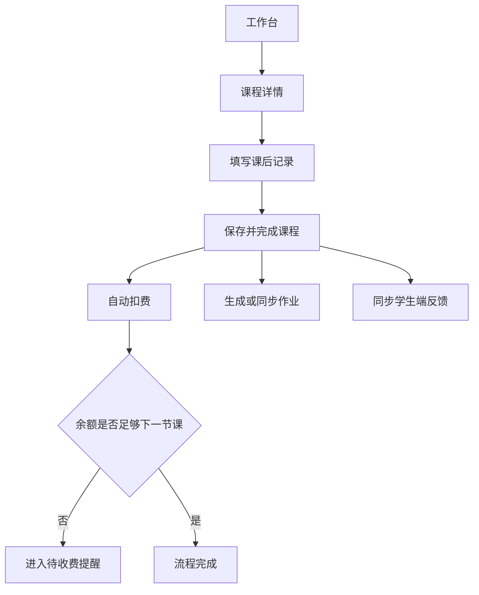
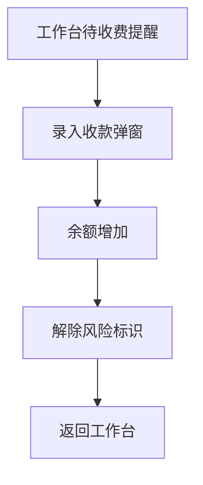

# 家教辅助系统 V2 原型说明

> 状态：当前
> 范围：老师端 V2
> 更新：2026-04-26
> 版本：2.0
> 日期：2026-04-21
> 说明：本文件为新版 PRD 的配套原型说明，采用中高保真文字原型描述信息层级、布局结构和关键交互。

## 当前原型对应状态（2026-04-23）

本原型中的以下老师端页面已经有真实前端实现或较高完成度实现：

- 工作台
- 课程页总览
- 复制上一周课程弹窗
- 学生账户相关视图
- 收费与账户页
- 作业中心
- 反馈复盘
- 学习复盘
- 设置页

以下内容仍以原型为主、代码里尚未完全打通：

- 课程详情中的完整课后记录闭环
- 请假 / 待补课池
- 学生端新版承接页

## 1. 原型总原则

新版原型遵循以下原则：

- 首页先推进任务，再展示信息
- 课程页围绕“一节课”形成闭环
- 学生页强调全貌和账户状态
- 收费作为余额管理自然嵌入流程
- 学生端以清晰承接老师动作结果为主

---

## 2. 老师端原型

### 2.1 全局布局

```
+----------------------------------------------------------------------------------+
| Logo  家教辅助系统V2                    [全局搜索]      [消息] [老师头像 v]      |
+------------------+---------------------------------------------------------------+
| 工作台           |                                                               |
| 课程             |                      主内容区域                                |
| 学生             |                                                               |
| 作业             |                                                               |
| 资料             |                                                               |
| ---------------- |                                                               |
| 设置             |                                                               |
+------------------+---------------------------------------------------------------+
```

说明：

- 左侧导航固定，支持折叠
- 右上角头像菜单内含账户设置与退出
- 消息不做独立页面，只做提醒入口

---

### 2.2 工作台首页

#### 页面目标

老师打开系统后立刻进入工作状态。

#### 页面结构

```
+----------------------------------------------------------------------------------+
| 工作台                                                    [今天] [快速排课]      |
| 今天是 4月21日 周二                                                                |
+----------------------------------------------------------------------------------+
| 关键提醒                                                                          |
| [待补记录 3] [今日课程 5] [待收费 2] [待批改 4]                                   |
+--------------------------------------+-------------------------------------------+
| 今日课程                              | 待补记录                                  |
|--------------------------------------|-------------------------------------------|
| 09:00 数学  王小明  1.5h [待上课]     | 李佳怡  英语课  17:00结束                  |
| 14:00 物理  李佳怡  1.0h [待上课]     | 状态：课已结束，未补记录                   |
| 16:30 英语  陈子轩  1.5h [余额预警]   | [去补记录]                                |
| [查看全部课程]                        | 王小明  数学课  昨天 19:00结束             |
|                                      | 状态：记录未完成，尚未扣费                 |
+--------------------------------------+-------------------------------------------+
| 待收费提醒                            | 待批改作业                                |
|--------------------------------------|-------------------------------------------|
| 陈子轩  当前余额 ¥120                 | 王小明  数学练习册 第3章                   |
| 下一节课预计费用 ¥180                 | 20:12 提交                                 |
| 预计不足 ¥60                          | [去批改]                                  |
| [录入收款] [查看账户]                 |                                           |
+--------------------------------------+-------------------------------------------+
| 快速操作                                                                          |
| [快速排课] [快速调课] [新增学生] [录入收款]                                       |
+----------------------------------------------------------------------------------+
```

#### 交互说明

- 点击“待补记录”卡片直接打开对应课程详情抽屉
- 点击“录入收款”打开轻量收款弹窗，不跳复杂页面
- 今日课程中带“余额预警”的课程在卡片右上角显示红点

---

### 2.3 快速排课弹窗

```
+---------------------------------------------------------------+
| 快速排课                                                  [X] |
|---------------------------------------------------------------|
| 学生 *         [陈子轩 v]                                      |
| 科目 *         [英语 v]                                        |
| 日期 *         [2026-04-22]                                    |
| 开始时间 *     [16:30]                                         |
| 计划课时 *     [1.5 小时 v]                                    |
| 备注           [______________________________]                |
|---------------------------------------------------------------|
| 冲突检测：无冲突                                               |
| 余额提示：当前余额不足覆盖下一节课，建议课前收费               |
|---------------------------------------------------------------|
|                                         [取消] [保存排课]     |
+---------------------------------------------------------------+
```

说明：

- 冲突检测和余额提示同屏展示
- 余额不足只提示，不阻止排课

---

### 2.4 课程页总览

#### 周视图

```
+----------------------------------------------------------------------------------+
| 课程                                         [周视图] [列表视图] [+ 排课]         |
| 筛选：[学生 v] [科目 v] [状态 v] [仅看待记录 □]                                   |
+----------------------------------------------------------------------------------+
| 4月20日-4月26日                     [< 上周] [今天] [下周 >]                      |
+----------------------------------------------------------------------------------+
| 时间   | 周一          | 周二          | 周三          | 周四          | 周五      |
| 09:00  | 王小明 数学    |                |                |                |           |
|        | [待上课]      |                |                |                |           |
| 14:00  |                | 李佳怡 物理    |                |                |           |
|        |                | [待记录]      |                |                |           |
| 16:30  |                | 陈子轩 英语    |                |                |           |
|        |                | [余额预警]    |                |                |           |
+----------------------------------------------------------------------------------+
```

#### 列表视图

```
+----------------------------------------------------------------------------------+
| 日期        | 时间      | 学生   | 科目 | 状态       | 记录状态   | 余额状态 | 操作 |
| 2026-04-21  | 09:00-10:30| 王小明 | 数学 | 待上课     | -         | 正常     | 详情 |
| 2026-04-21  | 14:00-15:00| 李佳怡 | 物理 | 已上课待记录| 未完成    | 正常     | 详情 |
| 2026-04-21  | 16:30-18:00| 陈子轩 | 英语 | 待上课     | -         | 预警     | 详情 |
+----------------------------------------------------------------------------------+
```

---

### 2.5 课程详情抽屉

```
+---------------------------------------------------------------+
| 课程详情                                                  [X] |
|---------------------------------------------------------------|
| 陈子轩 · 英语 · 2026-04-21 16:30-18:00                        |
| 状态：[待上课]  当前余额：¥120  下一节课风险：[需收费]        |
|---------------------------------------------------------------|
| 基本信息                                                      |
| 计划课时：1.5h                                                |
| 实际课时：[1.5 h v]                                           |
| 备注：[______________________________]                        |
|---------------------------------------------------------------|
| 课前速览                                                      |
| 最近一次反馈：口语表达积极，但单词拼写错误较多                |
| 最近一次作业：已提交，待批改                                  |
|---------------------------------------------------------------|
| 课后记录                                                      |
| 本节内容    [__________________________________________]      |
| 学生表现    [__________________________________________]      |
| 问题与风险  [__________________________________________]      |
| 下节安排    [__________________________________________]      |
| 家长关注    [需要 / 不需要 v]                                 |
|---------------------------------------------------------------|
| 作业                                                           |
| [本节布置作业 □]                                              |
| 标题        [______________________________]                  |
| 截止日期    [2026-04-23]                                      |
| 内容        [______________________________]                  |
|---------------------------------------------------------------|
| 扣费与余额                                                     |
| 科目单价：¥120 / 小时                                         |
| 本节预计扣费：¥180                                            |
| 当前余额：¥120                                                |
| 完成后余额：-¥60                                              |
| 提示：余额不足，建议本次课后立即收费                          |
|---------------------------------------------------------------|
|                          [暂存记录] [保存并完成课程]          |
+---------------------------------------------------------------+
```

#### 完成后系统反馈

点击“保存并完成课程”后出现成功反馈条：

```
课程已完成
- 已生成课后记录
- 已扣费 ¥180
- 学生余额更新为 -¥60
- 已加入待收费提醒
```

---

### 2.6 学生列表

```
+----------------------------------------------------------------------------------+
| 学生                                                     [+ 新增学生]            |
| 搜索：[姓名/手机号____________]  筛选：[年级 v] [风险 v] [科目 v]                |
+----------------------------------------------------------------------------------+
| 姓名   | 年级 | 主科目 | 最近上课 | 下一节课 | 当前余额 | 风险标签       | 操作 |
| 王小明 | 初三 | 数学   | 昨天      | 周四19:00| ¥360     | -              | 详情 |
| 陈子轩 | 初二 | 英语   | 今天      | 周五16:30| ¥120     | 余额不足       | 详情 |
| 李佳怡 | 高一 | 物理   | 今天      | 周六14:00| ¥800     | 待补记录       | 详情 |
+----------------------------------------------------------------------------------+
```

---

### 2.7 学生详情页

```
+----------------------------------------------------------------------------------+
| 陈子轩  初二  英语                                                        [编辑] |
| 家长：陈女士  138xxxxxx  下一节课：周五 16:30  当前余额：¥120  [录入收款]        |
| 风险：余额不足覆盖下一节课                                                   |
+----------------------------------------------------------------------------------+
| [课程] [课后记录] [作业] [账户] [资料]                                       |
+----------------------------------------------------------------------------------+
```

#### 账户 Tab

```
+----------------------------------------------------------------------------------+
| 当前余额：¥120                 主科单价：¥120/小时                              |
| 预计还能上：约 1.0 节课                                                         |
+--------------------------------------+-------------------------------------------+
| 最近收款记录                          | 最近扣费记录                              |
|--------------------------------------|-------------------------------------------|
| 2026-04-10  收款 ¥1000  微信转账      | 2026-04-18  英语课 1.5h  扣费 ¥180         |
| 2026-03-25  收款 ¥800   现金          | 2026-04-15  英语课 1.5h  扣费 ¥180         |
+--------------------------------------+-------------------------------------------+
| [录入收款] [余额调整]                                                         |
+----------------------------------------------------------------------------------+
```

#### 录入收款弹窗

```
+---------------------------------------------------------------+
| 录入收款                                                  [X] |
|---------------------------------------------------------------|
| 学生：陈子轩                                                  |
| 收款金额 *   [1000]                                           |
| 收款时间 *   [2026-04-21 18:30]                               |
| 收款方式     [微信转账 v]                                     |
| 备注         [______________________________]                |
|---------------------------------------------------------------|
| 收款后余额预计：¥1120                                          |
|---------------------------------------------------------------|
|                                         [取消] [确认收款]     |
+---------------------------------------------------------------+
```

---

### 2.8 作业页

```
+----------------------------------------------------------------------------------+
| 作业                                                                             |
| [待批改] [进行中] [已完成] [逾期未交]                               [+ 新建作业] |
+----------------------------------------------------------------------------------+
| 待批改                                                                          |
|----------------------------------------------------------------------------------|
| 学生   | 作业标题            | 来源课程      | 提交时间          | 操作           |
| 王小明 | 数学练习册 第3章    | 4/20 数学课   | 2026-04-21 20:12 | [去批改]       |
| 陈子轩 | 英语单词默写        | 4/19 英语课   | 2026-04-21 19:05 | [去批改]       |
+----------------------------------------------------------------------------------+
```

#### 批改侧边栏

```
+---------------------------------------------------------------+
| 批改作业                                                  [X] |
|---------------------------------------------------------------|
| 学生：王小明                                                 |
| 作业：数学练习册 第3章                                        |
| 来源课程：2026-04-20 19:00 数学课                             |
|---------------------------------------------------------------|
| 提交内容                                                      |
| [学生作业图片/文本内容展示区]                                 |
|---------------------------------------------------------------|
| 评分        [92]                                              |
| 评语        [__________________________________________]      |
|---------------------------------------------------------------|
|                                          [保存批改结果]       |
+---------------------------------------------------------------+
```

---

### 2.9 资料页

```
+----------------------------------------------------------------------------------+
| 资料                                                       [上传资料]            |
| 分类：[全部 v] [数学 v] [英语 v]                                                   |
+----------------------------------------------------------------------------------+
| 标题              | 科目 | 上传时间   | 已分享给       | 操作                     |
| 初二函数讲义.pdf   | 数学 | 2026-04-10 | 王小明、李佳怡 | [查看] [分享] [删除]    |
| 英语听力素材.docx  | 英语 | 2026-04-12 | 陈子轩         | [查看] [分享] [删除]    |
+----------------------------------------------------------------------------------+
```

---

### 2.10 设置页

#### 单价设置

```
+----------------------------------------------------------------------------------+
| 设置 / 科目与单价                                             [+ 新增科目]       |
+----------------------------------------------------------------------------------+
| 科目 | 单价（元/小时） | 生效时间   | 操作                                      |
| 数学 | 120             | 2026-01-01 | 编辑                                      |
| 英语 | 120             | 2026-01-01 | 编辑                                      |
| 物理 | 150             | 2026-01-01 | 编辑                                      |
+----------------------------------------------------------------------------------+
```

#### 提醒规则

```
+----------------------------------------------------------------------------------+
| 设置 / 提醒规则                                                                   |
+----------------------------------------------------------------------------------+
| [x] 当余额不足覆盖下一节课时，加入工作台待收费提醒                               |
| [x] 当课程结束后未补记录，30分钟后继续提醒                                       |
| [ ] 对逾期未交作业的学生进行系统提醒                                             |
+----------------------------------------------------------------------------------+
```

---

## 3. 学生/家长端原型

### 3.1 底部导航

```
+--------------------------------------------------+
| 课程 | 作业 | 反馈 | 资料 | 我的                 |
+--------------------------------------------------+
```

---

### 3.2 课程页

```
+--------------------------------------------------+
| 课程                                             |
+--------------------------------------------------+
| 今日课程                                          |
|--------------------------------------------------|
| 16:30-18:00  英语                                |
| 张老师  1.5小时                                  |
| [待上课]                                         |
+--------------------------------------------------+
| 最近课程                                          |
|--------------------------------------------------|
| 4月18日  英语  [已完成]                           |
| 点击查看课后反馈                                  |
+--------------------------------------------------+
```

---

### 3.3 作业页

```
+--------------------------------------------------+
| 作业                                             |
| [待完成] [已批改]                                |
+--------------------------------------------------+
| 英语单词默写                                      |
| 截止：4月23日                                     |
| 状态：待完成                                      |
+--------------------------------------------------+
| 数学练习册 第3章                                  |
| 状态：已批改  92分                                |
| [查看评语]                                        |
+--------------------------------------------------+
```

---

### 3.4 反馈页

```
+--------------------------------------------------+
| 反馈                                             |
+--------------------------------------------------+
| 4月21日 英语课                                    |
| 本节内容：阅读与词汇训练                          |
| 学生表现：课堂积极，但拼写仍需加强                |
| 下节安排：继续巩固高频词汇                        |
| 家长关注：建议每天复习15分钟                      |
+--------------------------------------------------+
```

---

### 3.5 资料页

```
+--------------------------------------------------+
| 资料                                             |
+--------------------------------------------------+
| 英语听力素材.docx                                 |
| 分享时间：4月12日                                 |
| [预览] [下载]                                     |
+--------------------------------------------------+
| 初二函数讲义.pdf                                  |
| [预览] [下载]                                     |
+--------------------------------------------------+
```

---

### 3.6 我的页

```
+--------------------------------------------------+
| 我的                                             |
+--------------------------------------------------+
| 陈子轩                                           |
| 当前余额：¥120                                    |
| 主科单价：¥120/小时                               |
| 预计还能上：约 1.0 节课                           |
+--------------------------------------------------+
| 最近扣费                                          |
|--------------------------------------------------|
| 4月18日 英语课  扣费 ¥180                         |
| 4月15日 英语课  扣费 ¥180                         |
+--------------------------------------------------+
| 最近收款                                          |
|--------------------------------------------------|
| 4月10日 收款 ¥1000                                |
+--------------------------------------------------+
```

---

## 4. 页面跳转关系

### 4.1 老师端主链路



### 4.2 收款链路



---

## 5. 原型重点说明

### 5.1 最重要的页面不是课程列表，而是课程详情

课程详情是本版最关键的操作承载体，必须保证老师在一个区域里完成：

- 看学生当前状态
- 填课后记录
- 布置作业
- 完成课程
- 触发扣费

### 5.2 最重要的提醒不是消息中心，而是工作台显性区块

待补记录和待收费提醒必须作为首页强提醒，不应藏在通知里。

### 5.3 最重要的收费页面不是报表，而是账户页

老师真正关心的是：

- 当前还剩多少钱
- 这节课扣多少
- 下一节课前要不要收费

不是复杂财务报表。

---

## 6. 后续设计稿建议

若进入高保真设计阶段，建议优先出以下页面：

1. 工作台首页
2. 课程页总览
3. 课程详情抽屉
4. 学生详情页
5. 录入收款弹窗
6. 学生端“我的”页

这 6 个页面决定新版是否真正跑通主流程。
