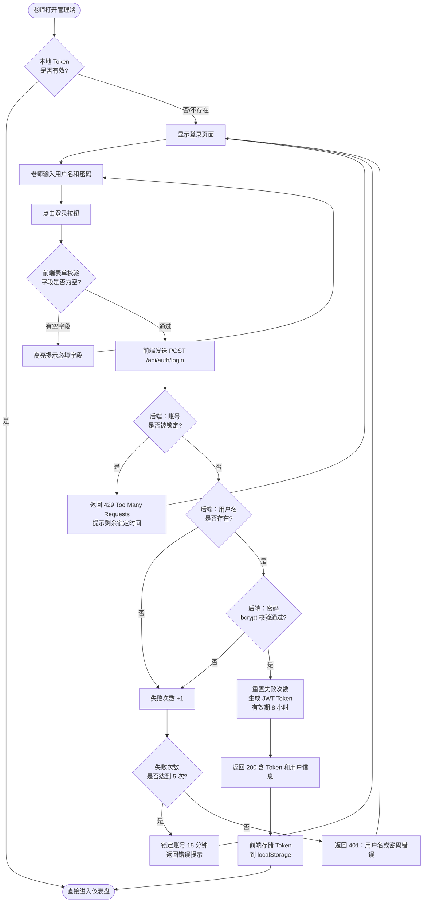
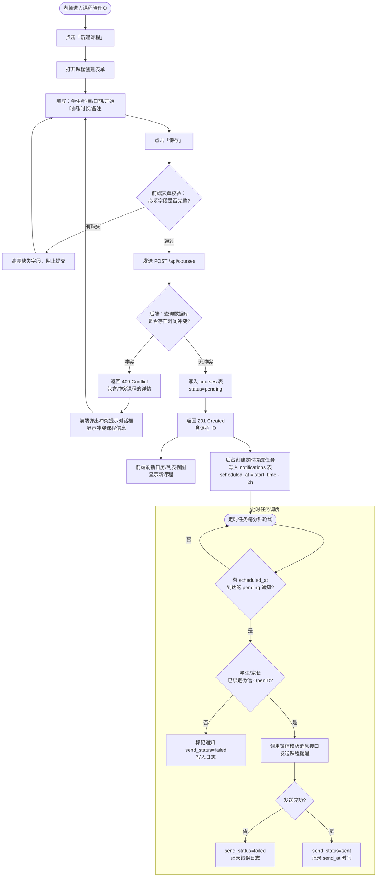
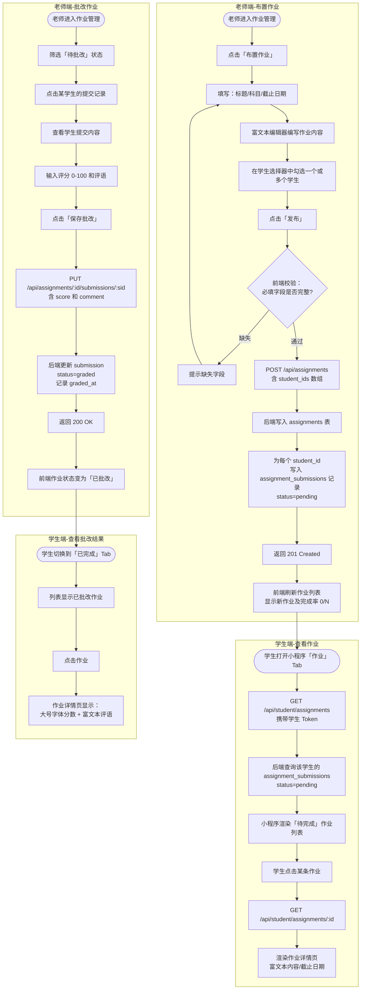
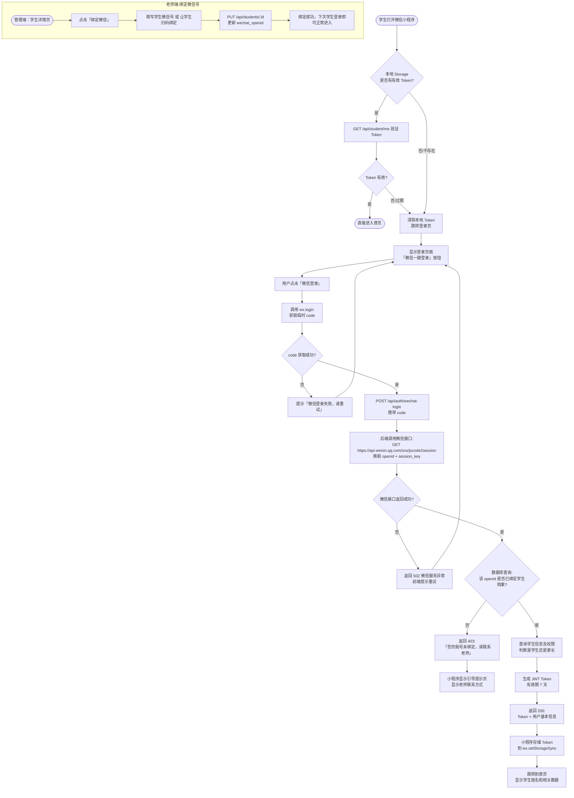

# 家教辅助系统 - 核心业务流程

> 状态：归档
> 范围：全项目
> 更新：2026-04-26
> 版本：1.0
> 日期：2026-02-27
> 说明：描述系统中 5 条核心业务流程，每条附文字说明和 Mermaid 流程图。

---

## 目录

1. [老师登录流程](#1-老师登录流程)
2. [排课并发送课程提醒通知流程](#2-排课并发送课程提醒通知流程)
3. [布置作业到学生查看流程](#3-布置作业到学生查看流程)
4. [收费记录流程](#4-收费记录流程)
5. [学生微信登录小程序流程](#5-学生微信登录小程序流程)

---

## 1. 老师登录流程

### 流程说明

老师通过管理端 Web 页面输入用户名和密码进行身份认证，系统校验后颁发 JWT Token，后续所有 API 请求携带该 Token 进行鉴权。Token 过期后自动跳回登录页，要求重新登录。

**参与方：** 老师（浏览器）、管理端前端、后端 API

**关键规则：**
- 密码在数据库中以 bcrypt 哈希存储，校验时对比哈希值
- 连续登录失败 5 次，账号锁定 15 分钟
- JWT Token 有效期 8 小时，前端在 localStorage 中持久化存储
- 所有受保护路由在请求前验证 Token 有效性，无效则跳转登录页

### 流程图



---

## 2. 排课并发送课程提醒通知流程

### 流程说明

老师在管理端为指定学生创建一节课程，系统在保存前进行时间冲突检测。课程创建成功后，系统可在上课前预设时间（如 2 小时前）自动通过微信推送提醒通知给学生/家长。

**参与方：** 老师（管理端）、后端 API、数据库、微信服务（消息推送）

**关键规则：**
- 冲突检测：新课时间段 [start_time, end_time) 与已有 pending/completed 课程时间段有任何重叠视为冲突
- 课程状态默认为 pending（待上课）
- 提醒通知在课程开始前 X 小时（老师可配置，默认 2 小时）由后台定时任务触发
- 若学生/家长未绑定微信 OpenID，通知仅记录系统日志，不实际推送

### 流程图



---

## 3. 布置作业到学生查看流程

### 流程说明

老师在管理端选择一个或多个学生，编写作业内容并发布。系统为每个学生创建独立的提交记录。学生在微信小程序端查看作业详情，完成后可提交。老师批改后，学生可在小程序端查看评分和评语。

**参与方：** 老师（管理端）、学生（微信小程序）、后端 API

**关键规则：**
- 同一份作业可同时布置给多个学生，系统为每个学生创建独立的 assignment_submissions 记录
- 作业内容使用富文本编辑器（ReactQuill），支持图文混合
- 小程序端使用 HTML 渲染组件显示富文本内容
- 截止日期过后未提交的作业，老师端显示红色逾期标识

### 流程图



---

## 4. 收费记录流程

### 流程说明

老师首先配置各科目的课时单价。每当一节课被标记为"已完成"后，系统自动根据课时时长和科目单价计算应收金额。老师收款后手动录入收款记录，系统实时更新欠费金额。老师可在收费报表中查看各学生的应收/已收/欠费情况。

**参与方：** 老师（管理端）、后端 API、数据库

**关键规则：**
- 应收金额基于"已完成"状态课程的累计计算，修改课程状态会触发重新计算
- 课时单价按科目维度设置，修改单价只影响未来课程（已结算的不回溯）
- 欠费 = 应收合计 - 已收合计，实时计算，不缓存
- 收款记录支持软删除（is_deleted=true），不物理删除，保证账单可追溯

### 流程图

```mermaid
flowchart TD
    subgraph 前置：设置科目单价
        A([老师进入收费管理-设置]) --> B[查看科目单价列表]
        B --> C{科目是否存在?}
        C -- 否 --> D[点击「添加科目」\n填写科目名和单价]
        D --> E[POST /api/billing/subjects]
        E --> F[保存科目单价配置]
        C -- 是 --> G[点击「编辑」修改单价]
        G --> H[PUT /api/billing/subjects/:id]
        H --> F
    end

    subgraph 触发应收：标记课程完成
        I([老师打开课程详情]) --> J[点击「标记为已完成」]
        J --> K[PUT /api/courses/:id\nstatus=completed]
        K --> L[后端更新课程状态]
        L --> M[应收金额实时重算\n= 该学生所有 completed 课程\n按科目匹配单价累加]
    end

    subgraph 录入收款记录
        N([老师收到学生付款]) --> O[进入收费管理-该学生账单页]
        O --> P[查看「应收 / 已收 / 欠费」摘要]
        P --> Q[点击「录入收款」]
        Q --> R[填写：收款金额/日期/支付方式/备注]
        R --> S[POST /api/billing/records]
        S --> T[写入 billing_records 表]
        T --> U[实时重算欠费金额\n= 应收合计 - 已收合计]
        U --> V[页面更新：欠费金额减少]
    end

    subgraph 查看收费报表
        W([老师进入收费管理-报表]) --> X[选择时间范围\n或学生筛选]
        X --> Y[GET /api/billing/report\n含筛选参数]
        Y --> Z[后端聚合计算\n应收/已收/欠费汇总]
        Z --> AA[展示报表：\n各学生明细 + 总计]
        AA --> AB{有欠费学生?}
        AB -- 是 --> AC[欠费学生高亮红色显示\n可点击「发送欠费提醒」]
        AC --> AD[POST /api/notifications\ntype=overdue_fee]
        AD --> AE[微信推送欠费提醒给家长]
        AB -- 否 --> AF([结束])
    end

    F --> I
    M --> N
    V --> W
```

---

## 5. 学生微信登录小程序流程

### 流程说明

学生（或家长）首次打开微信小程序时，通过微信授权获取临时 code，后端使用该 code 向微信服务器换取 OpenID，再与系统中的学生档案进行绑定，完成登录。登录成功后颁发 JWT Token，后续请求携带 Token 免登录访问。

**参与方：** 学生/家长（微信小程序）、微信服务器、后端 API、数据库

**关键规则：**
- 微信 OpenID 全局唯一且不变，是身份识别的核心标识
- 首次登录时，若老师尚未在学生档案中绑定该微信号，登录失败，引导学生联系老师
- 老师可在管理端为学生档案填写 wechat_openid（通过手机号匹配或手动录入）
- Token 有效期 7 天（小程序端使用习惯，比 Web 端更长）
- Token 存储在小程序的 wx.setStorageSync，下次启动时读取验证

### 流程图



---

## 附录：各流程与接口对照

| 流程 | 主要接口 | 说明 |
|------|---------|------|
| 老师登录 | POST /api/auth/login | 账号密码换 JWT Token |
| 排课 | POST /api/courses | 含冲突检测逻辑 |
| 排课提醒 | POST /api/notifications（定时） | 由后台定时任务触发 |
| 布置作业 | POST /api/assignments | 批量为多学生创建 submission |
| 批改作业 | PUT /api/assignments/:id/submissions/:sid | 更新评分和评语 |
| 设置单价 | POST /api/billing/subjects | 科目单价配置 |
| 录入收款 | POST /api/billing/records | 实际收款记录 |
| 查看报表 | GET /api/billing/report | 聚合应收/已收/欠费 |
| 微信登录 | POST /api/auth/wechat-login | code → openid → JWT |
| 绑定微信 | PUT /api/students/:id | 更新 wechat_openid |

---

*文档结束*
