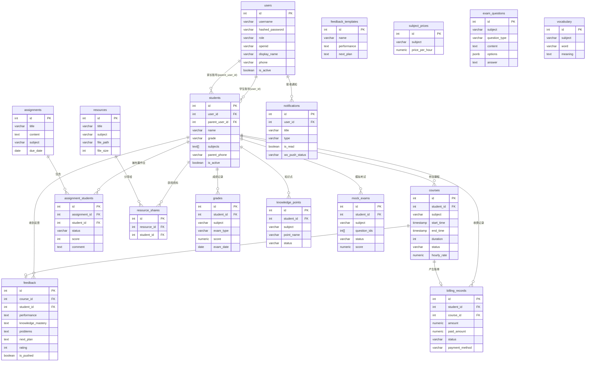

# 数据库设计文档

> 状态：归档
> 范围：后端
> 更新：2026-04-26
> 说明：数据模型设计归档参考；当前真实结构以 `backend/app/models/`、`backend/app/schemas/` 和迁移状态为准。

## 概述

- 数据库：PostgreSQL 16
- 字符集：UTF-8
- 时区：Asia/Shanghai（所有 TIMESTAMP 字段存储 UTC，业务层转换）
- 命名规范：表名和字段名均使用蛇形命名（snake_case）

---

## 1. 数据表定义

### 1.1 users（用户表）

系统所有可登录用户的账户信息，包含管理员（老师）、学生、家长。

```sql
CREATE TABLE users (
    id              SERIAL PRIMARY KEY,
    username        VARCHAR(50)  UNIQUE,                    -- 管理员账号，微信用户可为空
    hashed_password VARCHAR(255),                           -- bcrypt 哈希，微信用户可为空
    role            VARCHAR(20)  NOT NULL                   -- 'admin' | 'student' | 'parent'
                    CHECK (role IN ('admin', 'student', 'parent')),
    openid          VARCHAR(100) UNIQUE,                    -- 微信 openid，Web 用户可为空
    display_name    VARCHAR(100) NOT NULL,                  -- 显示名称
    avatar_url      VARCHAR(500),                           -- 头像 URL
    phone           VARCHAR(20),                            -- 联系电话
    is_active       BOOLEAN      NOT NULL DEFAULT TRUE,     -- 是否启用
    created_at      TIMESTAMP    NOT NULL DEFAULT NOW(),
    updated_at      TIMESTAMP    NOT NULL DEFAULT NOW()
);

-- 索引
CREATE INDEX idx_users_role      ON users(role);
CREATE INDEX idx_users_openid    ON users(openid) WHERE openid IS NOT NULL;
CREATE INDEX idx_users_username  ON users(username) WHERE username IS NOT NULL;
```

**字段说明**
- `username` / `hashed_password`：管理员（老师）使用账号密码登录
- `openid`：学生/家长通过微信登录，存储微信 openid
- `role`：权限控制依据，决定可访问的 API 范围

---

### 1.2 students（学生档案表）

学生的教学档案，与 users 表分离，便于管理学生的教学相关信息。

```sql
CREATE TABLE students (
    id              SERIAL PRIMARY KEY,
    user_id         INTEGER      REFERENCES users(id) ON DELETE SET NULL, -- 关联微信账号（可为空）
    name            VARCHAR(50)  NOT NULL,                   -- 学生姓名
    grade           VARCHAR(20)  NOT NULL,                   -- 年级（如"初二"、"高三"）
    subjects        TEXT[]       NOT NULL DEFAULT '{}',      -- 辅导科目数组（如 ['数学','英语']）
    parent_name     VARCHAR(50),                             -- 家长姓名
    parent_phone    VARCHAR(20),                             -- 家长手机号
    parent_user_id  INTEGER      REFERENCES users(id) ON DELETE SET NULL, -- 家长微信账号
    school          VARCHAR(100),                            -- 就读学校
    notes           TEXT,                                    -- 备注
    is_active       BOOLEAN      NOT NULL DEFAULT TRUE,      -- 是否在读
    created_at      TIMESTAMP    NOT NULL DEFAULT NOW(),
    updated_at      TIMESTAMP    NOT NULL DEFAULT NOW()
);

-- 索引
CREATE INDEX idx_students_user_id      ON students(user_id);
CREATE INDEX idx_students_parent_user  ON students(parent_user_id);
CREATE INDEX idx_students_name         ON students(name);
CREATE INDEX idx_students_grade        ON students(grade);
CREATE INDEX idx_students_is_active    ON students(is_active);

-- 全文搜索索引（支持按姓名搜索）
CREATE INDEX idx_students_name_text ON students USING gin(to_tsvector('simple', name));
```

---

### 1.3 courses（课程表）

每一条记录代表一次具体的课程安排（一节课）。

```sql
CREATE TABLE courses (
    id              SERIAL PRIMARY KEY,
    student_id      INTEGER      NOT NULL REFERENCES students(id) ON DELETE CASCADE,
    subject         VARCHAR(50)  NOT NULL,                   -- 科目
    start_time      TIMESTAMP    NOT NULL,                   -- 上课开始时间（UTC）
    end_time        TIMESTAMP    NOT NULL,                   -- 上课结束时间（UTC）
    duration        SMALLINT     NOT NULL,                   -- 时长（分钟）
    status          VARCHAR(20)  NOT NULL DEFAULT 'scheduled'
                    CHECK (status IN ('scheduled', 'completed', 'cancelled')),
    location        VARCHAR(200),                            -- 上课地点（可选）
    notes           TEXT,                                    -- 备注
    hourly_rate     NUMERIC(10,2),                           -- 本节课时单价（快照，防止价格变更影响历史记录）
    created_at      TIMESTAMP    NOT NULL DEFAULT NOW(),
    updated_at      TIMESTAMP    NOT NULL DEFAULT NOW(),

    -- 冲突检测约束：同一时间段不能有两节课（排除已取消的课）
    CONSTRAINT chk_course_time CHECK (end_time > start_time)
);

-- 索引
CREATE INDEX idx_courses_student_id  ON courses(student_id);
CREATE INDEX idx_courses_start_time  ON courses(start_time);
CREATE INDEX idx_courses_status      ON courses(status);
-- 日历查询优化：按时间范围查询
CREATE INDEX idx_courses_time_range  ON courses(start_time, end_time) WHERE status != 'cancelled';
```

**冲突检测实现**（在业务层/存储过程中实现）
```sql
-- 检测指定时间段是否与已有课程冲突
SELECT id FROM courses
WHERE status != 'cancelled'
  AND start_time < $end_time
  AND end_time > $start_time
  AND id != $exclude_id;  -- 编辑时排除自身
```

---

### 1.4 assignments（作业表）

老师布置的作业，可关联多名学生（通过 assignment_students 中间表）。

```sql
CREATE TABLE assignments (
    id              SERIAL PRIMARY KEY,
    title           VARCHAR(200) NOT NULL,                   -- 作业标题
    content         TEXT         NOT NULL,                   -- 作业内容（富文本 HTML）
    subject         VARCHAR(50)  NOT NULL,                   -- 科目
    due_date        DATE         NOT NULL,                   -- 截止日期
    created_at      TIMESTAMP    NOT NULL DEFAULT NOW(),
    updated_at      TIMESTAMP    NOT NULL DEFAULT NOW()
);

-- 作业与学生的多对多关联（含完成状态）
CREATE TABLE assignment_students (
    id              SERIAL PRIMARY KEY,
    assignment_id   INTEGER      NOT NULL REFERENCES assignments(id) ON DELETE CASCADE,
    student_id      INTEGER      NOT NULL REFERENCES students(id) ON DELETE CASCADE,
    status          VARCHAR(20)  NOT NULL DEFAULT 'pending'
                    CHECK (status IN ('pending', 'submitted', 'graded')),
    submitted_at    TIMESTAMP,                               -- 提交时间（学生端标记）
    score           SMALLINT     CHECK (score BETWEEN 0 AND 100),
    comment         TEXT,                                    -- 老师批改评语
    graded_at       TIMESTAMP,                               -- 批改时间

    UNIQUE (assignment_id, student_id)
);

-- 索引
CREATE INDEX idx_assignments_subject    ON assignments(subject);
CREATE INDEX idx_assignments_due_date   ON assignments(due_date);
CREATE INDEX idx_as_assignment_id       ON assignment_students(assignment_id);
CREATE INDEX idx_as_student_id          ON assignment_students(student_id);
CREATE INDEX idx_as_status              ON assignment_students(status);
```

---

### 1.5 feedback（课堂反馈表）

每节课结束后老师填写的反馈，与课程关联。

```sql
CREATE TABLE feedback (
    id              SERIAL PRIMARY KEY,
    course_id       INTEGER      REFERENCES courses(id) ON DELETE SET NULL, -- 关联课程（可选）
    student_id      INTEGER      NOT NULL REFERENCES students(id) ON DELETE CASCADE,
    performance     TEXT         NOT NULL,                   -- 本节课表现
    knowledge_mastery TEXT,                                  -- 知识点掌握情况
    problems        TEXT,                                    -- 存在问题
    next_plan       TEXT,                                    -- 下节课计划
    rating          SMALLINT     CHECK (rating BETWEEN 1 AND 5), -- 综合评价（1-5星）
    is_pushed       BOOLEAN      NOT NULL DEFAULT FALSE,     -- 是否已推送给家长/学生
    pushed_at       TIMESTAMP,                               -- 推送时间
    created_at      TIMESTAMP    NOT NULL DEFAULT NOW(),
    updated_at      TIMESTAMP    NOT NULL DEFAULT NOW()
);

-- 反馈模板表
CREATE TABLE feedback_templates (
    id              SERIAL PRIMARY KEY,
    name            VARCHAR(100) NOT NULL,                   -- 模板名称
    performance     TEXT,
    knowledge_mastery TEXT,
    problems        TEXT,
    next_plan       TEXT,
    created_at      TIMESTAMP    NOT NULL DEFAULT NOW()
);

-- 索引
CREATE INDEX idx_feedback_student_id  ON feedback(student_id);
CREATE INDEX idx_feedback_course_id   ON feedback(course_id);
CREATE INDEX idx_feedback_created_at  ON feedback(created_at);
```

---

### 1.6 resources（教学资料表）

老师上传的教学资料及分享记录。

```sql
CREATE TABLE resources (
    id              SERIAL PRIMARY KEY,
    title           VARCHAR(200) NOT NULL,                   -- 资料标题
    description     TEXT,                                    -- 描述
    subject         VARCHAR(50),                             -- 所属科目
    grade           VARCHAR(20),                             -- 适用年级
    file_type       VARCHAR(50)  NOT NULL,                   -- 文件 MIME 类型
    original_name   VARCHAR(255) NOT NULL,                   -- 原始文件名
    file_path       VARCHAR(500) NOT NULL,                   -- 存储路径（相对于 uploads 目录）
    file_size       INTEGER      NOT NULL,                   -- 文件大小（字节）
    created_at      TIMESTAMP    NOT NULL DEFAULT NOW(),
    updated_at      TIMESTAMP    NOT NULL DEFAULT NOW()
);

-- 资料分享给学生的关联表
CREATE TABLE resource_shares (
    id              SERIAL PRIMARY KEY,
    resource_id     INTEGER      NOT NULL REFERENCES resources(id) ON DELETE CASCADE,
    student_id      INTEGER      NOT NULL REFERENCES students(id) ON DELETE CASCADE,
    shared_at       TIMESTAMP    NOT NULL DEFAULT NOW(),

    UNIQUE (resource_id, student_id)
);

-- 索引
CREATE INDEX idx_resources_subject      ON resources(subject);
CREATE INDEX idx_resources_grade        ON resources(grade);
CREATE INDEX idx_resources_created_at   ON resources(created_at);
CREATE INDEX idx_resource_shares_student ON resource_shares(student_id);
CREATE INDEX idx_resource_shares_resource ON resource_shares(resource_id);
```

---

### 1.7 billing（收费记录表）

课时费用的计算和收款记录。

```sql
-- 科目课时单价配置
CREATE TABLE subject_prices (
    id              SERIAL PRIMARY KEY,
    subject         VARCHAR(50)  NOT NULL UNIQUE,            -- 科目名称
    price_per_hour  NUMERIC(10,2) NOT NULL,                  -- 每小时单价（元）
    updated_at      TIMESTAMP    NOT NULL DEFAULT NOW()
);

-- 收费记录（每条对应一节课的费用）
CREATE TABLE billing_records (
    id              SERIAL PRIMARY KEY,
    student_id      INTEGER      NOT NULL REFERENCES students(id) ON DELETE CASCADE,
    course_id       INTEGER      REFERENCES courses(id) ON DELETE SET NULL,
    amount          NUMERIC(10,2) NOT NULL,                  -- 应收金额（元）
    paid_amount     NUMERIC(10,2) NOT NULL DEFAULT 0,        -- 实收金额（元）
    status          VARCHAR(20)  NOT NULL DEFAULT 'unpaid'
                    CHECK (status IN ('unpaid', 'partial', 'paid')),
    payment_method  VARCHAR(20)
                    CHECK (payment_method IN ('cash', 'wechat', 'alipay', 'bank', 'other')),
    paid_at         TIMESTAMP,                               -- 收款时间
    notes           TEXT,                                    -- 备注
    created_at      TIMESTAMP    NOT NULL DEFAULT NOW(),
    updated_at      TIMESTAMP    NOT NULL DEFAULT NOW()
);

-- 索引
CREATE INDEX idx_billing_student_id   ON billing_records(student_id);
CREATE INDEX idx_billing_course_id    ON billing_records(course_id);
CREATE INDEX idx_billing_status       ON billing_records(status);
CREATE INDEX idx_billing_paid_at      ON billing_records(paid_at);
CREATE INDEX idx_billing_created_at   ON billing_records(created_at);
```

---

### 1.8 progress（学习进度表）

记录学生各次考试/测验的成绩，用于绘制成绩趋势图。

```sql
CREATE TABLE grades (
    id              SERIAL PRIMARY KEY,
    student_id      INTEGER      NOT NULL REFERENCES students(id) ON DELETE CASCADE,
    subject         VARCHAR(50)  NOT NULL,
    exam_type       VARCHAR(50)  NOT NULL,                   -- 'quiz'|'midterm'|'final'|'mock'|'other'
    exam_name       VARCHAR(200),                            -- 考试名称
    score           NUMERIC(5,2) NOT NULL,                   -- 得分
    full_score      NUMERIC(5,2) NOT NULL DEFAULT 100,       -- 满分
    exam_date       DATE         NOT NULL,                   -- 考试日期
    notes           TEXT,
    created_at      TIMESTAMP    NOT NULL DEFAULT NOW()
);

-- 知识点掌握情况
CREATE TABLE knowledge_points (
    id              SERIAL PRIMARY KEY,
    student_id      INTEGER      NOT NULL REFERENCES students(id) ON DELETE CASCADE,
    subject         VARCHAR(50)  NOT NULL,
    chapter         VARCHAR(100),                            -- 章节
    point_name      VARCHAR(200) NOT NULL,                   -- 知识点名称
    status          VARCHAR(20)  NOT NULL DEFAULT 'todo'
                    CHECK (status IN ('todo', 'learning', 'mastered')),
    notes           TEXT,
    updated_at      TIMESTAMP    NOT NULL DEFAULT NOW(),
    created_at      TIMESTAMP    NOT NULL DEFAULT NOW(),

    UNIQUE (student_id, subject, point_name)
);

-- 索引
CREATE INDEX idx_grades_student_id    ON grades(student_id);
CREATE INDEX idx_grades_subject       ON grades(subject);
CREATE INDEX idx_grades_exam_date     ON grades(exam_date);
CREATE INDEX idx_kp_student_subject   ON knowledge_points(student_id, subject);
CREATE INDEX idx_kp_status            ON knowledge_points(status);
```

---

### 1.9 notifications（通知表）

系统通知和微信推送记录。

```sql
CREATE TABLE notifications (
    id              SERIAL PRIMARY KEY,
    user_id         INTEGER      NOT NULL REFERENCES users(id) ON DELETE CASCADE, -- 接收者
    title           VARCHAR(200) NOT NULL,
    content         TEXT         NOT NULL,
    type            VARCHAR(50)  NOT NULL
                    CHECK (type IN ('course_reminder', 'assignment_reminder', 'feedback_push', 'manual')),
    is_read         BOOLEAN      NOT NULL DEFAULT FALSE,
    related_type    VARCHAR(50),                             -- 关联业务类型（如 'course'）
    related_id      INTEGER,                                 -- 关联业务 ID
    wx_push_status  VARCHAR(20)  DEFAULT 'pending'
                    CHECK (wx_push_status IN ('pending', 'sent', 'failed', 'skipped')),
    wx_push_at      TIMESTAMP,                               -- 微信推送时间
    created_at      TIMESTAMP    NOT NULL DEFAULT NOW()
);

-- 索引
CREATE INDEX idx_notifications_user_id   ON notifications(user_id);
CREATE INDEX idx_notifications_is_read   ON notifications(user_id, is_read);
CREATE INDEX idx_notifications_created   ON notifications(created_at);
```

---

### 1.10 exam（考试辅导模块）

真题库、词汇库和模拟考试。

```sql
-- 真题表
CREATE TABLE exam_questions (
    id              SERIAL PRIMARY KEY,
    subject         VARCHAR(50)  NOT NULL,
    year            SMALLINT,                                -- 题目年份
    question_type   VARCHAR(50)  NOT NULL,                  -- 'choice'|'fill'|'essay'|'reading'
    content         TEXT         NOT NULL,                   -- 题目内容（支持 HTML）
    options         JSONB,                                   -- 选择题选项，格式：{"A":"...","B":"..."}
    answer          TEXT         NOT NULL,                   -- 答案
    explanation     TEXT,                                    -- 解析
    difficulty      SMALLINT     DEFAULT 3
                    CHECK (difficulty BETWEEN 1 AND 5),
    tags            TEXT[]       DEFAULT '{}',              -- 标签（知识点）
    created_at      TIMESTAMP    NOT NULL DEFAULT NOW()
);

-- 词汇库（外语科目）
CREATE TABLE vocabulary (
    id              SERIAL PRIMARY KEY,
    subject         VARCHAR(20)  NOT NULL DEFAULT 'english',
    word            VARCHAR(100) NOT NULL,
    phonetic        VARCHAR(100),                            -- 音标
    meaning         TEXT         NOT NULL,                   -- 释义
    example         TEXT,                                    -- 例句
    level           VARCHAR(20),                            -- 词汇级别（如 'CET4','高考'）
    created_at      TIMESTAMP    NOT NULL DEFAULT NOW(),

    UNIQUE (subject, word)
);

-- 模拟考试
CREATE TABLE mock_exams (
    id              SERIAL PRIMARY KEY,
    student_id      INTEGER      NOT NULL REFERENCES students(id) ON DELETE CASCADE,
    title           VARCHAR(200) NOT NULL,
    subject         VARCHAR(50)  NOT NULL,
    question_ids    INTEGER[]    NOT NULL,                   -- 题目 ID 数组
    status          VARCHAR(20)  NOT NULL DEFAULT 'draft'
                    CHECK (status IN ('draft', 'active', 'completed')),
    started_at      TIMESTAMP,
    completed_at    TIMESTAMP,
    score           NUMERIC(5,2),
    created_at      TIMESTAMP    NOT NULL DEFAULT NOW()
);

-- 索引
CREATE INDEX idx_exam_questions_subject  ON exam_questions(subject);
CREATE INDEX idx_exam_questions_year     ON exam_questions(year);
CREATE INDEX idx_exam_questions_type     ON exam_questions(question_type);
CREATE INDEX idx_exam_questions_tags     ON exam_questions USING gin(tags);
CREATE INDEX idx_vocabulary_word         ON vocabulary(word);
CREATE INDEX idx_vocabulary_level        ON vocabulary(level);
CREATE INDEX idx_mock_exams_student      ON mock_exams(student_id);
```

---

## 2. ER 关系图



---

## 3. 重要查询优化说明

### 3.1 日历视图课程查询

**场景**：管理端查看某月/某周的所有课程（日历视图）

```sql
-- 查询指定时间范围内的课程（含学生姓名）
SELECT
    c.id, c.start_time, c.end_time, c.subject, c.status, c.duration,
    s.name AS student_name
FROM courses c
JOIN students s ON c.student_id = s.id
WHERE c.start_time >= '2024-01-01'
  AND c.start_time < '2024-02-01'
ORDER BY c.start_time;

-- 依赖索引：idx_courses_time_range (start_time, end_time)
-- 预计执行：Index Scan，毫秒级
```

### 3.2 仪表盘数据聚合查询

**场景**：首页仪表盘显示今日课程数、本月收入、待处理作业数

```sql
-- 今日课程数
SELECT COUNT(*) FROM courses
WHERE start_time >= CURRENT_DATE
  AND start_time < CURRENT_DATE + INTERVAL '1 day'
  AND status = 'scheduled';

-- 本月已收款金额
SELECT COALESCE(SUM(paid_amount), 0) FROM billing_records
WHERE paid_at >= DATE_TRUNC('month', NOW())
  AND paid_at < DATE_TRUNC('month', NOW()) + INTERVAL '1 month'
  AND status IN ('partial', 'paid');

-- 待批改作业数
SELECT COUNT(*) FROM assignment_students
WHERE status = 'submitted';
```

### 3.3 学生成绩趋势查询

**场景**：进度页显示某学生某科目的成绩趋势折线图

```sql
SELECT
    exam_date,
    score,
    full_score,
    ROUND(score / full_score * 100, 1) AS percentage,
    exam_type,
    exam_name
FROM grades
WHERE student_id = $1
  AND subject = $2
ORDER BY exam_date ASC;

-- 依赖索引：idx_grades_student_id, idx_grades_exam_date
```

### 3.4 欠费学生查询

**场景**：收费管理页的欠费提醒

```sql
SELECT
    s.id, s.name, s.grade,
    SUM(b.amount - b.paid_amount) AS outstanding_amount,
    COUNT(b.id) AS unpaid_count
FROM students s
JOIN billing_records b ON b.student_id = s.id
WHERE b.status IN ('unpaid', 'partial')
GROUP BY s.id, s.name, s.grade
HAVING SUM(b.amount - b.paid_amount) > 0
ORDER BY outstanding_amount DESC;

-- 依赖索引：idx_billing_status, idx_billing_student_id
```

### 3.5 作业完成情况统计

**场景**：作业管理页显示每个学生的完成率

```sql
SELECT
    s.id AS student_id,
    s.name AS student_name,
    COUNT(ass.id) AS total,
    COUNT(ass.id) FILTER (WHERE ass.status = 'submitted') AS submitted,
    COUNT(ass.id) FILTER (WHERE ass.status = 'graded') AS graded,
    ROUND(
        COUNT(ass.id) FILTER (WHERE ass.status IN ('submitted', 'graded')) * 100.0
        / NULLIF(COUNT(ass.id), 0), 1
    ) AS completion_rate
FROM students s
LEFT JOIN assignment_students ass ON ass.student_id = s.id
WHERE s.is_active = TRUE
GROUP BY s.id, s.name
ORDER BY s.name;
```

### 3.6 冲突检测查询

**场景**：添加/修改课程时检测时间冲突

```sql
-- 检测 $start_time ~ $end_time 是否与已有课程冲突
SELECT id, start_time, end_time,
       (SELECT name FROM students WHERE id = student_id) AS student_name
FROM courses
WHERE status != 'cancelled'
  AND start_time < $end_time   -- 现有课程在新课程结束前开始
  AND end_time > $start_time   -- 现有课程在新课程开始后结束
  AND id != $exclude_id        -- 排除自身（编辑时使用）
LIMIT 1;

-- 依赖索引：idx_courses_time_range (start_time, end_time)
-- 区间重叠判断：A 与 B 重叠 ⟺ A.start < B.end AND A.end > B.start
```

### 3.7 数据库初始化建议

```sql
-- 插入默认管理员账户（密码：admin123 的 bcrypt 哈希）
INSERT INTO users (username, hashed_password, role, display_name)
VALUES ('admin', '$2b$12$xxxxxxxxxxxxxxxxxxxxxxxxxxxxxxxxxxxxxxxxxxxxxxxxxxxxx', 'admin', '管理员');

-- 插入默认科目单价
INSERT INTO subject_prices (subject, price_per_hour) VALUES
('数学', 150.00),
('英语', 150.00),
('物理', 150.00),
('化学', 150.00),
('语文', 120.00);
```

### 3.8 性能优化总结

| 场景 | 优化手段 |
|------|---------|
| 课程日历查询 | 复合索引 `(start_time, end_time)` + 条件索引排除已取消课程 |
| 学生搜索 | GIN 全文索引 `to_tsvector('simple', name)` |
| 欠费查询 | `status` 字段索引 + 应用层缓存（每5分钟刷新）|
| 知识点查询 | 复合索引 `(student_id, subject)` 覆盖常见查询 |
| 文件路径查询 | `file_path` 字段本身无索引（通过 ID 查询） |
| 真题搜索 | GIN 索引 `tags` 数组字段 |

**连接池建议**：2核2G 服务器，`pool_size=5, max_overflow=5`，避免连接数过多导致 PostgreSQL 内存压力。

**VACUUM 策略**：PostgreSQL 默认 autovacuum 配置适合本系统规模，无需特别调整。
